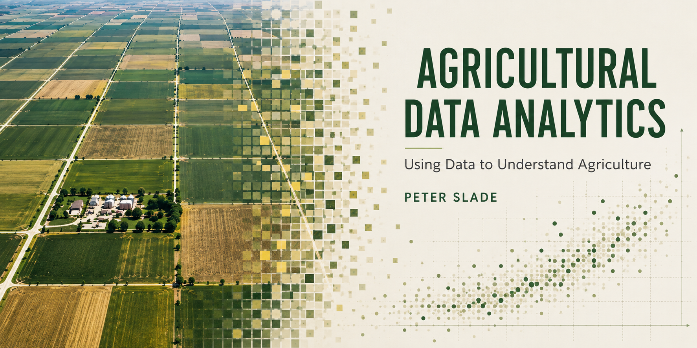

---
format:
  html:
    include-in-header:
      text: |
        
---

{.cover-hero fig-alt="Agricultural Data Analytics — an aerial view of prairie farm fields dissolving left-to-right into a grid of pixels and then a scatter plot of data points."}

::: {.landing-byline}
::: {.byline-item}
[Author]{.byline-heading}
Peter Slade
:::
::: {.byline-item}
[Last update]{.byline-heading}

:::
:::

Welcome to *Agricultural Data Analytics*. This book is the primary reading for AREC 261 at the University of Saskatchewan. Embedded in the textbook are my own videos, other resources, and the test bank.  The syllabus for the course is here.  

Of course, if you aren't a student of mine, you are more than welcome to use the book! 

The goal of this book — and the course it supports — is to get you doing real data analysis on real agricultural data as quickly as possible. By the end of the term you should be comfortable pulling a dataset into Excel or R, cleaning it up, summarizing it, visualizing it, and making careful, defensible claims about what the numbers mean. You should also be comfortable admitting what you *don't* know, which, in data analysis, is at least as important as what you do.

This book is a work in progress. If you find errors, unclear passages, or places where an extra example would help, please let me know at peter.slade@usask.ca or using the feedback link.  AI tools were used for brain storming, content generation, and editing -- but I am responsible for all errors.

