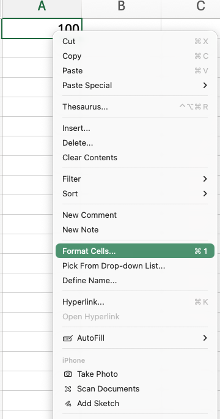

# Getting Started with Excel {#sec-excel-start}

This chapter introduces the basic building blocks of Excel: workbooks, worksheets, cells, formulas, and references. These are the tools we will use throughout the next several chapters to organize, analyze, and visualize data.

Excel is a spreadsheet program. At its core, a worksheet is a grid of cells. A cell can hold a value -- such as a number or text -- or a formula that calculates a value using other cells. When an input changes, formulas that depend on it update automatically.

## Learning Objectives {.unnumbered}

::: {.objectives}
By the end of this chapter, you will be able to:

- Identify the basic structure of an Excel workbook, including worksheets, cells, and ranges
- Distinguish between what a cell contains and what it displays, and set a number format deliberately
- Write formulas that refer to other cells, and predict what happens when you copy them
- Use $ to control which parts of a cell reference change when a formula is copied
- Use functions such as SUM with ranges of cells
:::


## Workbooks and Worksheets {#sec-workbook-structure}

A workbook is one Excel file. Inside it are worksheets -- the tabs along the bottom of the window. A workbook is more like a small filing cabinet than a single sheet of numbers.

Generally, you want to organize a workbook so that different worksheets perform different functions. A single worksheet containing multiple datasets, calculations, and charts can quickly become confusing -- both for you and for anyone with whom you share your work. When working with an actual dataset, always keep an untouched copy of the raw data. An Excel workbook might then contain separate worksheets for raw data, cleaned data, analysis, and charts.

Most of what we will do in this chapter involves small calculations within a single worksheet. We will return to workbook organization in @sec-workbook-aesthetics, when we begin working with larger datasets and complete data-analysis projects.

::: {.callout-tip collapse="true"}
## Other resources — workbooks and worksheets

- **Excel for Dummies** -- *Microsoft 365 Excel for Dummies*, the opening chapters on the Excel interface and workbook basics.
- **Microsoft Support** -- [Excel for Windows training](https://support.microsoft.com/en-us/office/excel-for-windows-training-9bc05390-e94c-46af-a5b3-d7c22f6990bb), Microsoft's own free tutorial hub.
- **Video (beginner overview)** -- [*How to use Excel for beginners*](https://www.youtube.com/watch?v=Ai0MV7twEBE) -- a short tour of entering data, formatting, and the interface.
:::

## File Formats and File Management {#sec-file-formats}

In this class, we will read in data in two formats:

- **`.xlsx`** -- The standard modern Excel workbook format. It can contain multiple worksheets, formulas, formatting, charts, and PivotTables. We will generally use this format when we are working in Excel. The older `.xls` format was the standard Excel format before 2007.
- **`.csv`** -- Comma-separated values. A CSV is a simple text file containing a single table: each line represents a row, with values separated by commas. CSV files contain data only -- not formulas, formatting, charts, or multiple worksheets. Because the format is simple and widely supported, CSV is commonly used to store and exchange tabular data between programs such as Excel, R, Python, and other statistical software.

Excel will readily open a .csv file. However, be careful: Excel sometimes tries to be helpful by automatically interpreting the data. For example, it might turn SEPT1 into the date 1-Sep, or remove leading zeros from a farm ID such as 00127. These changes can alter the underlying data, not just how they are displayed. When this might be a problem, use Data → Get Data → From Text/CSV, which lets you inspect and set column types explicitly, rather than simply double-clicking the file.

::: {.callout-tip collapse="true"}
## Other resources — file formats

- **Microsoft Support** -- [Import or export text (.txt or .csv) files](https://support.microsoft.com/en-us/office/import-or-export-text-txt-or-csv-files-5250ac4c-663c-47ce-937b-339e391393ba), including the Text Import Wizard that lets you set column types.
- **Microsoft Support** -- [File formats that are supported in Excel](https://support.microsoft.com/en-us/office/file-formats-that-are-supported-in-excel-0943ff2c-6014-4e8d-aaea-b83d51d46247), if you meet an unfamiliar extension.
:::

## Cells and Formulas

Each cell in a worksheet has an address formed by its column letter and row number: `A1`, `B2`, `AA35`, and so on. A cell can contain:

- A number: `42`, `3.14`, `-1000`
- Text: `Canola`, `Field 7`, `North field`
- A date: `2026-09-15` (Excel stores dates internally as numbers; we will return to this later.)
- A formula: anything starting with `=`

A formula is a calculation. It can be as simple as `=2+2`, but the real power of a spreadsheet comes from formulas that reference other cells. For example, `=A2+B2` adds the values in cells `A2` and `B2`.

Because the formula references the cells rather than fixed numbers, it recalculates whenever those cells change. Change the value in A2, and every formula that references A2 updates automatically.

Excel uses the standard mathematical operators -- `+`, `-`, `*` (multiply), `/` (divide), and `^` (exponent) -- and it evaluates them in the standard **PEMDAS** order: Parentheses, Exponents, Multiplication/Division, then Addition/Subtraction, working left to right within each level.

The worksheet below provides examples of simple operations.

::: {.workbook-callout}
::: {.excel-embed}
<iframe width="402" height="700" frameborder="0" scrolling="no" src="https://usaskca1-my.sharepoint.com/personal/pjs998_usask_ca/_layouts/15/Doc.aspx?sourcedoc=%7Bc02b36ae-e4f1-4cb9-aa41-da843db59da7%7D&action=embedview&wdAllowInteractivity=False&wdDownloadButton=True&wdInConfigurator=True"></iframe>
:::

[Download this workbook](textbook_examples/mod01_excel_operations.xlsx) · [Open online](https://usaskca1-my.sharepoint.com/personal/pjs998_usask_ca/_layouts/15/Doc.aspx?sourcedoc=%7Bc02b36ae-e4f1-4cb9-aa41-da843db59da7%7D&action=default) (File → Save a Copy to view formulas and edit)
:::

::: {.callout-tip collapse="true"}
## Other resources — cells and formulas

- **Excel for Dummies** -- *Microsoft 365 Excel for Dummies*, the chapter on entering formulas.
- **Microsoft Support** -- [Overview of formulas in Excel](https://support.microsoft.com/en-us/office/overview-of-formulas-in-excel-ecfdc708-9162-49e8-b993-c311f47ca173) and [Calculation operators and precedence](https://support.microsoft.com/en-us/office/calculation-operators-and-precedence-in-excel-48be406d-4975-4d31-b2b8-7af9e0e2878a).
- **Video (order of operations)** -- [*Order of operations for math formulas in Excel*](https://www.youtube.com/watch?v=jmrSG30aOHA).
:::

## Relative and Absolute References {#sec-references}

When you write a formula like `=A2-B2` in cell `C2` and then copy that formula down to `C3`, Excel automatically changes it to `=A3-B3`. This is called a relative reference: Excel interprets A2 not just as "cell A2," but as a cell in a particular position relative to the formula. When the formula moves, the reference moves with it.

Usually, this is exactly what you want. For example, suppose column A contains sales, column B contains costs, and you want to calculate profit in column C. Each row should subtract that row's costs from that row's sales. You can write the formula once and then copy it down the column.

Sometimes, however, you do not want a reference to change. Suppose you have a fixed exchange rate in cell E1 -- say, 1.35 CAD per USD -- and USD prices in `A2:A100`. You want column B to show each price in Canadian dollars. The USD price should change from row to row, but the exchange rate should not.

The fix is to use an absolute reference. A $ locks whatever comes immediately after it. For example:

- `A1` -- relative column, relative row (changes when copied in either direction)
- `$A1` -- absolute column, relative row (column stays as A, row changes)
- `A$1` -- relative column, absolute row (column changes, row stays as 1)
- `$A$1` -- absolute column and row (neither changes; "locked")

In the exchange-rate example, you would write `=A2*$E$1` in cell B2. When you copy the formula down, A2 becomes A3, A4, and so on, while `$E$1` remains `$E$1`. This allows every row to use its own USD price while referring to the same exchange rate.

The workbook below has three worksheets (tabs) that demonstrate relative and absolute references.

::: {.workbook-callout}
::: {.excel-embed}
<iframe width="402" height="700" frameborder="0" scrolling="no" src="https://usaskca1-my.sharepoint.com/personal/pjs998_usask_ca/_layouts/15/Doc.aspx?sourcedoc=%7Bb7f0c21d-352c-47ea-9eed-a82a2e30f8e9%7D&action=embedview&wdAllowInteractivity=False&wdDownloadButton=True&wdInConfigurator=True"></iframe>
:::

[Download this workbook](textbook_examples/mod01_references.xlsx) · [blank version to fill in yourself](textbook_examples/mod01_references_practice.xlsx) · [Open online](https://usaskca1-my.sharepoint.com/personal/pjs998_usask_ca/_layouts/15/Doc.aspx?sourcedoc=%7Bb7f0c21d-352c-47ea-9eed-a82a2e30f8e9%7D&action=default) (File → Save a Copy to view formulas and edit)
:::


::: {.callout-tip collapse="true"}
## Other resources — relative and absolute references

- **Microsoft Support** -- [Switch between relative, absolute, and mixed references](https://support.microsoft.com/en-us/office/switch-between-relative-absolute-and-mixed-references-dfec08cd-ae65-4f56-839e-5f0d8d0baca9).
- **Excel for Dummies** -- *Microsoft 365 Excel for Dummies*, the chapter on cell references.
- **Video** -- [*Excel Relative and Absolute Cell References*](https://www.youtube.com/watch?v=DIkBBIo0thw) -- what happens to references when you copy a formula, and what the `$` signs do.
:::

## Cell Formatting {#sec-cell-formatting}

In the formulas above, we were working only with numbers. Cells can also contain text, dates, and times.  Additionally, numbers can be displayed in different ways. Excel uses number formats to control how values appear. Common formats include General, Number, Currency, Percentage, and Date. Excel normally starts with General, but may automatically apply another format when it recognizes what you enter. For example, entering a date may cause Excel to apply a date format automatically.

You can change the format of a cell by right-clicking on it and choosing Format Cells (@fig-format-menu). This opens a dialog where you can choose a format and adjust options such as the number of decimal places, currency symbol, or how a date is displayed.

::: {#fig-format layout-ncol=2}

{#fig-format-menu}

{#fig-format-dialog}

Changing a cell's number format. The value Excel stores is unchanged -- only its appearance is.
:::

Two formatting issues are particularly important: decimal places and dates. When presenting numbers, use a level of precision that is meaningful for the audience. For example, reporting an average yield as 40.5 bushels per acre is usually more useful than reporting 40.519834760. Excel lets you control the number of decimal places displayed without changing the underlying value.

Dates require some additional care because Excel can perform calculations with them. For example, if a cell contains September 7, 2027 as a date, adding 7 gives September 14, 2027. If September 7, 2027 is stored as text instead, Excel cannot treat it in the same way.

Importantly, formatting changes how a value looks, not the underlying value Excel uses in calculations. A cell containing 0.45 can display 45%, and a cell containing 1000 can display $1,000.00. Formulas that reference those cells still use the underlying values 0.45 and 1000.

::: {.workbook-callout}
::: {.excel-embed}
<iframe width="402" height="700" frameborder="0" scrolling="no" src="https://usaskca1-my.sharepoint.com/personal/pjs998_usask_ca/_layouts/15/Doc.aspx?sourcedoc=%7B58a2f02f-69cb-46fa-ba96-4768f4ef22d9%7D&action=embedview&wdAllowInteractivity=False&wdDownloadButton=True&wdInConfigurator=True"></iframe>
:::

[Download this workbook](textbook_examples/mod01_cell_formatting.xlsx) · [blank version to fill in yourself](textbook_examples/mod01_cell_formatting_practice.xlsx) · [Open online](https://usaskca1-my.sharepoint.com/personal/pjs998_usask_ca/_layouts/15/Doc.aspx?sourcedoc=%7B58a2f02f-69cb-46fa-ba96-4768f4ef22d9%7D&action=default) (File → Save a Copy to view formulas and edit)
:::

::: {.callout-tip collapse="true"}
## Other resources — cell formatting

- **Microsoft Support** -- [Available number formats in Excel](https://support.microsoft.com/en-us/office/available-number-formats-in-excel-0afe8f52-97db-41f1-b972-4b46e9f1e8d2) and [Format a date the way you want](https://support.microsoft.com/en-us/office/format-a-date-the-way-you-want-8e10019e-d5d8-47a1-ba95-db95123d273e).
- **Excel for Dummies** -- *Microsoft 365 Excel for Dummies*, the chapter on formatting worksheets.
:::

## Ranges and the `SUM` Function {#sec-sum}

Every formula so far has referred to cells one at a time -- for example, `=A2*B2` or `=B7*$B$4`. That works when you are combining a few numbers, but it quickly becomes impractical. If you have 500 fields and want to calculate their total acres, you are not going to write `=A2+A3+A4+...` for 500 rows.

Instead, Excel lets you refer to a whole block of cells at once. This block is called a **range**, and it is written using two corner cells separated by a colon:

- `B5:B9` is the five cells running down column B from row 5 to row 9.
- `B5:D5` is the three cells running across row 5 from column B to column D.
- `B5:D9` is the rectangle with `B5` in the top left and `D9` in the bottom right --
  fifteen cells in all.

Many Excel functions take a range as their input. The first one we will use is SUM, which adds the values in a range:

```
=SUM(B5:B9)
```

The worksheet below contains five wheat fields. Column B gives the size of each field in acres, and column C gives its yield in bushels per acre. Multiplying the two gives the total bushels produced by each field. Total acres can then be calculated with `=SUM(B5:B9)`, while total production is `=SUM(D5:D9)`. Column E shows the formula used in each cell of column D so that you can see how the calculations work.

::: {.workbook-callout}
::: {.excel-embed}
<iframe width="402" height="700" frameborder="0" scrolling="no" src="https://usaskca1-my.sharepoint.com/personal/pjs998_usask_ca/_layouts/15/Doc.aspx?sourcedoc=%7B694f423f-e665-460b-8aee-2f68834a4ee2%7D&action=embedview&wdAllowInteractivity=False&wdDownloadButton=True&wdInConfigurator=True"></iframe>
:::

[Download this workbook](textbook_examples/mod01_sum.xlsx) · [blank version to fill in yourself](textbook_examples/mod01_sum_practice.xlsx) · [Open online](https://usaskca1-my.sharepoint.com/personal/pjs998_usask_ca/_layouts/15/Doc.aspx?sourcedoc=%7B694f423f-e665-460b-8aee-2f68834a4ee2%7D&action=default) (File → Save a Copy to view formulas and edit)
:::

A few details are worth noticing. You can give `SUM` more than one range by separating them with commas, and you can also include individual numbers. For example, `=SUM(B5:B9,40)` adds 40 acres of summerfallow that are not included in the table. A range can also run across a row rather than down a column. But be careful: `=SUM(B5:D5)` would add acres, yield, and total bushels together. Excel will calculate the answer without complaint, even though the result has no meaningful interpretation.

The main mistake to watch for is a range that does not include the cells you think it does. If you add three new fields below the table, the formula `=SUM(B5:B9)` will continue to total only the original five. When you click a cell containing a SUM formula, Excel outlines the range it is using. Check that the highlighted cells match the data you intend to include.

### `AVERAGE` and `COUNT` {.unnumbered}

`SUM` is one of a family. Two others you will use constantly take a range the same way:

- `=AVERAGE(C5:C9)` returns the mean of the five yields, 52.5 bu/ac.
- `=COUNT(B5:B9)` returns how many of those cells hold a number, in this case 5.

`COUNT` is more useful than it first looks, because it counts *numbers*, not cells. Blank
cells and text are skipped, so `COUNT` tells you how many observations you actually have
rather than how big the range is. `COUNTA` counts every non-empty cell, text included, if
that is what you want.

One thing to be careful about with `AVERAGE`. The average of the yield column treats every
field equally, so the 95-acre Creek field counts as much as the 310-acre Home field. If you
want the average yield across the whole farm, you want total bushels divided by total acres
-- `=D10/B10` -- which gives 52.0 rather than 52.5. Neither is wrong, but they answer
different questions, and Excel will not tell you which one you asked for.

These three functions all follow the same shape: a name, a bracket, and a range. In
@sec-conditional-functions you will meet `SUMIF`, `AVERAGEIF`, and `COUNTIF`, which do the same jobs on
a subset of the rows -- the average yield on canola fields only, or the number of fields over
60 bushels.

::: {.callout-tip collapse="true"}
## Other resources — ranges and SUM

- **Microsoft Support** -- [SUM function](https://support.microsoft.com/en-us/office/sum-function-043e1c7d-7726-4e80-8f32-07b23e057f89) and [Use Excel as your calculator](https://support.microsoft.com/en-us/office/use-excel-as-your-calculator-a1abc057-ed11-443a-a635-68216555ad0a).
- **Excel for Dummies** -- *Microsoft 365 Excel for Dummies*, the chapter on built-in functions.
:::
