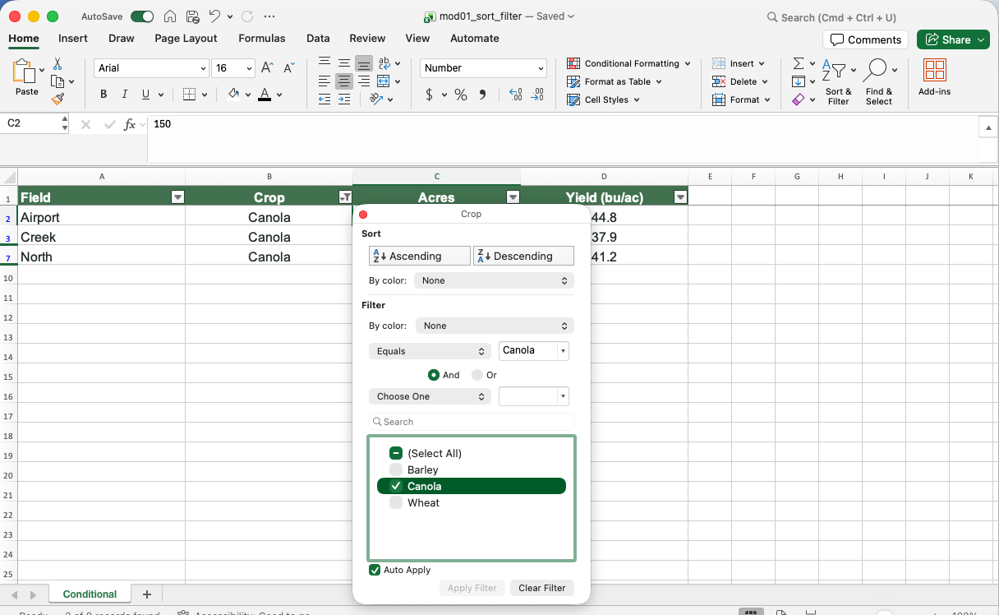

# Working with Data in Excel {#sec-excel-further}

The first chapter covered how a spreadsheet works. This chapter moves from simple calculations to working with real data in Excel: calculating statistics for subsets of observations, pulling information from one table into another, sorting and filtering data, and summarizing large datasets by category.

## Learning Objectives {.unnumbered}

::: {.objectives}
By the end of this chapter, you will be able to:

- Use `IF` to return one of two results depending on a condition
- Calculate statistics for subsets of data using `COUNTIF`, `SUMIF`, and `AVERAGEIF`
- Pull information from one table into another using `XLOOKUP`
- Sort and filter data without changing or corrupting the underlying dataset
- Explain how filtering affects what you see and what Excel formulas calculate
- Recognize wide and long data and identify which structure is appropriate for a task
- Summarize and compare groups of observations using a PivotTable
:::

## Conditional Functions {#sec-conditional-functions}

So far, our formulas have performed calculations without making decisions: multiply these two values, add this range, calculate its average. **Conditional functions** let a formula make a decision, or apply a calculation only when some condition is met.

### `IF` {#sec-if .unnumbered}

`IF` is the function that makes a decision. It looks at a condition and returns one of two values depending on whether that condition is true. The `IF` function has three arguments: (1) the condition to test, (2) the value to return if the condition is true, and (3) the value to return if the condition is false. Both the condition and the values returned can reference other cells.

In the following example, `IF` tests whether the value in D5 is greater than 50. If the condition is true, it returns the value in D6; if the condition is false, it returns the text No.

```
=IF(D5>50, D6, "No")
```

Column E of the workbook below uses `IF` to label each field `"Yes"` or `"No"`. Note the quotation marks: text inside a formula always needs them, and numbers never do.

::: {.workbook-callout}
::: {.excel-embed}
<iframe width="402" height="700" frameborder="0" scrolling="no" src="https://usaskca1-my.sharepoint.com/personal/pjs998_usask_ca/_layouts/15/Doc.aspx?sourcedoc=%7B914bfd54-1893-4ea6-a069-8c393ea9a169%7D&action=embedview&wdAllowInteractivity=False&wdDownloadButton=True&wdInConfigurator=True"></iframe>
:::

[Download this workbook](textbook_examples/mod01_conditional.xlsx) · [blank version to fill in yourself](textbook_examples/mod01_conditional_practice.xlsx) · [Open online](https://usaskca1-my.sharepoint.com/personal/pjs998_usask_ca/_layouts/15/Doc.aspx?sourcedoc=%7B914bfd54-1893-4ea6-a069-8c393ea9a169%7D&action=default) (File → Save a Copy to view formulas and edit)
:::


### `COUNTIF`, `SUMIF`, and `AVERAGEIF` {#sec-conditional-family .unnumbered}

`COUNT`, `SUM`, and `AVERAGE` calculate across an entire range. Each has a conditional version that performs the calculation using only observations that meet a specified condition -- the average yield on canola fields, for example, or the number of fields yielding more than 60 bushels per acre.

`COUNTIF` takes two arguments: the range to test and the condition to test for. `SUMIF` and `AVERAGEIF` take a third argument: the range containing the values to sum or average.

```
=COUNTIF(B5:B12, "Canola")
=SUMIF(B5:B12, "Canola", C5:C12)
=AVERAGEIF(B5:B12, "Canola", D5:D12)
```
The first formula counts the fields where column B contains Canola. The second identifies those same fields and adds up their acres from column C. For example, if B6 and B8 both contain Canola, the `SUMIF` formula will return `C6+C8`. `AVERAGEIF` works in the same way, except that it averages the corresponding values rather than adding them.

The two ranges must be the same size, but they do not technically need to contain the same row numbers. Excel matches the cells by their position within each range. For example, you could write: `=SUMIF(B5:B12, "Canola", D15:D22)`.  Here, B5 is paired with D15, B6 with D16, B7 with D17, and so on. If B6 and B8 contain Canola, Excel would therefore add D16+D18.

In practice, the ranges will usually cover the same rows of a dataset. The important point is that Excel matches their relative positions, not their row numbers.

Examples of these functions are in rows 15-20 of the workbook above.

::: {.callout-tip collapse="true"}
## Other resources — conditional functions (IF, COUNTIF, SUMIF, …)

- **Excel for Dummies** -- *Microsoft 365 Excel for Dummies*, the chapters on logical functions (`IF`) and on conditional counting/summing.
- **Microsoft Support** -- [IF function](https://support.microsoft.com/en-us/office/if-function-69aed7c9-4e8a-4755-a9bc-aa8bbff73be2), [COUNTIF](https://support.microsoft.com/en-us/office/countif-function-e0de10c6-f885-4e71-abb4-1f464816df34), [SUMIF](https://support.microsoft.com/en-us/office/sumif-function-169b8c99-c05c-4483-a712-1697a653039b), [AVERAGEIF](https://support.microsoft.com/en-us/office/averageif-function-faec8e2e-0dec-4308-af69-f5576d8ac642).
- **Video (IF function)** -- [*IF function in Excel tutorial*](https://www.youtube.com/watch?v=2mzGsJtJvLc).
- **Video (COUNTIF / SUMIF / AVERAGEIF)** -- [*How to use SUMIF, COUNTIF, and AVERAGEIF in Excel*](https://www.youtube.com/watch?v=O3GZmHdDQy8).
- **Video (broader formulas course)** -- Kevin Stratvert, [*Excel formulas and functions -- full course*](https://www.youtube.com/watch?v=Y8xhrUa3KH4) (includes an IF-function section).
:::


## Lookup Functions {#sec-lookup}

Data often arrive split across tables. You might have yields by field in one table and crop prices in another, but need both pieces of information for your analysis. A lookup lets us use information in one table to bring a corresponding value into another.

`XLOOKUP` is a function that allows us to look up a value. It takes three main arguments: the value to find, the range to search, and the range containing the value to return. For example:

```
=XLOOKUP(B11, $A$5:$A$7, $B$5:$B$7)
```

Excel searches `$A$5:$A$7` for whatever crop is named in `B11`, finds the matching position, and returns the value from the same position in `$B$5:$B$7`. Note the `$` signs: the crop being looked up changes from row to row, but the price table stays put, so its ranges are locked.

If there are multiple matches -- if Canola appeared twice in the price list -- `XLOOKUP` returns the value associated with the first match. This means that the value you are looking up should ideally identify a unique observation in the lookup table.

The workbook below has two tables: a short crop price list at the top, and the field data underneath. Column E uses `XLOOKUP` to find the price for each field's crop and bring it across, with the formula shown in column F.

::: {.workbook-callout}
::: {.excel-embed}
<iframe width="402" height="700" frameborder="0" scrolling="no" src="https://usaskca1-my.sharepoint.com/personal/pjs998_usask_ca/_layouts/15/Doc.aspx?sourcedoc=%7B1dc1b36e-393e-462b-b395-b6bd1fe4eae0%7D&action=embedview&wdAllowInteractivity=False&wdDownloadButton=True&wdInConfigurator=True"></iframe>
:::

[Download this workbook](textbook_examples/mod01_lookup.xlsx) · [blank version to fill in yourself](textbook_examples/mod01_lookup_practice.xlsx) · [Open online](https://usaskca1-my.sharepoint.com/personal/pjs998_usask_ca/_layouts/15/Doc.aspx?sourcedoc=%7B1dc1b36e-393e-462b-b395-b6bd1fe4eae0%7D&action=default) (File → Save a Copy to view formulas and edit)
:::

Sometimes one column is not enough to uniquely identify a row. Suppose each row represents one rural municipality in one year. RM 1 appears once for every year in the dataset, so looking up RM 1 alone will return whichever match appears first. To identify a particular observation, we need both the RM and the year.

One way to do this in Excel is to combine the two values into a single key and use that key for the lookup:

```
=XLOOKUP(1 & "|" & 2023, B2:B10650 & "|" & A2:A10650, E2:E10650)
```

Here, Excel effectively creates identifiers such as `1|2023`, `1|2024`, and `2|2023`, and then looks for the one we requested. The `|` is simply a separator between the two pieces of information.

The separator is important. Without one, different combinations can accidentally produce the same identifier. For example, 1 and 2023 would become `12023`, but so would 12 and 023.

A lookup needs enough information to uniquely identify the observation you want. Sometimes one variable is enough; sometimes you need a combination of variables. We will return to this idea when we learn how to join datasets later in the course.

::: {.callout-tip collapse="true"}
## Other resources — lookup functions (VLOOKUP, XLOOKUP, INDEX/MATCH)

- **Excel for Dummies** -- *Microsoft 365 Excel for Dummies*, the chapter on lookup and reference functions.
- **Microsoft Support** -- [VLOOKUP](https://support.microsoft.com/en-us/office/vlookup-function-0bbc8083-26fe-4963-8ab8-93a18ad188a1), [XLOOKUP](https://support.microsoft.com/en-us/office/xlookup-function-b7fd680e-6d10-43e6-84f9-8818e00d0651), [INDEX](https://support.microsoft.com/en-us/office/index-function-a5dcf0dd-996d-40a4-a822-b56b061328bd), [MATCH](https://support.microsoft.com/en-us/office/match-function-e8dffd45-c762-47d6-bf89-533f4a37673a).
- **Video (XLOOKUP)** -- Leila Gharani, [*How an Excel pro uses XLOOKUP*](https://www.youtube.com/watch?v=xnLvEhXWSas) (XLOOKUP vs VLOOKUP and INDEX/MATCH).
- **Video (VLOOKUP for beginners)** -- Kevin Stratvert, [*VLOOKUP in Excel -- step-by-step tutorial*](https://www.youtube.com/watch?v=xIynD1gFOLo).
- **Video (INDEX/MATCH)** -- Leila Gharani, [*The definitive guide to INDEX and MATCH*](https://www.youtube.com/watch?v=lCKglBM2jyk).
:::


## Sorting and Filtering {#sec-sort-filter}

Sorting and filtering are different from the functions we have used so far. Rather than calculating a new value, they change how the data in a worksheet are displayed and organized. The examples below use the same eight fields as before.

### Sorting {.unnumbered}

**Sorting** changes the order of the rows in a dataset. Click any cell in the column you want to sort by, then use **Sort & Filter** on the Home tab (or the corresponding buttons on the Data tab):

{#fig-sort-menu}

Sorting by Acres, smallest to largest, gives this:

{#fig-sort-result}


That last point is the one to be careful about.  Excel moved whole rows because the cursor
was sitting inside the table.  If you instead select a single column and sort *that*, Excel
reorders the cells in that column and leaves every other column in the same order (usually Excel will catch you and ask if you want to "Expand the selection" before doing this). 

### Filtering {.unnumbered}

**Filtering** temporarily hides observations that do not meet a condition. Turn filtering on from the same menu:

{#fig-filter-on}

Clicking one of those arrows opens a panel containing the values in that column:

{#fig-filter-dropdown}

If we select only Canola, Excel hides the other observations:

{#fig-filter-choosing}

{#fig-filter-applied}

Notice that the row numbers are no longer consecutive. The gaps indicate that some rows are hidden by the filter. This is an easy way to tell that you are viewing only part of the dataset. Nothing has been deleted -- clearing the filter makes all of the observations visible again.

`Ctrl+Shift+L` on Windows or `⌘⇧F` on a Mac toggles filters on and off.


::: {.callout-warning}
## Filters hide rows from *you*, not from your formulas

If you filter a column to show only 2023 and then write `=AVERAGE(E2:E10650)`, Excel still averages every row -- including the hidden ones. Filtering changes which rows you can see; it does not change the range used by an ordinary formula. You could therefore get the 1990--2025 average when you thought you were calculating the average for 2023.

To calculate a statistic for a *subset* of the data, you have several options:

- **Use a conditional function** such as `AVERAGEIF`, `SUMIF`, or `COUNTIF`. For example, `=AVERAGEIF(A2:A10650,2023,E2:E10650)` calculates the average of column E only for observations from 2023.
- **Copy the filtered observations to a new sheet** if you actually need a separate dataset containing only those observations. But be careful about creating unnecessary copies of your data.
- `SUBTOTAL` and `AGGREGATE` are functions that can calculate using only visible rows and therefore respond to filters. We will not cover them in this course.

Filtering is useful for exploring a subset of your data, but do not assume that a formula uses only the rows you can see.
:::

::: {.callout-tip collapse="true"}
## Other resources — sorting and filtering

- **Excel for Dummies** -- *Microsoft 365 Excel for Dummies*, the chapter on sorting and filtering data.
- **Microsoft Support** -- [Sort data in a range or table](https://support.microsoft.com/en-us/office/sort-data-in-a-range-or-table-62d0b95d-2a90-4610-a6ae-2e545c4a4654) and [Filter data in a range or table](https://support.microsoft.com/en-us/office/filter-data-in-a-range-or-table-01832226-31b5-4568-8806-38c37dcc180e).
- **Video (right-click method)** -- [*Excel sort and filter: skip the ribbon, use right-click*](https://www.youtube.com/watch?v=ntoMLncUqNM).
- **Video (basics)** -- The Organic Chemistry Tutor, [*Excel sorting and filtering data*](https://www.youtube.com/watch?v=O28-xL5YGkE).
:::


## Wide vs. Long Data {#sec-wide-long}

The same data can be arranged in different ways, and the shape of the data affects how easily we can work with them. Two common shapes are wide and long. The workbook below contains the same data in both forms on separate worksheets, with an explanation of the difference on the first worksheet.

::: {.workbook-callout}
::: {.excel-embed}
<iframe width="402" height="700" frameborder="0" scrolling="no" src="https://usaskca1-my.sharepoint.com/personal/pjs998_usask_ca/_layouts/15/Doc.aspx?sourcedoc=%7B3f9ef55b-c090-4e58-bf78-03239a045680%7D&action=embedview&wdAllowInteractivity=False&wdDownloadButton=True&wdInConfigurator=True"></iframe>
:::

[Download this workbook](textbook_examples/mod01_wide_long.xlsx) · [Open online](https://usaskca1-my.sharepoint.com/personal/pjs998_usask_ca/_layouts/15/Doc.aspx?sourcedoc=%7B3f9ef55b-c090-4e58-bf78-03239a045680%7D&action=default) (File → Save a Copy to view formulas and edit)
:::

In the wide table, crop names appear as column headings -- three crops, three columns of yields. In the long table, Crop is itself a column, with the crop names appearing as values, while all of the yields are stacked in a single Yield column. The information is the same; only its shape has changed.

Wide data are often easy for people to read and convenient for calculations involving individual columns. If you want the average canola yield, for example, you can simply average the Canola column. Long data are particularly useful when you want to group or summarize observations by a variable. In the long table, Crop is a variable that Excel can use to divide the observations into groups.

This becomes important for PivotTables. If we want a PivotTable showing average yield by crop, Excel needs Crop to be a field that it can group by. The long format provides exactly that: one column identifying the crop and another containing the yield.

::: {.callout-tip collapse="true"}
## Other resources — wide vs. long data

- **R for Data Science (Wickham)** -- the [Data tidying chapter](https://r4ds.hadley.nz/data-tidy) is the definitive treatment of tidy data and the wide/long distinction (we return to this in Module 3).
- **Video (concept + reshaping)** -- Riffomonas Project, [*Reshaping data to be long or wide with pivot_longer and pivot_wider*](https://www.youtube.com/watch?v=ZVddiwrbrr4). Uses R, but the *idea* of wide vs. long is exactly what we need here.
:::


## PivotTables {#sec-pivottables}

*Note that PivotTables are something that is best understood by seeing it in action -- I suggest videos over text for this section!!*

A **PivotTable** summarizes a dataset by category -- average yield by crop, total acres by year, or average yield by crop and year -- without requiring you to write formulas. This is one reason why long data are so useful: the variables stored in columns can become the categories that a PivotTable groups by.

You build a PivotTable by dragging the variable you want to group by into one box and the variable you want to summarize into another. The name comes from how easily you can **pivot** the resulting table: put crops down the rows and years across the columns, swap them, or add another variable to create more detailed groups -- all by dragging fields to different positions.

The workbook below puts this to work. Its Data tab contains every variety of six major crops over five years -- around a thousand rows, far too many to usefully inspect one at a time. Each row is a provincial total: acres are summed across all 21 risk zones and yield is an acreage-weighted average across them, so the rows are directly comparable. The three summary tabs show different ways a PivotTable can turn these data into useful summaries.

::: {.workbook-callout}
::: {.excel-embed}
<iframe width="402" height="700" frameborder="0" scrolling="no" src="https://usaskca1-my.sharepoint.com/personal/pjs998_usask_ca/_layouts/15/Doc.aspx?sourcedoc=%7Bad98bdea-c4de-4a91-a2f5-909c187fba4e%7D&action=embedview&wdAllowInteractivity=False&wdDownloadButton=True&wdInConfigurator=True"></iframe>
:::

[Download this workbook](textbook_examples/mod01_pivot.xlsx) · [Open online](https://usaskca1-my.sharepoint.com/personal/pjs998_usask_ca/_layouts/15/Doc.aspx?sourcedoc=%7Bad98bdea-c4de-4a91-a2f5-909c187fba4e%7D&action=default) (File → Save a Copy to view formulas and edit)
:::

To build one yourself, click any cell inside the data and select **Insert → PivotTable**.
Put the PivotTable on a new worksheet. Excel gives you an empty table and a list of the
variables in your data. Drag a variable into **Rows** to define the groups, and drag the
variable you want to summarize into **Values**. Drag another categorical variable into
**Columns** to create a two-way table. The **Filters** box lets you restrict the entire
summary to particular observations.

Be careful about how Excel summarizes the variable in **Values**. Excel will often default
to adding the values together. If you put Yield there, for example, Excel may report the
*sum* of all the yields -- a number with no useful interpretation. Instead, click the value
and use **Summarize Values By** to choose the statistic you actually want, such as Average.
The summary tabs in the workbook are built this way, so you can compare your results with
them.

Two other features are useful. **Show Values As** can display values as percentages of a
row, column, or grand total. And double-clicking a value inside a PivotTable creates a new
worksheet containing the observations behind that number. This is a quick way to investigate
a result that looks surprising.

Finally, before interpreting any summary, check the units. The six crops in this workbook
are all measured in bushels per acre, so their yields can be meaningfully compared. Pulse
crops such as lentils and chickpeas are reported in *pounds* per acre in the same source
data. Excel will happily average pounds per acre together with bushels per acre and return a
number -- but that number has no meaningful interpretation.

::: {.callout-tip collapse="true"}
## Other resources — PivotTables

- **Excel for Dummies** -- *Microsoft Excel Data Analysis for Dummies* (3rd ed.), the PivotTable chapters (this is one of the book's strongest topics).
- **Microsoft Support** -- [Create a PivotTable to analyze worksheet data](https://support.microsoft.com/en-us/office/create-a-pivottable-to-analyze-worksheet-data-a9a84538-bfe9-40a9-a8e9-f99134456576).
- **Video (beginner walkthrough)** -- Kevin Stratvert, [*How to create a pivot table in Excel*](https://www.youtube.com/watch?v=PdJzy956wo4).
:::


## Working Efficiently in Excel

Once datasets get large, you will start finding it clunky to navigate the worksheet with a mouse. Learning to navigate with keyboard shortcuts will make life much easier.

The most useful shortcut is **Command (⌘) + arrow** on a Mac or **Ctrl + arrow** on Windows.
It jumps to the edge of the current block of data. If you are at the top of a column
containing 10,000 observations, for example, `⌘`+`↓` or `Ctrl`+`↓` takes you to the bottom
almost instantly.

Adding **Shift** selects everything along the way. This is particularly useful when selecting
a range for a formula: instead of dragging down thousands of rows, click the first value and
use `⌘`+`Shift`+`↓` on a Mac or `Ctrl`+`Shift`+`↓` on Windows.

If there is a blank cell partway down a column, Excel may stop there. This can actually be
useful -- an unexpected stop may alert you to a blank in your data.

### A Few More Time-Savers {.unnumbered}

- **Use the fill handle.** The small square at the bottom-right corner of a selected cell
  lets you copy a formula to adjacent cells. Drag it down, or **double-click** it to fill the
  formula down alongside a neighbouring column of data. Relative and absolute references
  behave as described in [Relative and Absolute References](module01a.qmd#sec-references).

- **Freeze your headings.** For a long dataset, use **View → Freeze Panes → Freeze Top Row**
  to keep the variable names visible as you scroll.

- **Use Undo.** `⌘`+`Z` on a Mac or `Ctrl`+`Z` on Windows reverses your last action. This is
  particularly useful when experimenting with sorting, formulas, or formatting.

- **Use AutoSum.** The **Σ AutoSum** button on the Home tab will usually identify a nearby
  range of numbers and write the `SUM` formula for you. Always check that Excel selected
  the range you intended.

- **Paste values when you need the result rather than the formula.** Copy the cells and use
  **Paste Special → Values**. The pasted cells contain the resulting values rather than the
  formulas that produced them.

