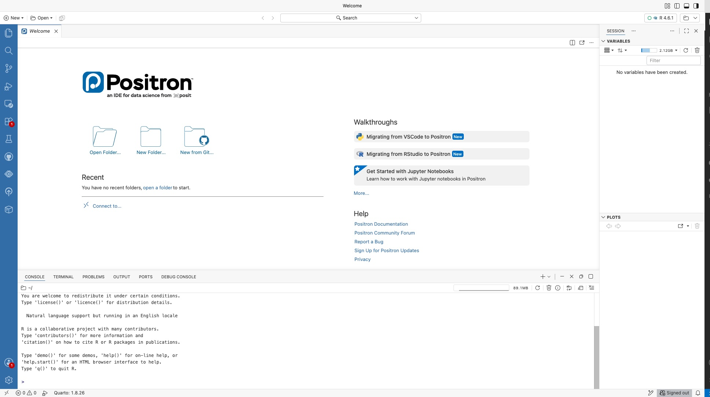

# Introduction to R and Positron {#sec-module2}

## Learning Objectives {.unnumbered}

::: {.objectives}
By the end of this module you should be able to:

1. Explain what R is and why we are using it in addition to Excel.
2. Install R and Positron, and run a simple R script.
3. Read a CSV file into R as a data frame.
4. Compute basic summary statistics (mean, median, sd, quartiles) in R.
5. Save a script that someone else can run from scratch and get the same results.
6. Use AI tools (GitHub Copilot, Claude, ChatGPT) productively to help write R code, while maintaining ownership of what the code does.
:::

## Why R? (And Why Also Excel?) {#sec-why-r}

You just spent a module getting comfortable with Excel. Now I am going to tell you to put it down and learn a new tool.   

Excel is an excellent tool for what it was designed to do: small-to-medium calculations where you can see every number on the screen, exploratory work, and handoffs to non-technical colleagues. But it has serious limitations:

- **Reproducibility.** An Excel workbook is a tangle of cells; there is no record of *what order* things were done in. If you want to re-run an analysis on new data, you have to click through the whole thing again.
- **Scale.** Excel caps out at a bit over a million rows per sheet and slows to a crawl well before that. Real datasets are often larger.
- **Composability.** Doing the same operation (e.g., compute summary statistics) on fifteen different files in Excel means clicking through the same steps fifteen times.
- **Advanced statistics.** Excel can do $t$-tests and linear regression, but the further you move from basic statistics, the worse a choice it is.

**R** is a programming language designed for statistical computing. R fixes every one of the limitations above. Your analysis is a **script** — a plain-text file that can be re-run, shared, version-controlled, and composed with other scripts. You can handle datasets of tens of millions of rows without trouble. You get access to thousands of packages written by statisticians around the world.

Learning **R** means learning to *program*. Writing code is a superpower -- you are no longer limited to using the apps someone else has developed -- you can now be the developer.  And this skill is about to become **enormously more powerful**, not less, because of AI. It is tempting to think "why learn to code when AI can write the code for me?" — but that has it backwards. AI is a spectacular *amplifier* for people who understand programming, just like a calculator is an amplifier for those who already understand basic mathematical operations.  

::: {.callout-tip collapse="true"}
## Other resources — why R?

- **R for Data Science (2nd ed.)** — the free, standard R textbook by Hadley Wickham and colleagues. The [Introduction](https://r4ds.hadley.nz/intro.html) lays out what data science is and the workflow (import → tidy → transform → visualize → model → communicate) we will follow.
- **Video** — R Programming 101, [*Why you should use R*](https://www.youtube.com/watch?v=9kYUGMg_14s) — a short, beginner-friendly pitch for learning R; a good first-day hook.
:::

## Installing R and Positron {#sec-installing-r}

You need two pieces of software to work with R:

1. **R itself** — the language and the program that runs your code. Download it from CRAN (the Comprehensive R Archive Network), <https://cran.r-project.org/>.   

2. **Positron** — the **editor** we will use to write R code. Download from <https://positron.posit.co/> and install it. Install R *first*, then Positron, so Positron can find your R.

You can think of an editor as being a bit like a web browser.  Chrome, Firefox, and Safari all read HTML code and show you a website.  Similarly, different editors (Positron, RStudio, VS Code) are all capable of running code in the **R** language.  My sense is that RStudio was previously the most common choice as an editor, but **Positron** -- which was developed by the same company as RStudio -- may quickly supplant it.  One reason for this is that using AI tools is a bit easier in Positron.

When Positron first opens you will see its Welcome screen, which looks something like this:

{#fig-positron-welcome}

::: {.callout-tip collapse="true"}
## Other resources — installing R and Positron

- **Positron documentation** — the [Download page](https://positron.posit.co/download.html) has installers for Windows, Mac, and Linux, plus the step for setting up R. The [docs home](https://positron.posit.co/) has guides and tutorials for first-time users.
- **Video** — Posit, [*Getting Started with Positron: A Quick Tour*](https://www.youtube.com/watch?v=mru9z50IOhI) — a short guided tour of the Positron interface.
:::

## The Console {#sec-console}

At the bottom of the screen is the console, where you can directly type commands and have **R** process them for you.  In the screenshot below I've typed in some random equations and we can see that **R** functions as a fancy calculator (following the typical order of operations):

{#fig-console-arithmetic}

One thing you will see in the output: each answer is printed with a `[1]` in front, like `[1] 9`. That `[1]` is just R noting that the value shown starts at position 1 of the result — it matters only when a result is a long list of numbers printed across several lines. For a single value you can ignore it.

### Saving answers as objects {#sec-console-objects .unnumbered}

A calculator forgets each answer as soon as it shows it. R does better: you can **save** a value under a name and reuse it later. This is the single most important idea in R. 

You save a value with the **assignment operator**, `<-` (a less-than sign and a dash, meant to look like a left-pointing arrow).  You can also use the `=` sign, but it is good coding practice to reserve the equals sign for other operations.  The thing you save is called an **object**.  In the screenshot below I saved `a` as an object equal to 4 and `b` as an object equal to `a*10`.


{#fig-console-assignment}

As you create objects, they appear in Positron's **Variables** pane on the right (the panel that lists everything you have created). In the screenshot, you can see `a` and `b` show up with their values as soon as they are assigned.

An object can hold more than a single number.  In the screenshot below, I save a **vector** of five values in an object called `yields` using the function `c()`, which *combines* values.  I can then perform operations on `yields` like calculating its mean.


INSERT SCREENSHOT

The whole rhythm of R is just this: **create objects with `<-`, and run functions on them**.  Sometimes we will save the results as new objects when we want to keep them, and we may perform operations on these objects.

### Why not just work in the console? {.unnumbered}


::: {.callout-tip collapse="true"}
## Other resources — the R console

- **Hands-On Programming with R** — a free, gentle beginner's book. [Chapter 2, "The Very Basics,"](https://rstudio-education.github.io/hopr/basics.html) opens exactly where we did: using R as a calculator, then objects and the `<-` assignment operator.
- **Video** — Sani, [*The R Console: Your First Steps in R*](https://www.youtube.com/watch?v=64FgvzqlRD4) — running commands and doing calculations directly in the console.
- **Video** — MarinStatsLectures, [*Basic Arithmetic and Coding in R*](https://www.youtube.com/watch?v=UYclmg1_KLk) — using R as a calculator (a classic beginner series).
:::

## R Scripts {#sec-first-script}

You should only ever type code directly into the console (as we did above) for quick, throwaway calculations.  For any real analysis — anything you want to re-run, check, share, or hand in — you need your code written down in a file you can save. That file is called a **script**, and it is the subject of the next section.

A **script** is a plain text file (ending in `.R`) where you *write and save* your code. The script is the permanent **recipe** for your analysis: you edit it, save it, and can re-run the whole thing later or share it with someone else. 

### Creating and running a script {.unnumbered}

Open Positron and create a new file with **File → New File**, then choose **R File** from the menu that appears:

{#fig-new-file}

Save it as `hello.R` (or whatever you want), then type (or paste) the following:

```r
# My first R script
# Author: your name
# Date: 2026-09-15

print("Hello, world!")
2 + 2
x <- c(1, 2, 3, 4, 5)
mean(x)
```

Here is the crucial thing that trips up beginners: **writing code in the script does not run it.** Typing these lines just puts text in a file. Look at the script below — the code is written, but the console is still empty and no objects exist yet in the Variables pane:

{#fig-script-before}

To actually run it, you have a two different options:

1. Click the **Run** button in the top right and either source the whole code to run all lines of your code, or "Execture code" to run just the selected lines (or the current line if noting is selected).

2. A faster way to run code is to just type **Cmd+Enter** (Mac) / **Ctrl+Enter** (Windows). 

After running all lines, the results appear in the **console**, and any objects you created show up in the **Variables** pane:

{#fig-script-after}

Let's break down what just happened:

- **Comments** start with `#` and are ignored by R. Use them liberally to explain your code.
- `print("Hello, world!")` prints text to the console.
- `2 + 2` evaluates an expression, just like in the console. R prints the result automatically.
- `x <- c(1, 2, 3, 4, 5)` is the "save an object" step you met in the console: it creates a **vector** of the numbers 1 through 5 and stores it under the name `x`. (You can write `=` instead of `<-`, but `<-` is traditional in R and I recommend it.)
- `mean(x)` is the "run a function on an object" step: it calls the `mean` function on `x` and hands back the result.

We should also note that the object `x` is now stored in **R**, and it will be stored until we exit this session or overwrite `x` with a new value.

This will be the last screen shot of **Positron** that I will show in the textbook.  From now on I will just show the code, and sometimes the results of this code.    

::: {.callout-tip collapse="true"}
## Other resources — R scripts

- **Video** — University of Surrey Library, [*Writing and running code: script vs console*](https://www.youtube.com/watch?v=2zXg0Pxapjs) — the difference between typing in the console and saving/running code in a script.
- **Video** — Sam Burer, [*The Basics of Scripts in R*](https://www.youtube.com/watch?v=NVglx_rthuM) — a short intro to what an R script is and how to run it.
:::

## R Basics: Types, Vectors, Data Frames, Functions {#sec-r-basics}

**R** works by having you store objects—which include simple numbers, vectors, matrices, data frames, regression models, charts, and more. To get started with data, we will learn about two of these objects: vectors and data frames.

Objects contain values of different types. Common types include character (text), numeric (numbers), and logical (TRUE/FALSE). Somewhat confusingly, the components of an object can themselves have different types. For example, a data frame consists of columns, and each column can contain a different type of data.

### Vectors {.unnumbered}

A **vector** is R's basic data structure. It is a sequence of values *of the same type* (all numbers, or all strings, etc.). You create one with `c()`:

```r
yields <- c(48, 52, 47, 55, 50)
varieties <- c("InVigor", "DK", "Clearfield", "InVigor", "DK")
is_irrigated <- c(TRUE, FALSE, FALSE, TRUE, FALSE)
```

If a vector is numeric then we can do arithmetic operations on it.  For example, say we have a vetor of yields in bu per acre and we want to convert it to tonnes per hectare, we can simply multiply the entire vector by a constant conversion factor.  
```r

```

### Data Frames {.unnumbered}

A **data frame** is R's word for a table: rows are observations, columns are variables. This is the main thing we will work with in this class

You can create one by hand, by combining vectors as in the following example:

```{r}
#| eval: true
fields <- data.frame(
  field_id = c("F01", "F02", "F03", "F04", "F05"),
  region = c("South", "South", "Central", "North", "North"),
  yield = c(48, 52, 47, 55, 50)
)
fields
```

But you will almost usually **read** a data frame from a CSV file. More on that in a moment.

You can access columns with the `$` operator.  For example, to get the column `yield` in our data frame `fields` we would type `fields$yield`.  You will even note that when you type `fields$` Positron will provide a dropdown of all the columns that you can choose from.  

```{r}
#| eval: true
fields$yield        # the yield column as a vector
mean(fields$yield)  # mean yield

fields$yield <- c(58, 62, 57, 65, 60) ##Reset the value of the yield column
mean(fields$yield)  # get the mean yield of the updated column
```

You can also extract any part of the data frame using square brackets denoting the row first then a comma then the column.  If you want a whole row, then leave the column blank, and vice-versa.  

```{r}
#| eval: true
fields[1, ]         # first row
fields[, 1]         # first column
fields[2, 3]        # in the second row, third column
```

### Functions {.unnumbered}

You call a function by writing its name followed by parentheses with arguments:

```r
mean(yields)            # 50.4
sd(yields)              # about 3.21
median(yields)          # 50
quantile(yields, 0.25)  # first quartile
length(yields)          # 5
```

To get help on a function, type `?function_name`:

```r
?mean
```

R will show you the documentation — what the function does, what its arguments mean, what it returns. Read it. R's documentation is sometimes terse but always authoritative.


::: {.callout-tip collapse="true"}
## Other resources — vectors, data frames, and functions

- **Hands-On Programming with R** — [Chapter 2, "The Very Basics"](https://rstudio-education.github.io/hopr/basics.html) (objects, vectors, and writing/using functions) and [the "R Objects" chapter](https://rstudio-education.github.io/hopr/r-objects.html) (vectors, matrices, and data frames in depth).
- **Video** — R Programming 101, [*Using functions and objects in R*](https://www.youtube.com/watch?v=hvFBDmT4bdY) — applying functions to objects, beginner-friendly.
- **Video** — Simon Sez IT, [*Introduction to vectors in R*](https://www.youtube.com/watch?v=DUWnw8G4udM) — creating vectors and doing calculations with them.
:::

## Reading Data from CSV {#sec-reading-data}

In practice, you almost always have data in a CSV file that you want to read into R. The modern way to do this uses the **tidyverse**, a collection of add-on **packages** for data manipulation that has become the standard for working with tabular data in R.

### Packages: install once, load every time {.unnumbered}

A **package** is a bundle of extra functions someone has written that do not come with R itself. Using one is a two-step process, and beginners constantly trip on the difference:

1. **Install it — once per computer.** This downloads the package from the internet and saves it on your machine. You only ever do this once (per computer):

    ```r
    install.packages("tidyverse")
    ```

    This prints a *lot* of text — progress bars and messages, sometimes in red. That red text is normal; it is not an error. Just wait for it to finish (it can take a few minutes the first time).

2. **Load it — once per script.** Installing puts the package on your computer, but it is not switched on until you *load* it. Put this at the **top of every script** that uses the tidyverse:

    ```r
    library(tidyverse)
    ```

If you skip the `library()` step and try to use a tidyverse function, R will stop with an error like:

```
Error in read_csv(...) : could not find function "read_csv"
```

That "could not find function" message almost always means **you forgot to load the package** (or you have not installed it yet). The fix is to run `library(tidyverse)` first. Note the quirk: you put quotes around the name when you *install* (`install.packages("tidyverse")`) but not when you *load* (`library(tidyverse)`).

### Reading the file, and the working directory {.unnumbered}

Once the tidyverse is loaded, you can read a CSV:

```r
yields <- read_csv("canola_yields_2025.csv")
```

`read_csv` (from the tidyverse) reads the file into a data frame and saves it in the object `yields`. It also prints a short note about what column types it guessed — check them, because R guesses well but not perfectly.

But here is the thing that stops almost every beginner the first time. When you write just `"canola_yields_2025.csv"` — a filename with no folder path — R looks for that file in one specific place called the **working directory**: the folder R currently considers "here." If the file is not in that folder, you get:

```
Error: 'canola_yields_2025.csv' does not exist in current working directory (...)
```

To fix this, you need the file and R to agree on where "here" is. Three ways, easiest first:

- **Check where R is looking** by running `getwd()` ("get working directory"). It prints the folder R is currently using.
- **Point R at the right folder** with `setwd("/full/path/to/your/folder")` ("set working directory"), or in Positron use **Session → Set Working Directory → Choose Directory…** and pick the folder that contains your CSV.
- **Best habit:** keep each analysis in its own folder, put the script *and* its data in that folder, and open that folder in Positron (**File → Open Folder…**). Then the working directory is already that folder and plain filenames just work.

A couple more notes:

- Alternatively you can give the *full path* to the file, e.g. `read_csv("C:/Users/you/Documents/data/canola_yields_2025.csv")`. Use forward slashes `/` even on Windows.
- If your file uses semicolons or tabs instead of commas, use `read_csv2` or `read_tsv`.

Once you have the data in, you can explore it:

```r
yields              # prints the data frame (first 10 rows)
head(yields)        # first 6 rows
tail(yields)        # last 6 rows
nrow(yields)        # number of rows
ncol(yields)        # number of columns
names(yields)       # column names
summary(yields)     # quick summary of every column
```

`summary()` is especially useful as a first look at a new dataset. For every numeric column it reports the min, max, mean, median, and quartiles; for text columns it simply notes how many values there are (and if a column is stored as a *factor* — a special categorical type — it counts each category). Always run it when you open a new dataset.

::: {.callout-tip collapse="true"}
## Other resources — reading data from CSV

- **R for Data Science (2nd ed.)** — [Chapter 7, "Data import"](https://r4ds.hadley.nz/data-import.html): reading files with `read_csv()`, column types, and common import problems.
- **readr documentation** — the [tidyverse readr reference](https://readr.tidyverse.org/) for `read_csv()` and its relatives.
- **Working directory & path errors** — [this chapter from *Mastering R Through Errors and Warnings*](https://bookdown.org/guokai8/mastering-r-through-errors/docs/working-directory-paths.html) explains `getwd()`/`setwd()` and the "file does not exist" error beginners hit constantly.
- **Video** — Science Grad School Coach, [*Read and load CSV files into R*](https://www.youtube.com/watch?v=B30wv33QzNY) — loading a CSV step by step.
:::

## Summary Statistics in R {#sec-r-summary-stats}

All the summary statistics you learned in Module 1 exist in R too:

```r
mean(yields$yield)
median(yields$yield)
sd(yields$yield)
var(yields$yield)
min(yields$yield)
max(yields$yield)
range(yields$yield)              # returns c(min, max)
quantile(yields$yield, 0.25)
quantile(yields$yield, c(0.25, 0.5, 0.75))  # multiple at once
IQR(yields$yield)
```

One thing to watch for: if your data has **missing values** (coded as `NA` in R), these functions will return `NA` by default. To compute the statistic ignoring the missing values, pass `na.rm = TRUE`:

```r
mean(yields$yield, na.rm = TRUE)
```

This is a common source of confusion. If `mean()` returns `NA` unexpectedly, the first thing to check is whether your data has missing values.

::: {.callout-tip collapse="true"}
## Other resources — summary statistics in R

- **Video** — Rob Spencer, [*Descriptive statistics using the `summary` function*](https://www.youtube.com/watch?v=rPSKX6460gY) — a short walkthrough of `summary()`.
- **Video** — Dr E Research Videos, [*Basic summary statistics in R*](https://www.youtube.com/watch?v=8XFmPP93w_Y) — mean, median, standard deviation, and the number summary.
:::

## The `dplyr` Verbs: A First Look {#sec-dplyr-verbs}

The tidyverse provides a set of **verbs** for manipulating data frames. You will meet them properly in Module 3, but I want to give you a taste now.

- `filter()` — keep rows matching a condition.
- `select()` — keep certain columns.
- `mutate()` — add new columns computed from existing ones.
- `summarise()` (or `summarize()`) — collapse many rows into a single summary row.
- `group_by()` — group rows by a variable, so that subsequent operations happen per group.
- `arrange()` — sort rows.

And one more piece of machinery: the **pipe operator** `|>` (or `%>%` in older code), which takes the thing on its left and passes it as the first argument to the thing on its right. This lets you chain operations into a readable sequence.

Example: "What is the mean yield of canola for each region, for fields larger than 100 acres?"

```r
yields |>
  filter(acres > 100) |>
  group_by(region) |>
  summarise(mean_yield = mean(yield, na.rm = TRUE),
            n = n()) |>
  arrange(desc(mean_yield))
```

Read it left to right, top to bottom: "Take the yields data, keep only fields over 100 acres, group by region, compute the mean yield and count in each group, and sort in descending order of mean yield."

This is a *declarative* style: you say what you want, not step by step how to get it. Compare it to the Excel equivalent (sort, filter, insert PivotTable, drag fields, adjust aggregation, sort). The R version is more concise, and — crucially — it is a script you can re-run on updated data without clicking anything.

We will spend all of Module 3 on these verbs. For now, just recognize that this is where we are heading.

::: {.callout-tip collapse="true"}
## Other resources — the dplyr verbs and the pipe

- **R for Data Science (2nd ed.)** — [Chapter 3, "Data transformation"](https://r4ds.hadley.nz/data-transform.html): `filter`, `select`, `mutate`, `summarize`, `group_by`, `arrange`, and the pipe. (This is the core of Module 3.)
- **dplyr documentation** — the [tidyverse dplyr reference](https://dplyr.tidyverse.org/), which lists all the main verbs.
- **Video** — Dataslice, [*Dplyr essentials: select, mutate, filter, group_by, summarise & more*](https://www.youtube.com/watch?v=Gvhkp-Yw65U) — one clear intro covering all the core verbs.
:::

## Writing Output to a File {#sec-writing-output}

To save a data frame back to a CSV, pass the object you want to save and the filename to write it to. For example, if you have built a summary table and stored it in an object called `region_summary`:

```r
write_csv(region_summary, "region_summary_2026-09-15.csv")
```

To save a plot (after making one with ggplot2, which comes in Module 4):

```r
ggsave("yield_histogram.png", width = 6, height = 4)
```

And to save the R **environment** (all the objects in memory) so you can pick up where you left off:

```r
save.image("session_2026-09-15.RData")
```

(Honestly, I rarely do that last one. If your script is reproducible, you should be able to re-run it from scratch to get back to where you were.)

## Writing Good R Scripts {#sec-good-scripts}

A few habits that will serve you well. I want you to internalize these early because they compound over time:

1. **Start every script with a header.** Your name, the date, what the script does, what input it expects, what output it produces.
2. **Load libraries at the top.** Not scattered throughout the file.
3. **Use comments to explain *why*, not *what*.** Anyone can read the code and see what it does. The comment should tell them why you did it that way.
4. **Use descriptive variable names.** `yield_by_region`, not `x1`. `mean_yield`, not `m`.
5. **Break long operations into named steps.** Instead of one giant pipe, assign intermediate results to variables with meaningful names.
6. **Make your script re-runnable from scratch.** If you have to click buttons or run commands in a specific order outside the script, something is wrong.
7. **Test on a subset first.** For large datasets, develop your analysis on the first 1000 rows until it works, then run on the full data.

A template:

```r
# ---
# Title: Canola yield summary by region
# Author: Your Name
# Date: 2026-09-15
# Input: canola_yields_2025.csv
# Output: region_summary_2026-09-15.csv
# Description:
#   Reads the 2025 canola yield data, filters to fields over
#   100 acres, and computes mean yield per region.
# ---

library(tidyverse)

# 1. Load data
yields <- read_csv("canola_yields_2025.csv")

# 2. Explore
summary(yields)

# 3. Summarise by region (only fields > 100 acres)
region_summary <- yields |>
  filter(acres > 100) |>
  group_by(region) |>
  summarise(mean_yield = mean(yield, na.rm = TRUE),
            n = n()) |>
  arrange(desc(mean_yield))

# 4. Save output
write_csv(region_summary, "region_summary_2026-09-15.csv")
```

Notice: this script is *self-documenting*. Six months from now, I can read it and understand exactly what it does. That is the goal.

::: {.callout-tip collapse="true"}
## Other resources — writing good, reproducible R scripts

- **The tidyverse style guide** — [style.tidyverse.org](https://style.tidyverse.org/) is the standard reference for naming, spacing, pipes, and generally readable R code.
- **Video** — Riffomonas Project (Pat Schloss), [*Keeping R code DRY with functions*](https://www.youtube.com/watch?v=XSRO4VKD-pc) — a good-habits video on not repeating yourself, from a reproducible-research series.
:::

## A Word on AI Coding Assistants {#sec-r-ai}

I mentioned AI in the Introduction. Let me be more specific now that we are actually writing code.

**What AI is good at:**

- Scaffolding a script from a description ("read this CSV, compute summary statistics by region, make a bar chart").
- Explaining error messages. Paste the error into Claude or ChatGPT and ask what it means; this is often faster than Googling.
- Suggesting the R function you want when you know what you want to do but not what it's called.
- Writing tedious boilerplate (regex patterns, date formatting, complex `case_when` conditions).

**What AI is bad at:**

- Understanding your specific dataset. AI will confidently assume columns have certain names, types, or meanings that they don't.
- Staying up to date with recent package changes.
- Deciding whether the analysis makes sense. It can write code that runs cleanly but answers the wrong question.
- Catching subtle bugs — e.g., silently dropping rows, using an approximate match when you need exact.

**How to use it responsibly:**

1. Read every line of code the AI suggests before you run it. If you don't understand a line, ask the AI to explain it, or look up the function yourself. **Do not run code you don't understand** — that is how you end up with an analysis that looks right but is wrong.
2. Run small tests. When the AI gives you a function, run it on a small example first and check the output by hand before applying it to the full dataset.
3. Verify claims. If the AI tells you "this function returns a list," check. If it tells you "there are 42 rows in the result," count them.
4. Keep a human-readable trail. Your final script should be something *you* wrote and understand, even if AI helped you draft it. If you cannot explain every line, it is not your script.

For this course: **you are allowed to use AI on assignments** (subject to instructions for specific assignments) as long as you can explain what every line does. On tests, you will be on your own — which is why building real understanding now matters.

## Worked Example: From CSV to Summary {#sec-module2-example}

Let's walk through a complete example. Download the small [`field_yields.csv`](practice/data/field_yields.csv) dataset (60 canola fields). You will:

1. Create a new folder for this exercise.
2. Save `field_yields.csv` in it.
3. Create a new file called `module2_exercise.R` in the same folder.
4. Write a script that:
   - Loads the tidyverse
   - Reads the CSV
   - Prints a summary
   - Computes the mean, median, and standard deviation of yield
   - Saves the results to an output CSV
5. Run the script from top to bottom. Confirm that the output file exists.
6. Close Positron, reopen, and re-run the script. Confirm you get the same output. This is what reproducibility feels like.

I will not spell out every line of the script here — half the point of the exercise is working it out. If you get stuck, the documentation for each function is always a `?` away, and the tidyverse website (<https://www.tidyverse.org/>) has excellent guides.

## Test Bank Sample {#sec-module2-test}

1. (Concept.) Give two reasons why we use R in addition to Excel. Give one situation where Excel is still the right choice.
2. (Syntax.) What does the `<-` operator do in R? What does `c()` do?
3. (Reading data.) You have a file called `yields.csv` in your working directory. Write one line of R that reads it into a data frame called `yields`.
4. (Summary.) Write R code that computes the mean, median, and standard deviation of the `yield` column of the `yields` data frame, ignoring any missing values.
5. (Scripting.) Explain why the following is a reproducibility problem:
   > "I changed the CSV file in Excel, then re-ran my R script."
6. (AI.) Describe one situation where using an AI coding assistant would help you, and one where it could lead you astray.

## Practice Exercises {#sec-module2-practice}

1. Install R and your editor of choice. Run `hello.R` from @sec-first-script.
2. Create a vector of the heights (in cm) of five people. Compute the mean, median, and standard deviation.
3. Download [`field_yields.csv`](practice/data/field_yields.csv) and write a script that reads it, prints `summary()`, and computes the mean of each numeric column.
4. Rewrite your Module 1 worked example (canola yields) as an R script. Compare the result with what you got in Excel.
5. Break your script intentionally (misspell a column name) and read the error message. Can you fix it?

