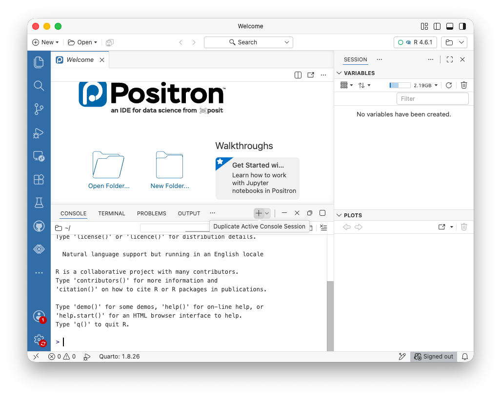
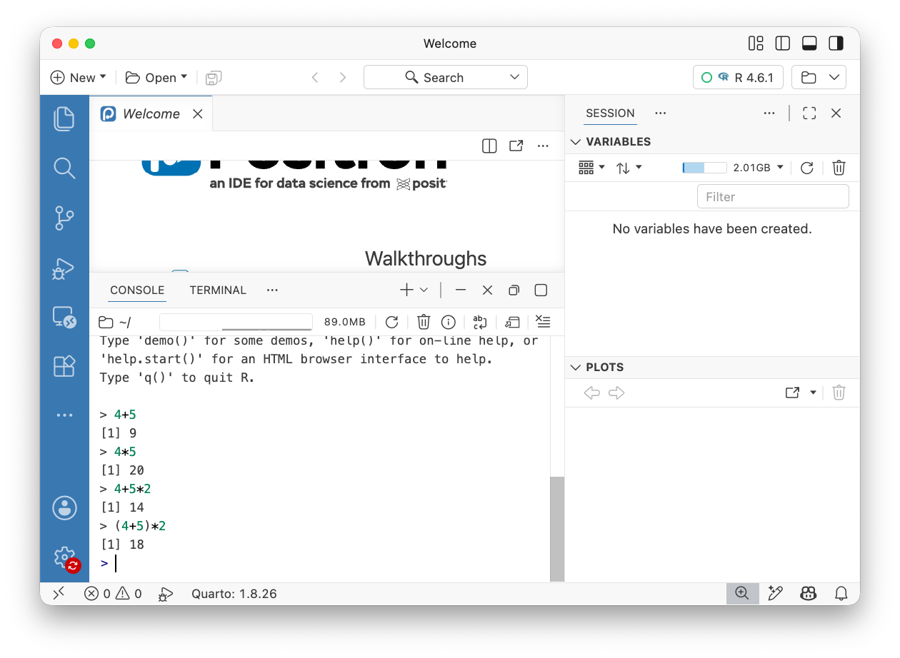
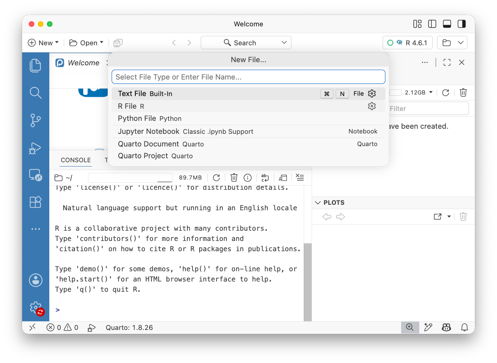
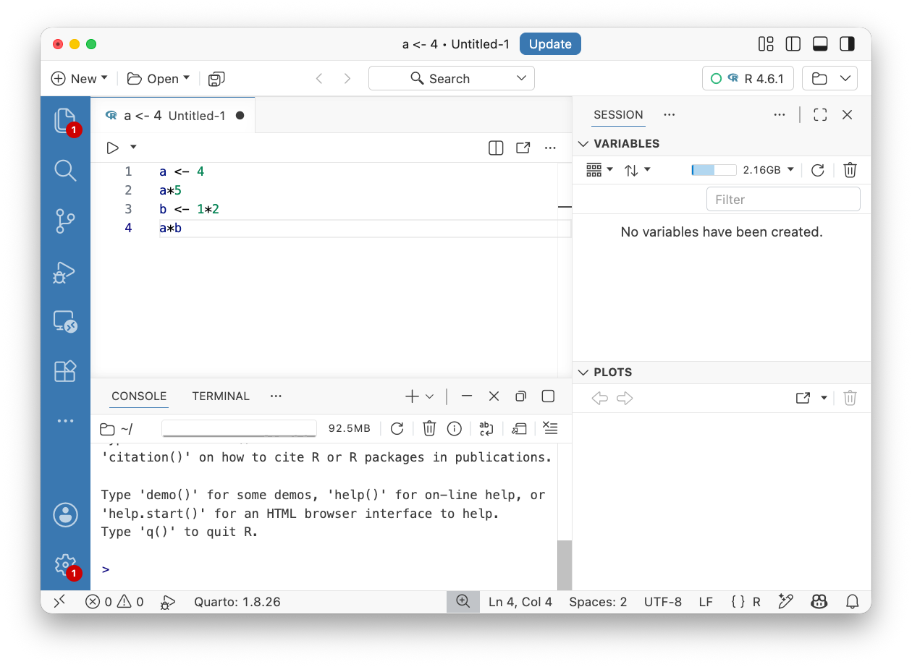
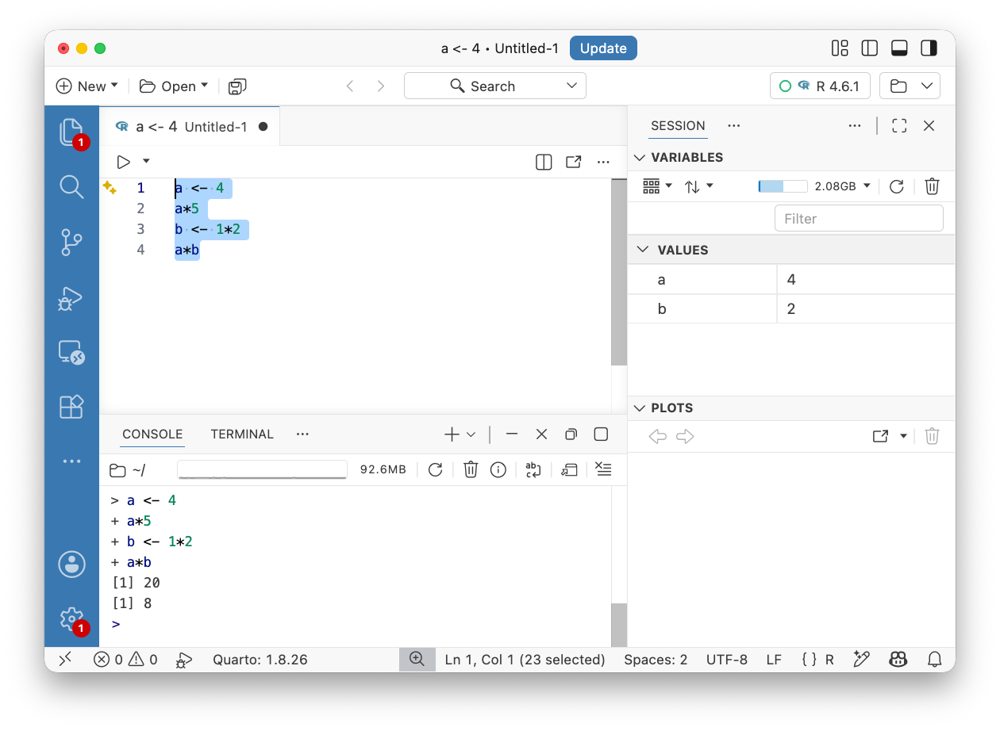

# Getting Started with R {#sec-r-start}

```{r}
#| include: false
#| eval: true
# Defines console(), which renders a code listing plus a full console session.
source("_console.R")
```

::: {.video-callout}
::: {.callout-note collapse="true" title="Video walkthrough of this chapter"}

:::
:::

In the first three chapters, we used Excel to enter, organize, summarize, and visualize
data. We now turn to **R**, a programming language built for working with data.

R requires a different way of working. In Excel, you manipulate data by clicking on cells,
menus, and buttons. In R, you write instructions as code. That takes some getting used to,
but it has several advantages.  Most importantly, the instructions themselves become a record of exactly
what you did.

This chapter introduces the basic mechanics. We will use R as a calculator, save values as
objects, write and run an R script, and introduce the two data structures we will use most
often: vectors and data frames.


## Why R? (And Why Also Excel?) {#sec-why-r}

You just spent several chapters getting comfortable with Excel. Now I am going to ask you to learn another tool.

Excel and R are good at different things. Excel is excellent when you want to see the data directly, make quick calculations, explore a relatively small dataset, or share a workbook with someone who does not program. We will continue to use it.

But Excel becomes awkward when an analysis gets larger or needs to be repeated. R has several advantages:

- **Reproducibility.** In R, the steps in an analysis are written down as code. Run the same code again and you repeat the same analysis. In Excel, many steps -- sorting, filtering, copying, clicking through menus -- leave little or no record of what you did.
- **Scale.** Excel worksheets are limited to a little over one million rows, and large workbooks become slow and difficult to manage well before that. R is designed to work with much larger datasets.
- **Repetition.** Suppose you need to perform the same analysis on fifteen files. In Excel, that means repeating the same sequence of clicks fifteen times. In R, you write the instructions once and reuse them.
- **Statistical analysis.** Excel handles basic descriptive statistics and regression reasonably well. R can do those things too, and it also gives us access to thousands of packages for more advanced statistical and data-analysis tasks.

I used to be more pessimistic about including R in this class.  One thing that has changed my mind is the emergence of AI tools.  Agentic AI, which we will learn in @sec-ai, has revolutionized coding. Coding without AI is now like doing long division by hand.  Of course, we still need to understand the principles of good coding, just as we need to understand the principles of division -- otherwise we wouldn't understand what the calculator (or the AI) is doing.  

::: {.callout-tip collapse="true"}
## Other resources — why R?

- **R for Data Science (2nd ed.)** -- the free, standard R textbook by Hadley Wickham and colleagues. The [Introduction](https://r4ds.hadley.nz/intro.html) lays out what data science is and the workflow (import → tidy → transform → visualize → model → communicate) we will follow.
- **Video** -- R Programming 101, [*Why you should use R*](https://www.youtube.com/watch?v=9kYUGMg_14s) -- a short, beginner-friendly pitch for learning R.
:::

## Installing R and Positron {#sec-installing-r}

You need two pieces of software to work with R:

1. **R itself** -- the language and the program that actually runs your R code. Download it from CRAN (the Comprehensive R Archive Network), <https://cran.r-project.org/>.

2. **Positron** -- the program we will use to write and run our R code. Download from <https://positron.posit.co/> and install it. Install R *first*, then Positron, so Positron can find your R.

It helps to distinguish the language from the program used to write it. A helpful analogy is a web browser.  Webpages are written in HTML, but you can view them in Chrome, Firefox, or Safari.  The same idea applies here: R is the language, and Positron is the **editor** we will use to work with it. Other editors, including RStudio and VS Code, can also run R code. We will use Positron because it provides a convenient environment for writing code, viewing data, and using modern AI coding tools.

When Positron first opens you will see its Welcome screen, which looks something like this:

{#fig-positron-welcome .screenshot}

::: {.callout-tip collapse="true"}
## Other resources — installing R and Positron

- **Positron documentation** -- the [Download page](https://positron.posit.co/download.html) has installers for Windows, Mac, and Linux, plus the step for setting up R. The [docs home](https://positron.posit.co/) has guides and tutorials for first-time users.
- **Video** -- Posit, [*Getting Started with Positron: A Quick Tour*](https://www.youtube.com/watch?v=mru9z50IOhI) -- a short guided tour of the Positron interface.
:::

## The Console {#sec-console}

At the bottom of the screen is the **console**, which lets you give R a command and immediately see the result. At first, you can think of R as a fancy calculator: type an expression like `4 + 5` or `4 * 5`, press Enter, and R evaluates it. R follows the usual order of operations, which you can see in the last two commands in the screenshot: `4+5*2` gives 14, while `(4+5)*2` gives 18.

{#fig-console-arithmetic .screenshot}

One thing you will see in the output: each answer is printed with a `[1]` in front, like `[1] 9`. The `[1]` does not mean the answer is 1. It tells you that the first value shown on that line is the first value in the result, which matters only when a result is a long sequence of values printed across several lines. For a single number you can ignore it.

### Saving answers as objects {#sec-console-objects .unnumbered}

A calculator gives you an answer and then forgets it. In R, we often want to save a result so that we can use it again. We do this by creating an **object**:

```r
a <- 4
```

Read this as "save 4 as `a`". The symbol `<-` is the **assignment operator**: it assigns the value on the right to the name on the left. We can then use `a` in another calculation. In the screenshot below I saved `a` as an object equal to 4 and `b` as an object equal to `a*2`.

{#fig-console-assignment .screenshot}

As you create objects, they appear in Positron's **Variables** pane on the right (the panel that lists everything you have created). In the screenshot, you can see `a` and `b` show up with their values as soon as they are assigned.

R also allows `=` for assignment in many situations. In this book we use `<-`: it keeps assignment visually distinct from `=` when we name arguments inside functions, and from `==`, which tests whether two values are equal.

An object can hold more than a single number.  Below, I save a **vector** of five values in an object called `yields` using the function `c()`, which *combines* values.  I can then perform operations on `yields` like calculating its mean.

```{r}
#| eval: true
#| echo: false
console('
yields <- c(48, 52, 47, 55, 50)
mean(yields)
')
```

This small example contains the basic pattern we will use throughout R: store data in objects, use functions to do things to those objects, and save new results when we want to use them later.

Typing commands directly into the console is useful for experimenting, but it is not how we should save an analysis.

::: {.callout-tip collapse="true"}
## Other resources — the R console

- **Hands-On Programming with R** -- a free, gentle beginner's book. [Chapter 2, "The Very Basics,"](https://rstudio-education.github.io/hopr/basics.html) opens exactly where we did: using R as a calculator, then objects and the `<-` assignment operator.
- **Video** -- Sani, [*The R Console: Your First Steps in R*](https://www.youtube.com/watch?v=64FgvzqlRD4) -- running commands and doing calculations directly in the console.
- **Video** -- MarinStatsLectures, [*Basic Arithmetic and Coding in R*](https://www.youtube.com/watch?v=UYclmg1_KLk) -- using R as a calculator (a classic beginner series).
:::

## R Scripts {#sec-first-script}

Suppose you calculate a mean in the console today and want to repeat the calculation next week with new data. Unless you remember exactly what you typed, the console is not much help. For any analysis you want to save, repeat, check, share, or hand in, write your code in an **R script**.

A script is a plain text file (ending in `.R`) containing R code. Think of the script as the recipe for your analysis: the data are the ingredients, and the script records the instructions. If the recipe is complete, you -- or someone else -- can run it later and reproduce the analysis.

### Creating and running a script {.unnumbered}

Open Positron and create a new file with **File → New File**, then choose **R File** from the menu that appears:

{#fig-new-file .screenshot}

Save it as `hello.R` (or whatever you want), then type (or paste) the following:

```r
##My first code
a <- 4
a*5
b <- 1*2
a*b
```

Writing code in the script does not run it. Typing these lines just puts text in a file. Look at the script below -- the code is written, but the console is still empty and no objects exist yet in the Variables pane:

{#fig-script-before .screenshot}

To actually run it, you have two options:

1. Click the **Run** button in the top right and either source the whole file to run every line, or "Execute code" to run just the selected lines (or the current line if nothing is selected).

2. A faster way to run code is to just type **Cmd+Enter** (Mac) / **Ctrl+Enter** (Windows).      This runs either the code you have selected or the line where your cursor is.

After running all lines, the results appear in the **console**, and any objects you created show up in the **Variables** pane:

{#fig-script-after .screenshot}

Let's break down what just happened:

- The first line is a comment.  Comments start with `#` and are not run as code -- they are meant to explain the code to yourself and anyone else who will use the code.
- `a <- 4` saves 4 as `a`. Notice that an assignment prints nothing to the console.
- `a*5` evaluates an expression, just like in the console, and prints `[1] 20`. The result is displayed but not saved anywhere.
- `b <- 1*2` calculates 1×2 and saves the result as `b`.
- `a*b` prints `[1] 8`.

The Variables pane now lists `a` and `b`, but nothing from the `a*5` line -- displaying a result and saving one are different things.  Note that `a` and `b` are now saved, and we can run further code that manipulates these objects.

The difference from our earlier console work is that the instructions are now saved. Close R, come back tomorrow, open `hello.R`, and the code is still there. Run it again and R repeats the same steps.

This will be the last screenshot of **Positron** that I will show in the textbook.  From now on I will just show the code, and the console output below it.

::: {.callout-tip collapse="true"}
## Other resources — R scripts

- **Video** -- University of Surrey Library, [*Writing and running code: script vs console*](https://www.youtube.com/watch?v=2zXg0Pxapjs) -- the difference between typing in the console and saving/running code in a script.
- **Video** -- Sam Burer, [*The Basics of Scripts in R*](https://www.youtube.com/watch?v=NVglx_rthuM) -- a short intro to what an R script is and how to run it.
:::

## R Basics: Types, Vectors, Data Frames, Lists, and Functions {#sec-r-basics}

R stores things as **objects**. An object might contain a single number, a sequence of numbers, a table of data, a statistical model, or even a graph. For now, we need three kinds of objects: **vectors**, which hold a sequence of values; **data frames**, which hold data in rows and columns; and **lists**, which can hold different kinds of objects together.

Values in R also have a **type**. The three types you will meet most often are numeric (numbers such as `48` or `-2`), character (text such as `"wheat"`), and logical (the values `TRUE` and `FALSE`). A vector contains values of one type, while a data frame can contain several columns of different types. You do not need to memorize a taxonomy of R objects and types; the important thing is to recognize what kind of information you are working with.

### Vectors {.unnumbered}

A **vector** is a sequence of values of the same type. You create one with `c()`:

```r
yields <- c(48, 52, 47, 55, 50)
varieties <- c("InVigor", "DK", "Clearfield", "InVigor", "DK")
is_irrigated <- c(TRUE, FALSE, FALSE, TRUE, FALSE)
```

Character values go inside quotation marks; numbers and the logical values `TRUE` and `FALSE` do not.

One reason vectors are so useful is that R can perform an operation on every value at once. Say the five yields are in bushels per acre and we want tonnes per hectare -- we multiply the whole vector by the conversion factor, without writing the calculation five times:

```{r}
#| eval: true
#| echo: false
console('
yields <- c(48, 52, 47, 55, 50)   # bushels per acre
yields * 0.0560                   # tonnes per hectare
')
```

This is called **vectorized** calculation, and it is one of the basic ways R works with data.

### Data Frames {.unnumbered}

A vector holds one variable. Real datasets usually contain many variables. In R a table of data is called a **data frame**. The shape is familiar from Excel: each row is an observation, and each column is a variable.

We will usually read data in from an external file (we will learn how in the next chapter).  But we can also create a data frame by combining vectors, as in the following example:

```{r}
#| eval: true
#| echo: false
console('
fields <- data.frame(
  field_id = c("F01", "F02", "F03", "F04", "F05"),
  region = c("South", "South", "Central", "North", "North"),
  yield = c(48, 52, 47, 55, 50)
)
fields
')
```

In this example `field_id`, `region`, and `yield` are variables; and each column is itself a vector.

Three functions report a data frame's shape: `nrow()` gives the number of rows, `ncol()` the number of columns, and `names()` the column names.

```{r}
#| eval: true
#| echo: false
console('
nrow(fields)

ncol(fields)

names(fields)
')
``` 

To refer to one column, use the `$` operator: `fields$yield` is the `yield` column of `fields`. When you type `fields$`, Positron provides a dropdown of the columns you can choose from. Because a column is a vector, you can use it in calculations:

```{r}
#| eval: true
#| echo: false
console('
fields$yield        # the yield column as a vector
mean(fields$yield)  # mean yield
')
```

### Lists {#sec-r-lists .unnumbered}

A vector contains values of one type, and a data frame is a rectangular collection of equal-length vectors. A **list** is more flexible.  Simply it is just a ordered collection of data.  For example, a list could have three elements.  The first two elements could be vectors, and the third could be a data frame.  In fact, one of the elements of a list could be another list -- this is called a nested list **nested list**.

Create a list with `list()`. Naming its elements makes them easier to find:

```{r}
#| eval: true
#| echo: false
console('
# Create a list containing a number and another list
weather <- list(
  latitude = 52.13,
  daily = list(
    date = c("2024-05-01", "2024-05-02"),
    precipitation = c(7.5, 4.1)
  )
)

# Display the structure of the nested list
str(weather)

# Extract one element from the outer list
weather$latitude

# Extract the daily list, then its precipitation vector
weather$daily$precipitation
')
```

The `$` operator selects a named element, just as it selects a column from a data frame. Each `$` moves down one level: `weather$daily` selects the list named `daily`, and the second `$` in `weather$daily$precipitation` selects the precipitation vector inside it.

Lists often appear when data do not fit naturally into one rectangular table. When R fetches data from a web service (@sec-data-packages), for example, the raw answer arrives as a nested list, and the columns of a data frame are extracted from it.


### Functions {.unnumbered}

Most of our work in R consists of applying **functions** to objects. A function is an instruction that takes some input, does something with it, and returns a result. We have already used several: `c()`, `mean()`, `data.frame()`.

The information supplied to a function is called an **argument**. In `mean(fields$yield)`, the function is `mean()` and the argument is `fields$yield`.

Here are the functions for the descriptive statistics from Module 1:

```{r}
#| eval: true
#| echo: false
console('
mean(fields$yield)       # Mean
median(fields$yield)     # Median
max(fields$yield)-min(fields$yield) #Range
var(fields$yield)        # Variance
sd(fields$yield)         # Standard deviation
sd(fields$yield)/mean(fields$yield) # Coefficient of variation
')
```

Some functions take multiple arguments.  For example, the function `quantile()` returns the value at a particular percentile.  Its two main arguments are `x`, the data, and `probs`, the percentile you want (expressed in decimal form).

There are two ways to supply the arguments.  First, write them in the correct order without naming them.  Second, name the arguments, in which case the order does not matter.  Named arguments are particularly useful when a function has several options, because the code then tells the reader what each value means.  The third example below shows what happens with unnamed arguments in the wrong order: R does not know what you meant, and here it produces an error.

```{r}
#| eval: true
#| echo: false
console('
quantile(fields$yield, 0.25)              # unnamed arguments, in the correct order

quantile(probs = 0.25, x = fields$yield)  # named arguments, in any order

quantile(0.25, fields$yield)              # unnamed arguments, in the wrong order')
```

You do not need to memorize every function or every argument. To get help on a function, type `?` followed by its name:

```r
?mean
```

R will show you the documentation: what the function does, what its arguments mean, what it returns.  It is often terse, but it is the authoritative answer, and knowing how to find it matters more than memorizing the details.

::: {.callout-tip collapse="true"}
## Other resources — vectors, data frames, lists, and functions

- **Hands-On Programming with R** -- [Chapter 2, "The Very Basics"](https://rstudio-education.github.io/hopr/basics.html) (objects, vectors, and writing/using functions) and [the "R Objects" chapter](https://rstudio-education.github.io/hopr/r-objects.html) (vectors, matrices, and data frames in depth).
- **Video** -- R Programming 101, [*Using functions and objects in R*](https://www.youtube.com/watch?v=hvFBDmT4bdY) -- applying functions to objects, beginner-friendly.
- **Video** -- Simon Sez IT, [*Introduction to vectors in R*](https://www.youtube.com/watch?v=DUWnw8G4udM) -- creating vectors and doing calculations with them.
:::

## Writing Good R Scripts {#sec-good-scripts}

You now know enough R to write a small analysis. Before we move on to real datasets, a few habits are worth establishing. The goal: someone should be able to open your script, understand what it does, and run it from beginning to end.

1. **Give the script a short header.** What the script is for, your name, and the date. For a larger project, also record the expected inputs and outputs.
2. **Use comments to explain your code.** Especially when you are just starting to write code, it is good practice to use a lot of comments.  A comment explains what you are doing and why. Just because you understand why you are doing something right now, doesn't mean you will remember it tomorrow (or that your collaborator will understand it).  As you get more comfortable with coding, you might use slightly fewer comments as you can more easily interpret your own code.

   I think there are two types of comments.  First, there are larger blocks of comments that might explain a whole section of code and then smaller comments that explain what is coming on the next line.  Some people like to keep comments on their own lines -- other people like to write comments at the end of a line.  Either approach works.  Just know that once you put in `#` everything else that follows on that line will be ignored.

3. **Use descriptive object names.** `mean_yield` and `total_acres`, not `x` and `data2`. A slightly longer name is usually worth it if it makes the code easier to understand.

4. **Break an analysis into understandable steps.** You do not need to cram everything into one line. Saving intermediate results makes code easier to inspect and debug.

5. **Make the script runnable from the beginning.** A script should not depend on commands you happened to type into the console earlier. Restart R, run the script from top to bottom, and it should reproduce the analysis.

The template below is a complete, if small, data analysis built from what this chapter covered: vectors, arithmetic on them, and functions. It computes total production and the acreage-weighted average yield for the five wheat fields from Module 1.

```r
# ---
# Title: Farm yield summary
# Author: Your Name
# Date: 2026-09-22
# Description:
#   Computes total production and the acreage-weighted
#   average yield for five wheat fields.
# ---

# 1. Data
yields <- c(48, 52, 47, 55, 50)    # bushels per acre
acres  <- c(310, 220, 95, 180, 150)

# 2. Production by field
production <- yields * acres

# 3. Total production
total_bu <- sum(production)

# 4. Farm average yield, weighted by acres
weighted_yield <- total_bu / sum(acres)

# 5. Print out results
total_bu
weighted_yield
```

It contains the data, records every calculation, uses meaningful names, and runs from beginning to end. Six months from now you can read this and know what it does.

In the next chapter, we stop creating tiny datasets by hand and learn how to bring real data into R.

::: {.callout-tip collapse="true"}
## Other resources — writing good, reproducible R scripts

- **The tidyverse style guide** -- [style.tidyverse.org](https://style.tidyverse.org/) is the standard reference for naming, spacing, and generally readable R code.
- **Video** -- Riffomonas Project (Pat Schloss), [*Keeping R code DRY with functions*](https://www.youtube.com/watch?v=XSRO4VKD-pc) -- a good-habits video on not repeating yourself, from a reproducible-research series.
:::
