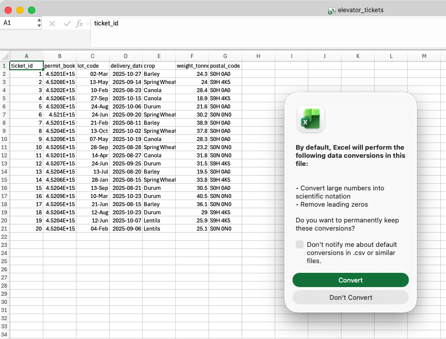
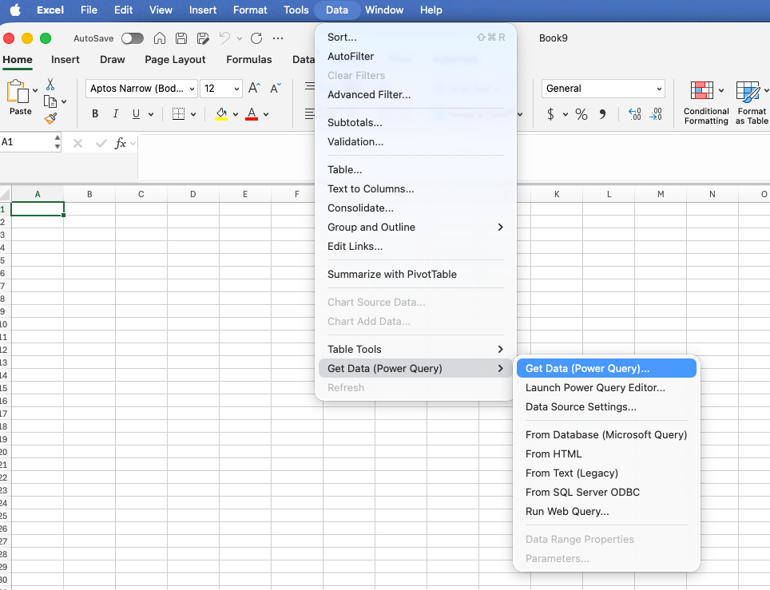
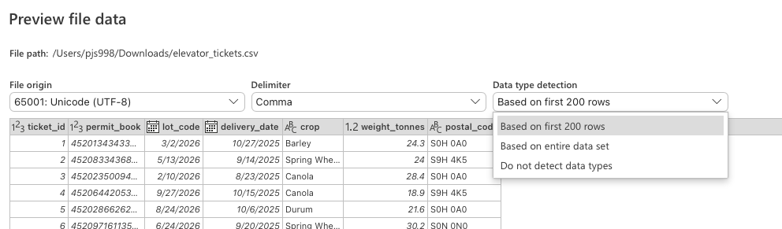

# Getting Data {#sec-getting-data}

```{r}
#| include: false
#| eval: true
# Load the helper that prints executed code as a console transcript
source("_console.R")
```

Every dataset in the book so far has arrived as a tidy table with sensible column names. Data does not normally show up that way. It shows up as an Excel workbook somebody emailed you with the numbers starting on row 8, as a CSV behind a link on a government dashboard, as a folder of monthly files, or as the answer a server sends back when a program asks it a question.

Getting the data is part of the analysis. Done well, it is repeatable, it leaves the original untouched, and it records enough that somebody else could fetch the same thing later. The chapter follows that order: decide what you need, find a source, fetch it, keep a raw copy, read it in, check it, write down where it came from. The tools differ between Excel and R; the order does not.

## Learning Objectives {.unnumbered}

::: {.objectives}
By the end of this chapter you should be able to:

1. Describe the table you need before you go looking for it.
2. Name the main public sources of agricultural data, and tell a manual download, a direct file link, an API, and a package that wraps an API apart.
3. Use Power Query to import a file with the column types set on the way in.
4. Read delimited text and Excel files into R with the column types stated, and find the values that failed to parse.
5. Fetch a file from the web, or download data with a package that wraps an API.
6. Keep a dated raw copy and a README that records source, units, parameters and retrieval date.
:::

## Start With the Table You Need {#sec-table-needed}

Do not start by downloading the biggest file you can find. Start by describing the table that would answer the question. For the question that runs through this module, whether Saskatchewan canola yields move with growing-season rain, that is:

- One row per rural municipality per year.
- Columns for canola yield and for May to August precipitation.
- Saskatchewan, roughly 2015 onward.
- Yield in bushels per acre, precipitation in millimetres.
- Something to identify each row: an RM number, a year, and whatever identifies a weather station.

Written out like this, the description says what to search for and whether a candidate file fits. It also shows that the yield and the rain will come from different agencies and will need a common identifier, which is the problem @sec-merging-data solves.

When you find a candidate, read its documentation before you read the data. What does one row represent? Who produced it, and is it measured, surveyed, or modelled? What are the units and the reference period? How are missing, suppressed or preliminary values marked? Is it revised after release? Is there a licence or attribution requirement? A file that opens without trouble can still be the wrong file.

## Where Agricultural Data Comes From {#sec-data-sources}

Some data you make yourself: a field trial, a survey, a sensor, the records from your own farm or business. Some is sent to you, usually as a spreadsheet. The rest has to be found, and for agriculture a lot of it is in the public domain. A short list of the places you can find data:

- **[Statistics Canada](https://www.statcan.gc.ca/en/subjects-start/agriculture_and_food).** Crop area, production and yield, livestock, prices, farm income, trade, the Census of Agriculture. The starting point for almost any Canadian question.
- **Saskatchewan Agriculture.** The weekly [crop report](https://www.saskatchewan.ca/business/agriculture-natural-resources-and-industry/agribusiness-farmers-and-ranchers/market-and-trade-statistics/crops-statistics/crop-report), the [crop planning guide](https://www.saskatchewan.ca/business/agriculture-natural-resources-and-industry/agribusiness-farmers-and-ranchers/farm-business-management/crop-planning-guide-and-crop-planner), and the [provincial dashboard](https://dashboard.saskatchewan.ca/agriculture), which is where the RM yields used in this module come from. The [Saskatchewan Crop Insurance Corporation](https://www.scic.ca/) publishes yields and premiums by risk zone.
- **Weather.** [Environment and Climate Change Canada](https://climate.weather.gc.ca/historical_data/search_historic_data_e.html) has daily observations from every station it has run, some going back to the 1880s. [Open-Meteo](https://open-meteo.com/en/docs/historical-weather-api) serves modelled weather for any latitude and longitude, which is useful where there is no station, with the caveat that it is a model estimate and not a gauge.
- **Soils.** The [Saskatchewan Soil Information System](https://sksis.usask.ca/) and the [Canadian Soil Information Service](https://sis.agr.gc.ca/cansis/).
- **Prices and markets.** AAFC's [market information system](https://agriculture.canada.ca/en/market-information-system), [ICE](https://www.ice.com/products/251/Canola-Futures) for canola futures, [Farm Credit Canada](https://www.fcc-fac.ca/en/knowledge/economics/farmland-values-report) for land values.
- **Drought.** The [Canadian Drought Monitor](https://agriculture.canada.ca/en/agricultural-production/weather/canadian-drought-monitor), monthly maps and data.
- **Outside Canada.** USDA's [QuickStats](https://quickstats.nass.usda.gov/) for the US, [FAOSTAT](https://www.fao.org/faostat/en/) for the world, the [World Bank](https://data.worldbank.org/) for anything macroeconomic.

It is best practice to obtain data directly from the agency that produces it. A chart in a news story is a good way to discover that a dataset exists; the agency's table is the thing to download.

One source worth knowing about now, though it waits for @sec-spatial-data: AAFC's [Annual Crop Inventory](https://open.canada.ca/data/en/dataset/ba2645d5-4458-414d-b196-6303ac06c1c9), a satellite classification of what grew in every 30-metre cell of Canadian farmland, every year since 2009.

## Downloading Data

We can obtain data in a few different ways. The simplest is to directly download data or have data sent to you in a `.csv`, `.xlsx` or some other file. This is how we have approached data so far in this class.  So far in the class we have been reading in data that is already fairly "clean".  Not all data is this simple.  In this chapter, we will overview some common issues with loading data.

We will also discuss obtaining data directly through R code.  Many data providers have an API (application programming interface) that allows you to request data directly from their server.  Using the API directly is a more advanced topic.  However, we will learn to use R packages that use APIs to download data -- in particular we will learn about the `openmeteo` package that allows the user to download weather data and the `cansim` package that allows the user to download data from Statistics Canada.


## Opening data files in Excel {#sec-excel-getting}

Excel's native file format is .xlsx.  But it can also open `.csv`, `.tsv`, `.txt` and other file formats.  One issue with Excel opening these files is that it can try to convert the data to formats that are not intended.  

For example, download [`elevator_tickets.csv`](practice/data/elevator_tickets.csv) -- twenty grain-delivery tickets -- and open it in Excel.  The following message pops-up, warning that excel will convert large numbers to scientific notation and remove leading zeros.  This is a problem because the data contains identifiers that are not meant to be treated as numbers.  It also has silently converted the lot codes to dates.   


{#fig-csv-doubleclick .screenshot}

### Power Query {#sec-power-query}

::: {.video-callout}
::: {.callout-note collapse="true" title="Video walkthrough of this section"}

:::
:::

A better -- though much more involved -- way of importing data into Excel is to use Power Query.  Power Query is found under **Data > Get Data**. We will use it more in the coming chapters. It reads a source, shows a preview, lets you fix the columns, and loads the result onto a sheet.
For the tickets file:

1. Choose **Data > Get Data > From Text/CSV** (on a Mac, **Data > Get Data (Power Query)**; the wording moves around between versions) and select the file.
2. In the preview, set **Data Type Detection** to **Do not detect data types**. This matters: once `00001` has been converted to the number `1`, changing it back to Text cannot restore the zeros.
3. Press **Transform Data** rather than **Load**. In the editor, use each column header's type icon to set `ticket_id`, `permit_book` and `lot_code` to Text, `delivery_date` to Date, and `weight_tonnes` to Decimal Number.
4. Choose **Close & Load**. Save the workbook as `.xlsx`, which keeps the query; saving as CSV throws it away.

::: {.callout-note collapse="true" title="Screenshots of these steps"}
{#fig-csv-getdata-menu .screenshot}

{#fig-csv-type-detection .screenshot}

{#fig-csv-type-text .screenshot}
:::

After loading, check it. The number of rows and columns is what you expected; the identifiers kept their zeros and all their digits; the dates cover the right period; the numbers are numbers; blanks did not become zeros.

<!-- Public view-only link expires 2026-11-20 under the USask 90-day policy. -->
::: {.workbook-callout}
::: {.callout-tip collapse="false" title="Workbook: elevator_tickets_correct.xlsx after importing with Power Query"}

::: {.excel-embed}
<iframe width="402" height="346" frameborder="0" scrolling="no" src="https://usaskca1-my.sharepoint.com/:x:/g/personal/pjs998_usask_ca/IQD955B7F1PqSaL5DFwl9gh7AQZwjKYJIwzw-xZ0Kcw0_54?e=99d1Ua&action=embedview&wdAllowInteractivity=False&wdHideGridlines=True&wdHideHeaders=True&wdDownloadButton=True&wdInConfigurator=True"></iframe>
:::

[Download this workbook](textbook_examples/elevator_tickets_correct.xlsx) · [Open online](https://usaskca1-my.sharepoint.com/:x:/g/personal/pjs998_usask_ca/IQD955B7F1PqSaL5DFwl9gh7AQZwjKYJIwzw-xZ0Kcw0_54?e=99d1Ua) (view only)
:::
:::


## Getting Data Into R {#sec-r-getting}

In R the whole acquisition is a script: the path or address, the parameters, the column types, the checks. Rerunning the script reruns the acquisition.

### CSV, TSV and other delimited files {#sec-csv-files}

The tidyverse functions come from **readr**. The two files used here are the same ones used in the Excel examples above:

```{r}
#| eval: true
#| echo: false
console('
# Load the tidyverse packages
library(tidyverse)

# Read the comma-delimited ticket file
tickets <- read_csv(
  "practice/data/elevator_tickets.csv"
)

# Print the first six rows
head(tickets)
')
```

In a CSV file, a comma delimits fields. Other text files may use a different **delimiter**. Use `read_delim()` for these files and specify the delimiter with its `delim` argument.

Much like Excel, `read_csv()` guesses each column's type from the first thousand values. In the console above, `ticket_id` kept its zeros and `lot_code` stayed as text. However, `permit_book` was read as a number, printed as `4.52e15`, and has already lost its last digits. We can state the types in `read_csv()` using the `col_types` argument. `cols()` creates a named list in which each column name is paired with the type that column should have.

```{r}
#| eval: true
#| echo: false
console('
# Read the ticket file and state the important column types
tickets <- read_csv(
  "practice/data/elevator_tickets.csv",
  col_types = cols(
    # Keep ticket identifiers as text
    ticket_id = col_character(),
    # Keep permit-book identifiers as text
    permit_book = col_character(),
    # Keep lot codes as text
    lot_code = col_character(),
    # Read dates in year-month-day order
    delivery_date = col_date("%Y-%m-%d")
  )
)

# Print the first six rows
head(tickets)
')
```

Columns not named in `cols()` are still guessed.  We can read Excel files directly in R using the **readxl** package. 

### Direct download {#sec-direct-download}

To this point, where he have used `read_csv()`, we have used a path on our computer as the file name.  We can also use a URL in place of a path.  For example, the average RM yields that we have been using in this course can be directly download from the Government of Saskatchewan's website. 
```{r}
#| eval: true
#| echo: false
console('
# Store the direct download URL
rm_yields_url <- "https://dashboard.saskatchewan.ca/export/rm-yields-data/4950.csv"

# Read the CSV directly from the web
rm_yields <- read_csv(rm_yields_url)

# Save a dated snapshot of the data in the project data folder
write_csv(rm_yields, "data/rm_yields_2026-08-22.csv")

# Print the first six rows
head(rm_yields)
')
```

Note that when we download the data it is best to always store a copy of the data on our computer.  This saves us from having to dowload the data multiple times, and protects us against the data provider alterning their url or removing the data completely.
There are some issues with these data. For example, `Winter Wheat` contains a space, so R prints the name in backticks. We will standardize names in @sec-cleaning-r.

### Downloading data via an R package {#sec-data-packages}

::: {.video-callout}
::: {.callout-note collapse="true" title="Video walkthrough of this section"}

:::
:::

Many data providers allow their data to be downloaded though an API (application programming interface).  Essentially, that data is kept o na server and a request can be sent to the server to ask for certain data.  For example, we could ask the Statistics Canada API for averge wheat yields in Saskatchewan from 2020-2025.  Querying APIs directly is a more advanced topic.  Fortunately, R packages exsit that will make these API calls for you, once you provide the information that you need.  Let's look at two of these pacakges:

1. **openmeteo** package is one example.  When you load this package you can use the function `weather_history()` to directly download data.  As with all functions, if you want to understand the arguments that you need to supply to weather history type `?weather_history` in your console.  In this case you will see that you need to supply at least three arguments, start, end and either hourly or daily:

2. **cansim** package allows you to download data from Statistics Canada.  The function `get_cansim()` allows you to download data from a specific table.  For example, if we wanted to download the nitrogen fertilizer price index (Table: 18-10-0258-01) we could use the following code:


To use the openmeteo package, we first need to install it.  This is a bit of a special package as it doens't live on CRAN, but rather on GitHub.  To install it we first need to install the remotes package from CRAN, and then use that to install openmeteo from GitHub.

```r
# Install remotes from CRAN
install.packages("remotes")

# Install openmeteo from GitHub
remotes::install_github("tpisel/openmeteo")
```

After installation, we can use the weather_history() function to download data.  This function requires four arguments:

1. Location (in logitude and latitude)
2. The start date/time of the data you want
3. The end date/time of the data you want
4. One of either hourly or daily, depending on the time scale of the data you want.  For these arguments you must specify the variable that you want: tempreature_2m, precipitation_sum, windspeed_10, etc.
5. You can also specify the timezone of the data you want.  If you don't specify a timezone, the default is Grenwhich mean time.  That is to say if you ask for precipitation at 2pm, it will give you the precipitation at 2pm GMT, which is not very useful for us in Saskatchewan.  So we will specify the timezone as "America/Regina".

For example, 

```{r}
#| eval: true
#| echo: false
console('
# Load the Open-Meteo API wrapper
library(openmeteo)

# Request hourly precipitation for Saskatoon, May 1-5, 2024, in the America/Regina timezone
saskatoon_rain_package <- weather_history(
  c(52.13, -106.67),
  start = "2024-05-01",
  end = "2024-05-05",
  hourly = "precipitation"
)

# Print the returned data frame
saskatoon_rain_package
')
```


#### The cansim package {#sec-cansim}

The **cansim** package downloads any Statistics Canada table by its table number. It installs from CRAN:

```r
# Install cansim from CRAN
install.packages("cansim")
```

The main function is `get_cansim()`, which takes the table number as its only required argument. Earlier in the chapter we downloaded seeded acres by clicking through the website for table 32-10-0359-01. The same table arrives as a data frame in one call:

```{r}
#| eval: true
#| echo: false
console('
# Load the Statistics Canada wrapper
library(cansim)

# Download table 32-10-0359-01 (seeded acres, production and yield)
field_crops <- get_cansim("32-10-0359-01")

# Print the dimensions of the table
dim(field_crops)
')
```

`get_cansim()` returns the whole table -- every province, crop, year and harvest disposition -- so it is large, and the numbers sit in a column named `VALUE`. The functions from @sec-dplyr-verbs cut it down to the piece you want:

```{r}
#| eval: true
#| echo: false
console('
# Keep Saskatchewan canola seeded acres since 2015
sask_canola_acres <- field_crops |>
  filter(
    GEO == "Saskatchewan",                              # Saskatchewan only
    `Type of crop` == "Canola (rapeseed)",              # canola only
    `Harvest disposition` == "Seeded area (acres)",     # seeded acres
    REF_DATE >= 2015                                    # 2015 onward
  ) |>
  select(REF_DATE, GEO, VALUE)                          # keep three columns

# Print the result
sask_canola_acres
')
```

The table number records exactly what was downloaded, and rerunning the script fetches the current version of the table. `get_cansim()` also caches the download, so a script that reads the same table twice only fetches it once.

## A final note on saving data {#sec-readme}

When building your project folder it is best practice to keep data seperate from code.  It is also best to store raw data seperately from cleaned and processed data.  The raw data is never edited by you.  

```
project/
  data/
    raw/          files exactly as retrieved, never edited
    processed/    written by scripts
  R/
  README.md
```

Then in the README.md you can log the provenance of each dataset.


::: {.callout-tip collapse="true"}
## Other resources — getting data

- **Microsoft** -- [What is Power Query?](https://learn.microsoft.com/en-us/power-query/power-query-what-is-power-query) and the [Web connector](https://learn.microsoft.com/en-us/power-query/connectors/web/web).
- **readr** -- [column types](https://readr.tidyverse.org/articles/column-types.html); **readxl** -- [`read_excel()`](https://readxl.tidyverse.org/reference/read_excel.html).
- **openmeteo** -- [package documentation and source code](https://github.com/tpisel/openmeteo).
- **cansim** -- [package documentation](https://mountainmath.github.io/cansim/).
:::
