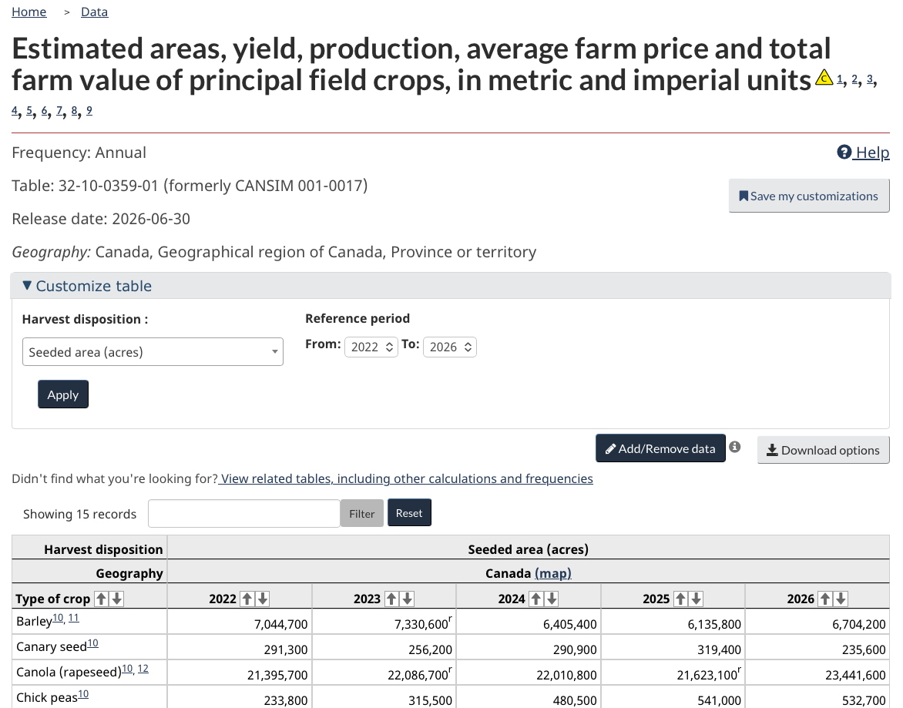

# Getting Data {#sec-getting-data}

```{r}
#| include: false
#| eval: true
# Load the helper that prints executed code as a console transcript
source("_console.R")
```

Every dataset in the book so far has arrived as a tidy table with sensible column names. Data does not normally show up that way. It shows up as an Excel workbook somebody emailed you with the numbers starting on row 8, as a CSV behind a link on a government dashboard, as a folder of monthly files, or as the answer a server sends back when a program asks it a question.

Getting the data is part of the analysis. Done well, it is repeatable, it leaves the original untouched, and it records enough that somebody else could fetch the same thing later. The chapter follows that order: decide what you need, find a source, fetch it, keep a raw copy, read it in, check it, write down where it came from. The tools differ between Excel and R; the order does not.

## Learning Objectives {.unnumbered}

::: {.objectives}
By the end of this chapter you should be able to:

1. Describe the table you need before you go looking for it.
2. Name the main public sources of agricultural data, and tell a manual download, a direct file link, an API, and a package that wraps an API apart.
3. Explain the parts of an API request and what comes back.
4. Use Power Query to import a file, a folder of files, a file on the web, or a simple API, with the column types set on the way in.
5. Read delimited text and Excel files into R with the column types stated, and find the values that failed to parse.
6. Fetch a file or make an API request from R.
7. Keep a dated raw copy and a README that records source, units, parameters and retrieval date.
:::

## Start With the Table You Need {#sec-table-needed}

Do not start by downloading the biggest file you can find. Start by describing the table that would answer the question. For the question that runs through this module, whether Saskatchewan canola yields move with growing-season rain, that is:

- One row per rural municipality per year.
- Columns for canola yield and for May to August precipitation.
- Saskatchewan, roughly 2015 onward.
- Yield in bushels per acre, precipitation in millimetres.
- Something to identify each row: an RM number, a year, and whatever identifies a weather station.

Written out like this, the description says what to search for and whether a candidate file fits. It also shows that the yield and the rain will come from different agencies and will need a common identifier, which is the problem @sec-merging-data solves.

When you find a candidate, read its documentation before you read the data. What does one row represent? Who produced it, and is it measured, surveyed, or modelled? What are the units and the reference period? How are missing, suppressed or preliminary values marked? Is it revised after release? Is there a licence or attribution requirement? A file that opens without trouble can still be the wrong file.

## Where Agricultural Data Comes From {#sec-data-sources}

Some data you make yourself: a field trial, a survey, a sensor, the records from your own farm or business. Some is sent to you, usually as a spreadsheet. The rest has to be found, and for agriculture a lot of it is in the public domain. A short list of the places you can find data:

- **[Statistics Canada](https://www.statcan.gc.ca/en/subjects-start/agriculture_and_food).** Crop area, production and yield, livestock, prices, farm income, trade, the Census of Agriculture. The starting point for almost any Canadian question.
- **Saskatchewan Agriculture.** The weekly [crop report](https://www.saskatchewan.ca/business/agriculture-natural-resources-and-industry/agribusiness-farmers-and-ranchers/market-and-trade-statistics/crops-statistics/crop-report), the [crop planning guide](https://www.saskatchewan.ca/business/agriculture-natural-resources-and-industry/agribusiness-farmers-and-ranchers/farm-business-management/crop-planning-guide-and-crop-planner), and the [provincial dashboard](https://dashboard.saskatchewan.ca/agriculture), which is where the RM yields used in this module come from. The [Saskatchewan Crop Insurance Corporation](https://www.scic.ca/) publishes yields and premiums by risk zone.
- **Weather.** [Environment and Climate Change Canada](https://climate.weather.gc.ca/historical_data/search_historic_data_e.html) has daily observations from every station it has run, some going back to the 1880s. [Open-Meteo](https://open-meteo.com/en/docs/historical-weather-api) serves modelled weather for any latitude and longitude, which is useful where there is no station, with the caveat that it is a model estimate and not a gauge.
- **Soils.** The [Saskatchewan Soil Information System](https://sksis.usask.ca/) and the [Canadian Soil Information Service](https://sis.agr.gc.ca/cansis/).
- **Prices and markets.** AAFC's [market information system](https://agriculture.canada.ca/en/market-information-system), [ICE](https://www.ice.com/products/251/Canola-Futures) for canola futures, [Farm Credit Canada](https://www.fcc-fac.ca/en/knowledge/economics/farmland-values-report) for land values.
- **Drought.** The [Canadian Drought Monitor](https://agriculture.canada.ca/en/agricultural-production/weather/canadian-drought-monitor), monthly maps and data.
- **Outside Canada.** USDA's [QuickStats](https://quickstats.nass.usda.gov/) for the US, [FAOSTAT](https://www.fao.org/faostat/en/) for the world, the [World Bank](https://data.worldbank.org/) for anything macroeconomic.

It is best practice to obtain data directly from the agency that produces it. A chart in a news story is a good way to discover that a dataset exists; the agency's table is the thing to download.

## Downloading Data

In this course, we will obtain data in four ways.

| Route | What you do | What you get | Good for |
|---|---|---|---|
| Manual download | Choose options on a website, click **Download** | A CSV or Excel file | Exploring, one-off work |
| Direct file link | Give Excel or R the address of a published file | The same file, fetched by a program | Simple repeatable retrieval |
| API | Send a structured request to a server | Usually JSON, sometimes CSV | Selecting exactly what you want; anything automated |
| Package | Call an R function that builds the request and tidies the answer | A data frame | Providers with a maintained package |

Manual downloads and direct file links are fairly self-explanatory. For example, if we want data on seeded acres in each province, we can visit [Statistics Canada table 32-10-0359-01](https://www150.statcan.gc.ca/t1/tbl1/en/tv.action?pid=3210035901), customize the table and click **Download options**.

{#fig-statcan-download .screenshot}

If we want yields for each RM in Saskatchewan, we can get them from the provincial Ministry of Agriculture. The [direct link downloads the CSV](https://dashboard.saskatchewan.ca/export/rm-yields-data/4950.csv); the [crop production dashboard](https://dashboard.saskatchewan.ca/business-economy/business-industry-trade/crop-production) provides more information about the data.

You may not yet have encountered the latter two options: APIs and software packages.

### APIs {#sec-apis}
An **API** (application programming interface) is a documented way for one program to ask another for data. Your program sends a request that says what it wants, and the server sends back a response containing just that. The request is a line of text, so it is recorded, repeatable, and easy to change.

For a simple data API, the request is a URL with the choices written into it. For example, to obtain precipitation data for May 1 to May 5, 2024, we can use this URL: <https://archive-api.open-meteo.com/v1/archive?latitude=52.13&longitude=-106.67&start_date=2024-05-01&end_date=2024-05-05&daily=precipitation_sum&timezone=America/Regina>.

The URL looks complex, but it is easier to parse when broken into its components:

```
https://archive-api.open-meteo.com/v1/archive
    ?latitude=52.13
    &longitude=-106.67
    &start_date=2024-05-01
    &end_date=2024-05-05
    &daily=precipitation_sum
    &timezone=America/Regina
```

The first line is the **endpoint** for Open-Meteo. Everything after the question mark consists of query parameters. The first two parameters contain the latitude and longitude, the next two contain the start and end dates, the sixth line requests daily precipitation, and the final line sets the time zone. Changing these parameters requests different data. The [Open-Meteo documentation](https://open-meteo.com/en/docs/historical-weather-api) lists the available parameters.

If the request succeeds the server answers with a status code, `200`, and a body. Data APIs mostly answer in **JSON**, a text format that nests values under labels rather than laying them out as rows and columns. The answer to our above request is:

```json
{"latitude":52.126537,"longitude":-106.74034,
  "generationtime_ms":3.182649612426758,
  "utc_offset_seconds":-21600,
  "timezone":"America/Regina",
  "timezone_abbreviation":"GMT-6",
  "elevation":486.0,
  "daily_units":{
    "time":"iso8601",
    "precipitation_sum":"mm"},
  "daily":{
    "time":["2024-05-01","2024-05-02","2024-05-03","2024-05-04","2024-05-05"],
    "precipitation_sum":[7.50,4.10,2.80,3.00,0.00]}}
```

The line breaks are only for readability. The final line tells us that daily precipitation was 7.5 mm on May 1, 4.1 mm on May 2 and so on.

If the request fails the status code says roughly why: `400` is a malformed request, `401` or `403` a permissions problem, `404` nothing at that address, `500` the server's fault. Leave `longitude` out of the request above and Open-Meteo answers `400`.

Many APIs ask for a **key**, a free password that identifies who is asking, which you request once from the provider and send with every request. USDA's QuickStats needs one; Open-Meteo does not. A key identifies *you*, so keep it out of any workbook or script you share. The usual habit is to put it in an environment variable or a separate file that you do not share, and have the script read it from there.

Two other API issues you may encounter. Some APIs return only the first page of a large result and expect you to ask for the rest. Most limit how many requests you can make in a minute. And rerunning the same request later can return different numbers, because the provider revised them, which is why the raw copy in @sec-raw-copy matters as much for an API as for a file.

Direct API requests can be difficult because the response is often nested JSON. An R package can wrap the request and return a data frame; the `openmeteo` example in @sec-data-packages uses the same parameters as this URL.

## Getting Data Into Excel {#sec-excel-getting}

Excel can open a file by double-clicking it. For anything you will do twice, Power Query is the better route, and it is the one this section builds up to.

### File Formats

An `.xlsx` file can hold several sheets, formatting, formulas and charts. The older `.xls` does the same with more limits. Files other people send you are usually one of these, and the things to look for on opening are which sheet holds the data and whether the table starts on row 1 or under a title and some notes.

A **CSV** (comma-separated values) file is plain text. Each line is a row and commas separate the fields. It keeps no formulas, no formatting, no column types and no second sheet, which is why it is the usual format for passing data between programs and why most downloads come this way. A **TSV** uses tabs. A `.txt` file may use tabs, semicolons, pipes or something else; open it in a text editor to see. The simplicity is the point, and it also means the program that opens the file has to guess what each field is.

### What double-clicking a CSV does {#sec-csv-excel}

Download [`elevator_tickets.csv`](practice/data/elevator_tickets.csv), which contains twenty grain-delivery tickets, and open it directly in Excel. Excel tries to be helpful by assigning types to the columns. On current versions of Excel for Mac, you should see the warning in Figure @fig-csv-doubleclick.

{#fig-csv-doubleclick .screenshot}

By clicking **Convert**, you are accepting two operations:

- Leading zeros disappear. `00451` becomes `451`, and an RM number or a postal code loses its shape.
- Long numbers turn into scientific notation. A 16-digit account number displays as `1.23E+15`, and the last digits are rounded away for good.

After the conversion, the identifiers look quite different. Excel also interpreted the lot codes as dates.

<!-- Public view-only link expires 2026-11-20 under the USask 90-day policy. -->
::: {.workbook-callout}
::: {.callout-tip collapse="false" title="Workbook: elevator_tickets.xlsx after Excel's automatic conversions"}

::: {.excel-embed}
<iframe width="402" height="346" frameborder="0" scrolling="no" src="https://usaskca1-my.sharepoint.com/personal/pjs998_usask_ca/_layouts/15/Doc.aspx?sourcedoc={9d996bbe-a578-4e19-982e-7f603d73faea}&action=embedview&wdAllowInteractivity=False&wdHideGridlines=True&wdHideHeaders=True&wdDownloadButton=True&wdInConfigurator=True&waccluster=CA3&edaebp="></iframe>
:::

[Download this workbook](textbook_examples/elevator_tickets.xlsx) · [Open online](https://usaskca1-my.sharepoint.com/:x:/g/personal/pjs998_usask_ca/IQC-a5mdeKUZTpguf2A9c_rqAXCA1uhiQ8ATsYUFTgp_60U?e=ODC9XU) (view only)
:::
:::

There are two issues. First, the conversions are wrong and have to be corrected. Second, correcting them by hand leaves no record of what we did. For a quick calculation we could save the result as an `.xlsx` file, but Power Query records the import steps and can repeat them.


### Power Query {#sec-power-query}

Power Query is Excel's import tool, under **Data > Get Data**. It reads a source, shows a preview, lets you fix the columns, and loads the result onto a sheet. Two things make it the right default. It lets you set each column's type before anything is loaded. And it records every step, so when the source changes you press **Refresh** and the same steps run again on the new data. The import becomes a recipe rather than a set of manual fixes.

For the tickets file:

1. Choose **Data > Get Data > From Text/CSV** (on a Mac, **Data > Get Data (Power Query)**; the wording moves around between versions) and select the file.
2. In the preview, set **Data Type Detection** to **Do not detect data types**. This matters: once `00001` has been converted to the number `1`, changing it back to Text cannot restore the zeros.
3. Press **Transform Data** rather than **Load**. In the editor, use each column header's type icon to set `ticket_id`, `permit_book` and `lot_code` to Text, `delivery_date` to Date, and `weight_tonnes` to Decimal Number.
4. Choose **Close & Load**. Save the workbook as `.xlsx`, which keeps the query; saving as CSV throws it away.

{#fig-csv-getdata-menu .screenshot}

{#fig-csv-type-detection .screenshot}

{#fig-csv-type-text .screenshot}

After loading, check it. The number of rows and columns is what you expected; the identifiers kept their zeros and all their digits; the dates cover the right period; the numbers are numbers; blanks did not become zeros.

<!-- Public view-only link expires 2026-11-20 under the USask 90-day policy. -->
::: {.workbook-callout}
::: {.callout-tip collapse="false" title="Workbook: elevator_tickets_correct.xlsx after importing with Power Query"}

::: {.excel-embed}
<iframe width="402" height="346" frameborder="0" scrolling="no" src="https://usaskca1-my.sharepoint.com/personal/pjs998_usask_ca/_layouts/15/Doc.aspx?sourcedoc={7b90e7fd-5317-49ea-a2f9-0c5c25f6087b}&action=embedview&wdAllowInteractivity=False&wdHideGridlines=True&wdHideHeaders=True&wdDownloadButton=True&wdInConfigurator=True&waccluster=CA3&edaebp="></iframe>
:::

[Download this workbook](textbook_examples/elevator_tickets_correct.xlsx) · [Open online](https://usaskca1-my.sharepoint.com/:x:/g/personal/pjs998_usask_ca/IQD955B7F1PqSaL5DFwl9gh7AQZwjKYJIwzw-xZ0Kcw0_54?e=99d1Ua) (view only)
:::
:::

On Windows, Power Query can also retrieve a direct download or API response through **From Web**. That option is not available in the same form on a Mac. I find the interface clunky even on Windows, so this course uses R for APIs, particularly when a package is available.


## Getting Data Into R {#sec-r-getting}

In R the whole acquisition is a script: the path or address, the parameters, the column types, the checks. Rerunning the script reruns the acquisition.

### CSV, TSV and other delimited files {#sec-csv-files}

The tidyverse functions come from **readr**. The two files used here are the same ones used in the Excel examples above:

```{r}
#| eval: true
#| echo: false
console('
# Load the tidyverse packages
library(tidyverse)

# Read the comma-delimited ticket file
tickets <- read_csv(
  "practice/data/elevator_tickets.csv"
)

# Print the first six rows
head(tickets)
')
```

In a CSV file, a comma delimits fields. Other text files may use a different **delimiter**. Use `read_delim()` for these files and specify the delimiter with its `delim` argument.

Much like Excel, `read_csv()` guesses each column's type from the first thousand values. In the console above, `ticket_id` kept its zeros and `lot_code` stayed as text. However, `permit_book` was read as a number, printed as `4.52e15`, and has already lost its last digits. We can state the types in `read_csv()` using the `col_types` argument. `cols()` creates a named list in which each column name is paired with the type that column should have.

```{r}
#| eval: true
#| echo: false
console('
# Read the ticket file and state the important column types
tickets <- read_csv(
  "practice/data/elevator_tickets.csv",
  col_types = cols(
    # Keep ticket identifiers as text
    ticket_id = col_character(),
    # Keep permit-book identifiers as text
    permit_book = col_character(),
    # Keep lot codes as text
    lot_code = col_character(),
    # Read dates in year-month-day order
    delivery_date = col_date("%Y-%m-%d")
  )
)

# Print the first six rows
head(tickets)
')
```

Columns not named in `cols()` are still guessed. For a file you read repeatedly, stating the important types is worth doing: it documents what you expect, and when the file changes, the mismatch shows up at the read rather than three steps later when a summary comes back wrong. After checking all seven types, the compact equivalent is `col_types = "cccDcdc"`. Add `show_col_types = FALSE` only after you have made those choices explicit.

A value that does not fit the stated type does not stop the script. R puts in `NA`, warns, and records the problem, and `problems()` lists what it recorded. `grain_deliveries_messy.csv`, the file @sec-cleaning works through, has one weight typed with its unit:

```{r}
#| eval: true
#| echo: false
console('
# Read the messy deliveries file and require a numeric weight
deliveries <- read_csv(
  "practice/data/grain_deliveries_messy.csv",
  col_types = cols(
    # Parse weight as a double
    weight_tonnes = col_double()
  )
)

# List values that failed to parse
problems(deliveries)
')
```


### Excel files {#sec-readxl}

We can read Excel files directly in R using the **readxl** package. It installs with the tidyverse but is not loaded by `library(tidyverse)`, so load it separately. Excel workbooks can contain many sheets. By default, `read_excel()` reads the first sheet, but the `sheet` argument can identify another sheet by name or position, such as `2` for the second sheet.

Spreadsheets built by people often have something above the table: a title, a note about units or a blank row. R takes the first row as column names regardless. The `skip` argument tells R to ignore a stated number of rows at the top.

The code below shows three attempts to read the barley workbook. The first reads the README sheet instead of the data. The second reads the correct sheet but treats its title as the header. The third reads the correct sheet and skips the three rows above the table.

```{r}
#| eval: true
#| echo: false
console('
# Load the package for reading Excel workbooks
library(readxl)

# Read the first sheet in the workbook
barley_first_sheet <- read_excel(
  "practice/data/sask_barley_2025.xlsx"
)

# Print the first six rows of the README sheet
head(barley_first_sheet)

# Read the Barley_2025 sheet without skipping its title rows
barley_no_skip <- read_excel(
  "practice/data/sask_barley_2025.xlsx",
  sheet = "Barley_2025"
)

# Print the first six rows of the incorrectly imported table
head(barley_no_skip)

# Read the Barley_2025 sheet and skip the three title rows
barley <- read_excel(
  "practice/data/sask_barley_2025.xlsx",
  sheet = "Barley_2025",
  skip = 3
)

# Print the first six rows of the correctly imported table
head(barley)
')
```

An alternative to `skip` is to specify the range of cells to import. This can exclude both rows and columns.

```{r}
#| eval: true
#| echo: false
console('
# Read only cells A4 through C36 on the Barley_2025 sheet
barley <- read_excel(
  "practice/data/sask_barley_2025.xlsx",
  range = "Barley_2025!A4:C36"
)

# Print the first six rows
head(barley)
')
```

`read_csv()` takes `skip` too. Print the object after reading it either way; the shape of what comes back is the quickest check that you read the right thing.

### A file on the web {#sec-direct-download}

`read_csv()` accepts a URL in place of a path, so the RM yields can be read straight from the dashboard:

```{r}
#| eval: true
#| echo: false
console('
# Store the direct download URL
rm_yields_url <- "https://dashboard.saskatchewan.ca/export/rm-yields-data/4950.csv"

# Read the CSV directly from the web
rm_yields <- read_csv(rm_yields_url)

# Print the first six rows
head(rm_yields)
')
```

There are some issues with these data. For example, `Winter Wheat` contains a space, so R prints the name in backticks. We will standardize names in @sec-clean-names.

### Keep a raw copy {#sec-raw-copy}

Reading from the URL is fine for a look. It is not fine for a project because the file at that address can be revised or replaced; in this case, the RM data are updated at least once a year. Download the file into a raw-data folder, include the retrieval date in its filename and record where it came from.

```{r}
#| eval: true
#| echo: false
console('
# Create the raw-data directory if it does not exist
dir.create("data/raw", recursive = TRUE, showWarnings = FALSE)

# Record the retrieval date in the file name
raw_file <- "data/raw/rm_yields_2026-08-22.csv"

# Download the file only when the dated copy is absent
if (!file.exists(raw_file)) {
  # Save the web response without opening or changing it
  download.file(rm_yields_url, destfile = raw_file, mode = "wb")
}

# Read the saved raw file
rm_yields <- read_csv(raw_file)

# Print the first six rows
head(rm_yields)
')
```

The script records how the data were obtained. The `if` statement downloads the file only on the first run; subsequent runs read the dated copy already on disk.

### Calling an API {#sec-api-r}

The **httr2** package builds a request one part at a time, which makes the parts visible. The Open-Meteo request from @sec-apis:

```{r}
#| eval: true
#| echo: false
console('
# Load the package for making HTTP requests
library(httr2)

# Start a request and add the location, dates, variable and time zone
weather_request <- request("https://archive-api.open-meteo.com/v1/archive") |>
  req_url_query(
    latitude = 52.13,
    longitude = -106.67,
    start_date = "2024-05-01",
    end_date = "2024-05-05",
    daily = "precipitation_sum",
    timezone = "America/Regina"
  )

# Print the request object
weather_request

# Show the request without sending it
req_dry_run(weather_request)

# Send the request and store the response
weather_response <- req_perform(weather_request)

# Print the HTTP status code
resp_status(weather_response)
')
```

`request()` names the endpoint, `req_url_query()` adds and encodes the parameters, and `req_dry_run()` lets you inspect the request before sending it. `req_perform()` sends it and already stops on an HTTP error such as `400` or `404`; `resp_status()` reports the successful response's code.

The body is JSON. `resp_body_json()` turns it into nested R lists, and `tibble()` picks out the two lists we want:

```{r}
#| eval: true
#| echo: false
console('
# Convert the JSON response to nested R objects
weather_json <- resp_body_json(weather_response, simplifyVector = TRUE)

# Put the date and precipitation vectors into a data frame
saskatoon_rain <- data.frame(
  # Convert the date strings to Date values
  date = as.Date(weather_json$daily$time),
  # Extract daily precipitation in millimetres
  precipitation_mm = weather_json$daily$precipitation_sum
)

# Print the resulting data frame
saskatoon_rain
')
```

Every API's JSON is shaped differently. The first time you use one, run `str(weather_json)` and read the provider's documentation rather than guessing field names. Save the raw response too, with `writeLines(resp_body_string(weather_response), "data/raw/saskatoon_2024-05.json")`, for the same reason as the raw CSV.

### Packages that wrap an API {#sec-data-packages}

Where a package exists for the provider, it can build the request and unpack the JSON for us. The **openmeteo** package provides `weather_history()`, which accepts the same location, dates, variable and time zone used in the request above.

The package is not on CRAN, so install it from GitHub once. Installation code is not evaluated when the book renders:

```r
# Install remotes from CRAN
install.packages("remotes")

# Install openmeteo from GitHub
remotes::install_github("tpisel/openmeteo")
```

After installation, one function call returns a data frame:

```{r}
#| eval: true
#| echo: false
console('
# Load the Open-Meteo API wrapper
library(openmeteo)

# Request historical precipitation for Saskatoon
saskatoon_rain_package <- weather_history(
  c(52.13, -106.67),
  start = "2024-05-01",
  end = "2024-05-05",
  daily = "precipitation_sum",
  timezone = "America/Regina"
)

# Print the returned data frame
saskatoon_rain_package
')
```

The package hides the request-building and JSON-unpacking steps, but it does not freeze the data. Running the same call later may return revised values, so save a dated raw copy when the exact version matters (@sec-raw-copy).

## Check It Arrived {#sec-validate-import}

A successful import means the software read something. Before using it, look at whether it read the right thing. In R:

```{r}
#| eval: true
#| echo: false
console('
# Show the ticket table dimensions, types and example values
glimpse(tickets)

# List any values that failed to parse
problems(tickets)

# Summarize each ticket column
summary(tickets)

# Count repeated ticket identifiers
tickets |>
  count(ticket_id) |>
  filter(n > 1)
')
```

That covers the dimensions and types, the values that failed to parse, the minimums and maximums, and whether the column that should identify a row does. Add to it: do the dates and the geography cover what you expected, are the units explicit, and do a handful of rows agree with what the provider's website shows?

In Power Query, turn on **View > Column quality**, **Column distribution**, and **Column profile**. Failed type conversions appear as Error; empty, distinct, and unique counts help find missing values and duplicate identifiers. After loading, the same basic checks are the row count, a filter on the identifier, `MIN`, `MAX`, and `COUNTBLANK`. The full tour of what goes wrong in the values is @sec-cleaning.

## Say Where It Came From {#sec-readme}

Keep raw data apart from anything derived from it:

```
project/
  data/
    raw/          files exactly as retrieved, never edited
    processed/    written by scripts
  R/
  README.md
```

Never edit the only copy of a raw file. If a value must be corrected, correct it in code, or in a recorded Power Query step, where the change is visible.

Every project gets a `README.md` at the top, saying what the project is and where each dataset came from. It does not need to be long, but it needs the provider, the page the data was found on, the direct link or endpoint and its parameters, the unit of observation, the units, the retrieval date, and the name of the raw file.

```
# Canola yields and growing-season rain

Question: do Saskatchewan canola yields move with May-August rainfall?

## Data

data/raw/rm_yields_2026-08-21.csv
  Government of Saskatchewan dashboard, https://dashboard.saskatchewan.ca/agriculture
  Direct file: https://dashboard.saskatchewan.ca/export/rm-yields-data/4950.csv
  Retrieved 2026-08-21. One row per RM per year. Annual estimates produced
  from Ministry crop-report and Saskatchewan Crop Insurance Corporation data.
  Bushels per acre (from the dashboard page; not in the file). Values are
  published only where there are no confidentiality concerns; blanks are not
  identified more specifically in the download.

data/raw/saskatoon_weather_2026-08-21.json
  Open-Meteo historical weather API, endpoint
  https://archive-api.open-meteo.com/v1/archive
  Parameters: latitude 52.13, longitude -106.67, daily precipitation_sum,
  2024-05-01 to 2024-08-31, timezone America/Regina
  Retrieved 2026-08-21. Millimetres. Modelled, not a station observation.

## Scripts

R/01_get_data.R   fetches both sources and writes data/raw/
R/02_prepare.R    checks, reshapes and merges them
```

The retrieval date is doing real work. Agencies revise estimates, dashboards replace files, APIs change. A file called `yields_final.csv` with no provenance is close to useless a year later: you cannot tell which release it is, whether you already cleaned it, or whether the numbers were revised after you downloaded them.

::: {.callout-tip collapse="true"}
## Other resources — getting data

- **Microsoft** -- [What is Power Query?](https://learn.microsoft.com/en-us/power-query/power-query-what-is-power-query) and the [Web connector](https://learn.microsoft.com/en-us/power-query/connectors/web/web).
- **readr** -- [column types](https://readr.tidyverse.org/articles/column-types.html); **readxl** -- [`read_excel()`](https://readxl.tidyverse.org/reference/read_excel.html).
- **httr2** -- [package documentation](https://httr2.r-lib.org/).
- **openmeteo** -- [package documentation and source code](https://github.com/tpisel/openmeteo).
:::
