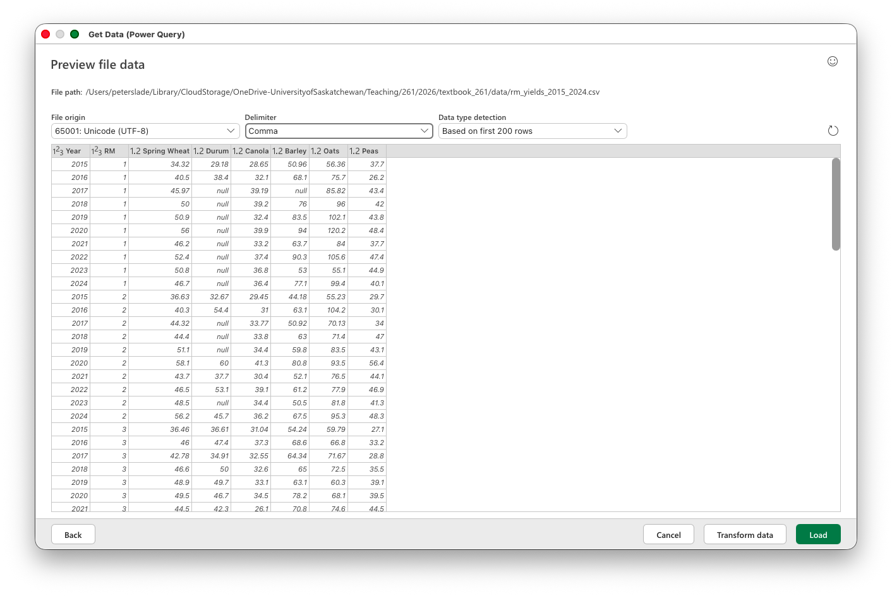

# Cleaning Data {#sec-cleaning}

```{r}
#| include: false
#| eval: true
source("_console.R")
```

A file that opens without an error may still contain duplicate rows, inconsistent names, mixed units and missing values recorded as ordinary text. Data cleaning takes up a large part of most data analysis projects. Unfortunately, it is also the dullest part of the job. This chapter is about finding common problems and recording what you did about them.


## Data shape {#sec-tidy-data}

The R packages we use for data cleaning are part of the tidyverse, which is organized around the idea of **tidy data**. The same idea matters in Excel. A dataset is tidy when:

1. Every variable has its own column.
2. Every observation has its own row.
3. Every value has its own cell.

The definition is simple, but deciding what counts as a variable or an observation is not always obvious. Consider the RM yield data used in the previous chapter. In the original file, one row represents an RM in one year, while the yields for six crops occupy six columns.

| Year | RM | Spring Wheat | Durum | Canola | Barley | Oats | Peas |
|-----:|---:|-------------:|------:|-------:|-------:|-----:|-----:|
| 2015 |  1 |        34.32 | 29.18 |  28.65 |  50.96 | 56.36 | 37.7 |
| 2016 |  1 |        40.50 | 38.40 |  32.10 |  68.10 | 75.70 | 26.2 |
| 2017 |  1 |        45.97 |       |  39.19 |        | 85.82 | 43.4 |
| 2018 |  1 |        50.00 |       |  39.20 |  76.00 | 96.00 | 42.0 |

We could make the data even wider. One row could represent an RM, with a separate column for every crop-year combination: `Canola_2024`, `Canola_2025`, `Barley_2024` and so on.

<!-- TODO: Insert the RM table with one column per crop-year combination. -->

Or we could make the data longer, with one row for each RM-year-crop combination and separate columns for `RM`, `year`, `crop` and `yield_bu_ac`.

<!-- TODO: Insert the long RM-year-crop table. -->

None of these shapes is always right or wrong. The useful shape depends on what you want to do. The long version works well for PivotTables because `crop` can be placed in the Rows, Columns or Filters area. In R, the same `crop` column can be filtered, grouped or mapped to a graph. A wider table may be easier for a person to read or for presenting a small number of results.

When you open a table, write down what one row represents and what each column represents. This usually makes the shape problem visible.

::: {.callout-tip collapse="true"}
## Other resources -- tidy data

- **R for Data Science (2nd ed.)** -- [Chapter 5, "Data tidying"](https://r4ds.hadley.nz/data-tidy) develops the tidy-data idea and shows how to reshape datasets between long and wide forms.
- **Video** -- Riffomonas Project, [*Reshaping data to be long or wide with pivot_longer and pivot_wider*](https://www.youtube.com/watch?v=ZVddiwrbrr4).
:::

### Data shape in Excel {#sec-unpivot}

::: {.video-callout}
::: {.callout-note collapse="true" title="Video walkthrough of this section"}

:::
:::

The RM yields file (@sec-direct-download) is wide, with one column for each crop. Power Query calls the wide-to-long operation **Unpivot**. Import the CSV with **Data > Get Data > From Text/CSV**, choose **Transform Data**, select `Year` and `RM`, and then choose **Transform > Unpivot Columns > Unpivot Other Columns**. Rename the two new columns `crop` and `yield_bu_ac` before loading the result.

Power Query returns 15,478 rows because **Unpivot Other Columns** drops source cells containing `null`. The R example below keeps those cells as `NA` and therefore returns 17,700 rows; add `values_drop_na = TRUE` to `pivot_longer()` when you want the two results to agree. The reverse operation is **Pivot Column** in Power Query or a PivotTable on a worksheet.




### Data shape in R {#sec-reshaping}

::: {.video-callout}
::: {.callout-note collapse="true" title="Video walkthrough of this section"}

:::
:::

`pivot_longer()` does the same job as Unpivot. It takes several columns, puts their names in one column and puts their values in another. Here is the RM yields table:

```{r}
#| eval: true
#| echo: false
console('
# Load packages
library(tidyverse)

# Read the wide table
yields_wide <- read_csv(
  "practice/data/rm_yields_2015_2024.csv",
  show_col_types = FALSE
)

# Print the wide data
yields_wide

# Put the crop names and yields into columns
yields_long <- yields_wide |>
  pivot_longer(
    cols = -c(Year, RM),
    names_to = "crop",
    values_to = "yield_bu_ac"
  )

# Print the long data
yields_long

nrow(yields_long)
')
```

The column selection `-c(Year, RM)` means every column except `Year` and `RM`. Those two columns continue to identify the observation, while the six crop columns become values in the new `crop` column. The result has one row per RM-year-crop and six times as many rows as the wide table.

`pivot_wider()` goes in the other direction. `names_from` supplies the new column names and `values_from` supplies the values placed under them:

```{r}
#| eval: true
#| echo: false
console('
# Return the crop column to six separate crop columns
yields_long |>
  pivot_wider(
    names_from = crop,
    values_from = yield_bu_ac
  )
')
```

There is no single correct shape for every purpose. Analysis is often easier with long data, while a wider table can be useful for presenting results.

## Data cleaning {#sec-data-cleaning}

Before cleaning a new dataset, check what arrived. A file can contain the wrong units, missing records and duplicate observations without producing an error. A short inspection at the beginning can save a great deal of confusion later.

These checks can find problems, but they cannot prove that every value is correct. A yield of 55 bu/ac may be perfectly plausible and still belong to the wrong field. We need to understand the source as well as inspect the values.

### Know what the values mean {.unnumbered}

Data cleaning relies on your ability to spot values that do not make sense. This means you need some idea of what the data should look like. A crop yield between 0 and 100 may be plausible when it is measured in bushels per acre, while the same crop measured in tonnes per acre will have much smaller values. The number alone is not enough.

Before looking for errors, answer a few questions:

- What does one row represent?
- What population and time period does the file cover?
- What units are used?
- Which column or columns should identify one observation?
- How are missing values and categories coded?
- Has the file already been filtered, cleaned or aggregated?

This information may be in a data dictionary, a README file or the page from which the data were downloaded. If it is not documented, you may need to ask the person who created the file.

### Take a first look {.unnumbered}

Start with the basic structure:

- Count the rows and columns.
- Inspect the column names and data types.
- Look at several rows from the beginning and end of the file.
- Check whether numbers or dates were imported as text.
- Count repeated values of any column, or combination of columns, that should identify one row.

An unexpected row count or repeated identifier may mean that records are missing, duplicated or stored at a different level than you expected. Looking at the first few rows is useful, but it will not reveal a problem near the bottom of a large file.

### Check each variable {.unnumbered}

For a **numeric variable**:

- Count the observed and missing values.
- Examine the minimum, quartiles, median, mean and maximum.
- Plot a histogram or box plot.
- Look for impossible values, extreme observations, several clusters and suspicious concentrations at zero.

The useful limits depend on the subject. A negative crop yield is impossible, while a yield of 100 bu/ac may be unusual but real. Investigate an extreme value rather than automatically deleting it.

For a **categorical variable**:

- Count the distinct values and their frequencies.
- Look for inconsistent capitalization, spelling and extra spaces, such as `Canola`, `canola` and `Canola `.
- Check whether blank strings or codes such as `-99`, `N/A` and `unknown` represent missing values.
- Investigate rare categories rather than assuming that they are mistakes.

For a **date variable**:

- Check the earliest and latest dates.
- Look for dates outside the period covered by the data.
- Check for gaps, repeated dates and dates stored as text.

### Check variables together {.unnumbered}

Some problems appear only when two or more variables are compared:

- Seeding should occur before harvest.
- Percentages should normally fall between 0 and 100.
- Reported production should be consistent with acres and yield.
- Category and location codes should agree with their documentation.

A scatter plot can reveal an odd relationship between two numeric variables. A line plot can expose gaps or abrupt changes over time. Summaries grouped by year, region or source can show whether missing values or unusual measurements are concentrated in one part of the dataset.

### Investigate before changing {.unnumbered}

When something looks wrong:

1. Return to the source record or documentation if possible.
2. Flag the observation rather than immediately deleting it.
3. Keep the raw file unchanged.
4. Record any correction, conversion or exclusion in a reproducible cleaning step.
5. If the correct treatment remains uncertain, report that uncertainty and compare the results with and without the questionable observations.

## Common data quality issues {#sec-quality-issues}

These are the issues I most commonly encounter with datasets:

1. **Awkward column names.** In R, you will refer to column names constantly, so consistency matters. If you sometimes use `SpringWheat`, other times `Spring Wheat`, and still other times `spring-wheat`, you will continually have to remember which convention you chose.

    A common best practice is **snake case**: use lowercase letters and replace spaces with underscores. For example, use `spring_wheat`.

    Column names should be descriptive without becoming unnecessarily long. Whether you choose `yield` or `yield_bu_ac` depends on the dataset. If it contains several yield measures, names such as `yield_bu_ac` and `yield_kg_ha` clearly distinguish their units. If there is only one yield column, the simpler name `yield` may be sufficient.

2. **Text in a numeric column.** Sometimes units or other text are included with numeric values. For example, a weight column might contain `38.2 t`, `42.1 t`, and `37.8 t`.

    Excel or R will usually interpret such a column as text, preventing you from performing calculations such as finding the mean or standard deviation. You will need to separate the units from the values and convert the values to numbers. Ideally, the units should be recorded in the column name—for example, `weight_t`.

3. **Duplicate observations.** A dataset may contain duplicate rows. These can arise from data-entry mistakes, combining files more than once, or recording the same observation in multiple systems.

    Duplicates are often data-quality problems, but identical rows are not necessarily errors. Two producers, fields, or transactions may legitimately have the same recorded values. Before removing duplicates, determine what uniquely identifies an observation and investigate why the duplication occurred.

4. **Missing values.** Ideally, missing values are stored as blank cells or as `NA`. However, they may instead be represented by codes such as `-99`, `N/A`, `missing`, or `9999`.

    You need to identify these codes and convert them to a consistent missing-value representation. Be careful: a code such as `0` may indicate a missing value in one dataset but a genuine observation in another. Consult the dataset's documentation whenever possible.

5. **Impossible or implausible values.** A dataset may contain values that are impossible, such as negative yields, or highly implausible, such as a wheat yield of 1,250 bu/acre.

    Examining the minimum and maximum of each numeric variable is a quick way to identify potential problems. Histograms and other graphs can also reveal unusual observations. These values should be investigated before being corrected or removed; an unusual value is not necessarily an error.

6. **Mixed units.** A column may contain values recorded in different units. For example, some weights might be reported in tonnes and others in kilograms.

    A histogram can help identify mixed units. Suppose you plot nitrogen application rates and find that 30% of observations fall below 1 while the remaining 70% are above 100. This pattern may indicate that some producers recorded tonnes per hectare while others recorded kilograms per hectare.

    Once you identify mixed units, convert all observations to a common unit and record that unit clearly in the column name or dataset documentation.

7. **Inconsistent categories.** Data based on individual reporting often contain categories recorded in inconsistent ways. For example, the same wheat variety might appear as `Brandon`, `AAC Brandon`, `Brandon AAC`, and `Brndon`.

    Listing the unique categories and counting the number of observations in each is a useful way to find these inconsistencies. You can then standardize the different versions under a single category, such as `AAC Brandon`.

All seven issues appear together in [`field_records_messy.csv`](practice/data/field_records_messy.csv), a season of spring wheat field records constructed for practice. The first ten rows:

| Field ID | VARIETY_NAME | Acres | Yield (bu/ac) | harvest weight | N rate | Moisture % |
|---|---|---:|---:|---|---:|---|
| F001 | AAC Viewfield | 160 | 67.6 | 297.7 t | 97.1 | 12.4 |
| F002 | Brandon | 320 | 54.9 | 476.0 t | 96.2 | 14.7 |
| F003 | CDC Landmark | 120 | 54.4 | 172.6 t | 0.081 | 12.3 |
| F002 | Brandon | 320 | 54.9 | 476.0 t | 96.2 | 14.7 |
| F004 | Brandon AAC | 320 | -99 | 642.5 t | 116.7 | 15.4 |
| F005 | CDC Landmark | 320 | 65.8 | 561.5 t | 89.9 | 12.3 |
| F006 | Brndon | 160 | 50.8 | 222.8 t | 0.113 | N/A |
| F005 | CDC Landmark | 320 | 65.8 | 561.5 t | 89.9 | 12.3 |
| F007 | AAC Viewfield | 80 | -12 | 138.6 t | 135.9 | 14.5 |
| F008 | AAC Brandon | 160 | 60.3 | 264.0 t | 127.3 | 12.4 |


1. Column names have spaces, capitals and special characters
2. The same variety appears as Brandon, Brandon AAC, Brndon and AAC Brandon
3. Some yields are reported as -99 (a typical missing value code)
4. F007 has a yield of -12, which is impossible
5. Harvest weight has its unit typed into the cell
6. The nitrogen rates for F003 and F006 sit below 1 while the rest sit near 100 -- tonnes against kilograms per hectare
7. F002 and F005 each appear twice, identically


If we summarize the numeric columns, we see the following.  Note that the last row forces the moisture column to numeric, which converts any text to an NA value.

| Column | Min | Max | Mean | Median |
|---|---:|---:|---:|---:|
| Yield (bu/ac) | -99 | 1250 | 74.5 | 55.8 |
| N rate | 0.08 | 135.9 | 71.5 | 89.9 |
| harvest weight | \- | \- | \- | \- |
| Moisture % | \- | \- | \- | \- |
| Moisture % (forced to numeric) | 11.6 | 9999 | 299.3 | 14.7 |

8. There are impossibly high yields of 1,250
9. Moisture has issues with text in the column -- when not forced to numeric it doesn't return any summary statistics.  
10. NA values for moisture are coded as 9999, which is outside the plausible range of 0 to 100.

## Data cleaning in Excel {#sec-cleaning-excel}

::: {.video-callout}
::: {.callout-note collapse="true" title="Video walkthrough of this section"}

:::
:::

The following Excel workbook shows some steps in checking and then cleaning the data.  In the DataSummary worksheet, the numeric variables are summarized, getting the mean, median, minimum and maximum and a histogram is plotted.  For the categorical variables, the `UNIQUE()` function is used to list the distinct values and the `COUNTIF()` function is used to count how many times each distinct value appears.  Finally, we counted the number of rows using `=ROWS(RawData!A2:A39)` and the number of distinct rows using `=ROWS(UNIQUE(RawData!A2:A39))`.  The difference between these two counts is the number of duplicate rows.


After diagnosing these issues, the best way to clean the data is through a Power Query which creates a transparent and reproducible workflow.  The output of the Power Query is in the workbook and the video at the top of this section explains the steps taken to clean the data.

::: {.workbook-callout}
<!-- Anyone-view link expires 2026-11-29 under the University of Saskatchewan 90-day policy. -->

::: {.excel-embed}
<iframe width="100%" height="700" frameborder="0" scrolling="no" src="https://usaskca1-my.sharepoint.com/:x:/g/personal/pjs998_usask_ca/IQARIWupQ2l6SLHNK4SJIFi7AaPD784L8M-lxPSEBlwjw2I?e=Gd8AR1&action=embedview&wdAllowInteractivity=False&wdDownloadButton=True&wdInConfigurator=True&ActiveCell=%27DataSummary%27!A1"></iframe>
:::

[Download this workbook](textbook_examples/mod03_field_records_cleaning.xlsx) · [Open online](https://usaskca1-my.sharepoint.com/:x:/g/personal/pjs998_usask_ca/IQARIWupQ2l6SLHNK4SJIFi7AaPD784L8M-lxPSEBlwjw2I?e=Gd8AR1) (File → Save a Copy to view formulas and edit)
:::

## Data cleaning in R {#sec-cleaning-r}

Data cleaning is -- in my view -- easier in R than in Excel.  We can write an R script that can be applied to any dataset.  In R the whole job fits in one script: read the raw file, check it, apply the cleaning rules and write the cleaned copy somewhere else. The script is the record of what was done, and when a new version of the raw file arrives it can be rerun from the top.

### Diagnosing data issues in R {.unnumbered}

We can diagnose data issues in R using many of the functions we have already learned, like `glimpse()` and `summary()`.  Three new functions will be useful:

- `hist()` draws a histogram of a numeric column.
- `count()` counts the number of rows in each category of a column.
- `distinct()` returns the data with any duplicate rows removed.

```{r}
#| eval: true
#| echo: false
#| fig.show: hold
console('
# ---
# Title: Diagnosing the field records
# Author: Your Name
# Date: 2026-09-05
# Description:
#   Reads data/field_records_messy.csv and checks it for data-quality
#   issues before any cleaning.
# ---

# Load packages
library(tidyverse)

# Read the file
records <- read_csv("data/field_records_messy.csv")

# Column names and types as they arrived
glimpse(records)

## This reveals a first set of issues: harvest weight and moisture are text when they should be numeric.  Moreover, column names are a mess.

# Summary of every column
summary(records)

## This reveals further issues with the minimum and maximum of yield, and the minimum and 1st quartile of the nitrogen rate.  We might want to plot the histogram of the nitrogen rate to visualize the issue.
hist(records$`N rate`, breaks = 20)

# Count the categories: the same variety appears under four spellings
records |>
  count(VARIETY_NAME, sort = TRUE)

# Count the rows, then the distinct rows: the difference is the duplicates
nrow(records)
nrow(distinct(records))
')
```

#### Cleaning data in R {.unnumbered}


To clean the data there are also four new functions that we need to learn:

- `clean_names()` converts every column name to snake case, which fixes issue 1.  For example, `VARIETY_NAME` becomes `variety_name`.  This function requires the `janitor` package in R.  
- `rename()` if we are still not happy with just using clean_names(), we can rename columns to whatever we want.  For example, `variety_name` could be renamed to `variety`.
- `if_else()` is a conditional function. Similar to `IF` in Excel, it takes three arguments: a condition, a value to return if the condition is true, and a value to return if the condition is false.  When run in tidyverse it operates on each element of a column.  For example, `mutate(yield = if_else(yield < 0, NA, yield))` would mean to mutate the yield column such that, if the yield is less than 0 replace it with NA and otherwise return what was in the yield column.  So if yield started out as (35, -5, 40, -12, 50) it would become (35, NA, 40, NA, 50).
- `parse_number()` removes text from numbers, so that `142.9 t` becomes `142.9`.


The code below fixes our issues one-by-one, saving the resulting data frame after each step.  

```{r}
#| eval: true
#| echo: false
console('
# ---
# Title: Cleaning the field records, one issue at a time
# Author: Your Name
# Date: 2026-09-05
# Description:
#   Reads data/field_records_messy.csv and fixes each data-quality
#   issue in turn, saving a new data frame after each step.
# ---

# Load packages
library(tidyverse)

## Install janitor package (if not installed already) -- I have commented it out because it is already installed
#install.packages("janitor")

## Load janitor package
library(janitor)

# Read the file
records <- read_csv("data/field_records_messy.csv")


## Issue 1: column names.  We can clean column names using the clean_names() function from the janitor package.  It converts all column names to lower case and replaces spaces with underscores.  Save the resulting data frame as records_clean_names

records_clean_names <- records |>
  clean_names()

names(records_clean_names)

## If we still want to rename columns, we can use the rename() function.   Save the resulting data frame as records_new_names and check the column names.
records_new_names <- records_clean_names |> 
  rename(variety = variety_name)

names(records_new_names)

## Issue 2: Inconsistent variety names. We can fix the variety names using the if_else() function.  The three arguments would say if variety is one of "Brandon", "Brandon AAC", or "Brndon", then replace it with "AAC Brandon", otherwise leave it as is.  Save the resulting data frame as records_variety_fix and count the varieties in the variety column.

records_variety_fix <- records_new_names |>
    mutate(variety = if_else(variety %in% c("Brandon", "Brandon AAC", "Brndon"),
                           "AAC Brandon",
                           variety))

records_variety_fix |>
  count(variety, sort = TRUE)

## Issues 3, 4 and 8: Impossible and NA yields. We can change yields below 0 and above 200 to NA using the if_else() function. This deals with yields that are reported as -99 (a typical missing value code), the impossible -12, and the implausible 1,250.  Save the resulting data frame as records_yield_fix and check the yield_bu_ac column.

records_yield_fix <- records_variety_fix |>
  mutate(yield_bu_ac = if_else(yield_bu_ac <= 0 | yield_bu_ac > 200,
                                NA,
                                yield_bu_ac))

summary(records_yield_fix$yield_bu_ac)


## Issue 5: text in harvest weight. We can strip the unit text from the weights and make them numeric using the parse_number() function.  This function extracts the numeric part of a string and converts it to a numeric value.  Save the resulting data frame as records_weight_fix and check the harvest_weight column.

records_weight_fix <- records_yield_fix |>
  mutate(harvest_weight = parse_number(harvest_weight))

summary(records_weight_fix$harvest_weight)

## Issue 6: Nitrogen units vary. We can convert nitrogen rates below 1 to kg/ha by multiplying them by 1000 using the if_else() function.  Save the resulting data frame as records_n_rate_fix and check the n_rate column.

records_n_rate_fix <- records_weight_fix |>
    mutate(n_rate = if_else(n_rate < 1,
                            n_rate * 1000,
                            n_rate))

summary(records_n_rate_fix$n_rate)


## Issue 7: Duplicate rows.  We can remove duplicate rows using the distinct() function.  It removes any rows that are identical to another row in the dataset.  Save the resulting data frame as records_unique and check the number of rows.

records_unique <- distinct(records_n_rate_fix)

nrow(records_unique)


## Issues 9 and 10: Moisture has text and NA values recorded as 9999.  We can first change the type to numeric using parse_number() and then change any values above 100 to NA using the if_else() function.  Save the resulting data frame as records_moisture_fix and check the moisture_percent column.

records_moisture_fix <- records_unique |>
  mutate(moisture_percent = parse_number(moisture_percent),
         moisture_percent = if_else(moisture_percent > 100,
                                     NA,
                                     moisture_percent))

summary(records_moisture_fix$moisture_percent)


')


```


The above code works just fine -- but it is a bit laborious to write and read.  We are saving six different data frames, one for each issue.  A better approach would be to combine all of this into a single pipeline, which is what we do below.  

```{r}
#| eval: true
#| echo: false
console('
# ---
# Title: Cleaning the field records
# Author: Your Name
# Date: 2026-09-05
# Description:
#   Reads data/field_records_messy.csv, fixes the data-quality issues
#   in one pipeline, and writes the cleaned file to
#   output/field_records_clean.csv.
# ---

# Load packages
library(tidyverse)
library(janitor)

# Read the file
records <- read_csv("data/field_records_messy.csv")

# Clean the data
records_clean <- records |>
  clean_names() |>   # issue 1: every column name to snake case
  rename(variety = variety_name)  |>
  distinct() |>      # issue 7: drop the exact duplicate rows

  mutate(
    # Issue 2: one spelling for the Brandon variety
    variety = if_else(variety %in% c("Brandon", "Brandon AAC", "Brndon"),
                      "AAC Brandon",
                      variety),
    # Issues 3, 4 and 8: the -99 code, the negative and the 1250 all become NA
    yield_bu_ac = if_else(yield_bu_ac <= 0 | yield_bu_ac > 200,
                          NA,
                          yield_bu_ac),
    # Issue 5: strip the unit text from the weights and make them numeric
    harvest_weight = parse_number(harvest_weight),
    # Issue 6: rates below 1 are t/ha, so convert them to kg/ha
    n_rate = if_else(n_rate < 1,
                           n_rate * 1000,
                           n_rate),
    # Issue 9: moisture has text values
    moisture_percent = parse_number(moisture_percent),
    # Issue 10: change moisture values above 100 to NA
    moisture_percent = if_else(moisture_percent > 100,
                          NA,
                          moisture_percent)
  )

# Print the cleaned data
records_clean

# Check again: the same checks on the cleaned data
summary(records_clean)

records_clean |>
  count(variety, sort = TRUE)

# Save the cleaned file to output; the raw file is never edited
write_csv(records_clean, "output/field_records_clean.csv")
')
```


