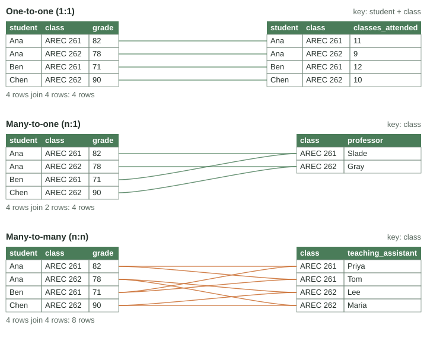
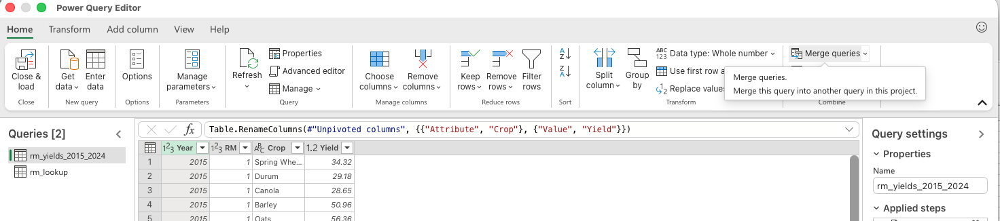
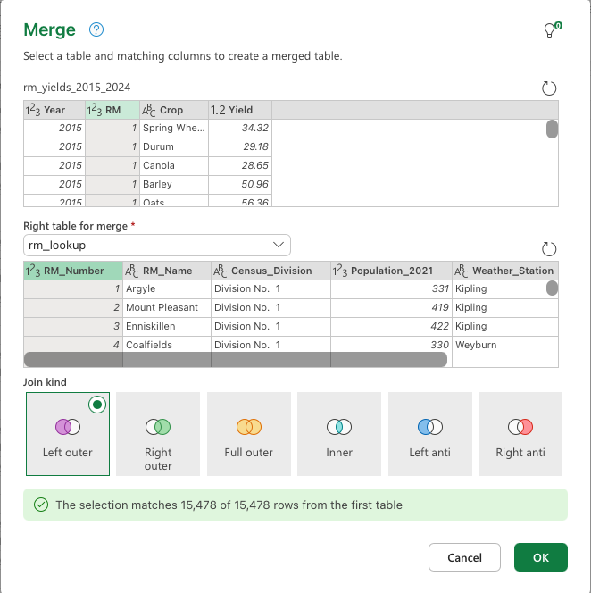
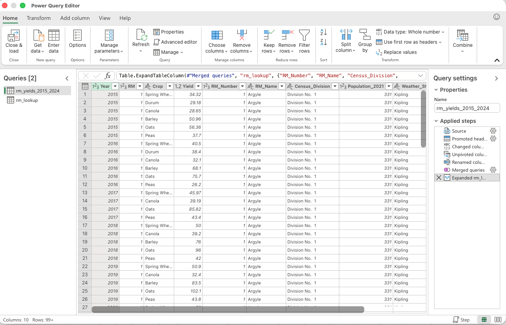
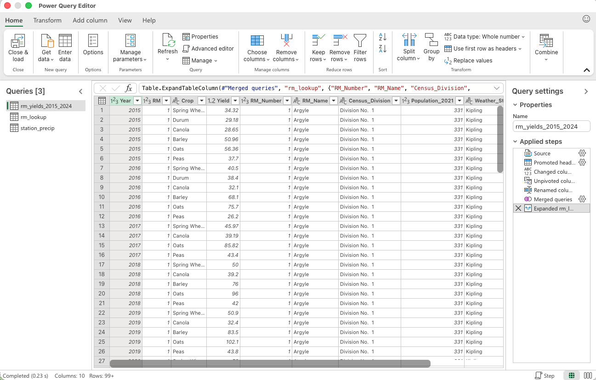

# Merging Data {#sec-merging-data}

```{r}
#| include: false
#| eval: true
source("_console.R")
```

The data you need to answer one question often arrive in several tables. For example, suppose we wanted to understand the relationship between RM yields and precipitation. The yield data would come in one table, and the precipitation data would likely come in another. To answer our question, we would need to **merge** or **join** these tables.

Throughout this section, we will work with three datasets:

- [`rm_yields_2015_2024.csv`](practice/data/rm_yields_2015_2024.csv), with one row per RM per year. It contains 2,950 rows for ten years and six crops. Yields are measured in bushels per acre.
- [`station_precip.csv`](practice/data/station_precip.csv), with one row per weather station per year. It contains May to August precipitation for sixteen stations and a count of days with no reading.
- [`rm_lookup.csv`](practice/data/rm_lookup.csv), with one row per RM. It contains the RM name, census division, 2021 population and the closest of the sixteen weather stations.

We will do two merges:

1. Merge the RM yields with the RM lookup. This will give us a dataset containing the closest weather station for each yield observation.
2. Merge the dataset from step 1 with the weather station data. This will give us the growing-season precipitation for each observation.


### Keys {.unnumbered}

A key is a column, or set of columns, used to identify and match rows across datasets. When we merge, we say that we merge on the key. The key must be present in both datasets.


In the three tables above, the keys for the two merges are:

1. RM yields to RM lookup: RM.
2. The resulting dataset to weather-station data: weather station and year.

### One-to-one, many-to-one and many-to-many {.unnumbered}

There are three types of merges:


{#fig-join-types}

- **One-to-one (1:1).** Each key value appears once in both tables. Grades and attendance both have one row per student-class, so the merged table has the same number of rows as either input.
- **Many-to-one (n:1).** Values in the key column may repeat in one dataset but are unique in the other. In this example, students take many classes, so each student appears multiple times in the table on the left. Each class has a single professor, however, so each class appears only once in the table on the right.
- **Many-to-many (n:n).** Values in the key column repeat in both datasets. In the figure, students take multiple classes (the table on the left), and each class can have multiple teaching assistants (the table on the right).

Before joining, decide which relationship you expect. Then compare the row counts before and after.

Both of our merges will be many-to-one:

1. The RM yields dataset contains many observations for the same RM, but the RM lookup contains only one row for each RM.
2. The merged dataset from step 1 contains many observations with the same closest weather station and year, but the weather-station dataset contains only one observation for each station and year.

## Merging in Excel {#sec-merge-excel}

::: {.video-callout}
::: {.callout-note collapse="true" title="Video walkthrough of this section"}

:::
:::

In Chapter 2, we used `XLOOKUP` to bring values from one table into another (@sec-lookup). That approach is useful for a quick lookup. Here, we will use Power Query because it records the merge as a repeatable series of steps and can match on several columns directly.

Begin by importing `rm_yields_2015_2024.csv` and `rm_lookup.csv` with **Data > Get Data > From Text/CSV > Transform Data**. In the Power Query editor:

1. Load the RM yield data using Power Query, transforming the data to longer format as we did before.
2. Choose Power Query, select import csv, and select the RM lookup table.
3. Select transform data.  You will now see two queries on your left hand side (@fig-pq-merge-queries).
4. Select the first query (rm_yields_2015_2024) and then click **Home > Merge Queries**.

{#fig-pq-merge-queries .screenshot}

5. In the pop up menu (@fig-pq-merge-dialog) select rm_lookup as the right table to merge.
6. Select the key to merge on in each table by clicking its column heading: `RM` in the yields table and `RM_Number` in the lookup table.
7. Keep **Left Outer** as the join kind. This keeps every yield observation and adds information wherever the lookup contains a matching RM.
8. Check the number of matching rows reported at the bottom of the dialog -- here every one of the 15,478 yield observations finds a match -- then choose **OK**.

{#fig-pq-merge-dialog .screenshot}

9. The merged data arrives packed into a single new column whose every entry reads `[Table]` (@fig-pq-merged-column). Expand it using the double-arrow icon in its header: tick the columns you want (the RM name, census division, population and closest weather station) and untick **Use original column name as prefix** so the columns keep their own names.

![After the merge, the lookup columns sit folded inside a `[Table]` column. The double-arrow icon in its header expands them. Do not click a `[Table]` link itself -- that drills into that one row's table and discards the rest.](images/pq_merged_table_column.png){#fig-pq-merged-column .screenshot}

{#fig-pq-merge-expanded .screenshot}

Now you should see the RM lookup data merged with the RM yield data.  We can now repeat the same process to merge once again with the station data: import `station_precip.csv` the same way, so a third query appears (@fig-pq-station-added).  The only difference is that we are now going to merge on both the station name and the year (@fig-pq-two-keys). Select `Weather_Station` and then Ctrl-click `Year` in the top table, and `Station` then Ctrl-click `Year` in the bottom one -- the small 1 and 2 beside the headings show the matching order.

{#fig-pq-station-added .screenshot}

{#fig-pq-two-keys .screenshot}

After expanding the precipitation column and choosing **Close & load**, every yield observation carries its RM's name, closest station, and that station's growing-season precipitation for the right year.

<!-- TODO: embed the finished mod03 merge workbook (OneDrive view-only iframe) here, following the mod04 pattern. -->

### Checking the merge {.unnumbered}

After each merge, compare the number of rows with the original yields table. A many-to-one left merge should retain the same number of rows. Filter the expanded columns for `null` to find observations that did not match, and check several rows against the source tables.

Power Query also offers **Inner**, **Full Outer** and **Left Anti** joins. These correspond to the R joins introduced below. A Left Anti join is particularly useful for listing rows that have no match before completing the merge.

## Merging in R {#sec-merge-r}

In tidyverse we merge data with join functions.  There are four different types of joins depending on which data we want to keep in the merged file.  Suppose we have two datasets `x` and `y`:


- **`left_join(x, y, by)`** keeps every row of `x` whether it has a match in `y` or not.  But does not keep rows in `y` that don't have a match. 
- **`inner_join(x, y, by)`** keeps only rows that matched in both tables.
- **`full_join(x, y, by)`** keeps every row from both tables, regardless of whether there is a match.
- **`anti_join(x, y, by)`** returns the rows of `x` that have no match in `y`. It is useful for finding failed matches before a join.

The `by` argument specifies the key we merge on, written with `join_by()`. A column with the same name in both tables is written once, `join_by(year)`; if the key has different names in the two tables, write `join_by(left_name == right_name)`.


The full R code for merging the datasets in R is below.  We first read in the three datasets, pivoting the yields to be in long format.  We then merge the yield data with the RM lookup using a left join.  This keeps all the data in yield data regardless of whether there is a match in the RM lookup, but would not keep any RM lookup rows that do not have a match in the yield data.  We then check the number of rows before and after the merge to make sure it is what we expect.  The exact code is

```{r}
with_station <- yields_long |>
  left_join(rm_lookup,
            by = join_by(rm == rm_number))
```


We can read this as set `with_station` equal to the result of:

1. Take yields long *then*
2. Left join it with the RM lookup.  
3. Merge the dataset by matching `rm` in the yields_long with `rm_number` in the RM lookup. 


*As an exercise, you should see how and why the merge would be different if we used an inner join or full join instead of a left join.  Because there is one RM in the rm_lookup that is not in the yields_long, full join will result in more rows -- these additional rows will have empty data for columns that are in `yields_long`.  However, because all rows in `yields_long` have a match in `rm_lookup`, `inner_join` will result in the exact same table as `left_join` -- note that this is only because all the RMs in our yield data are represented in the RM lookup data.*

We then check the number of rows before and after the merge.

We then merge the `with_station` dataset with the station precipitation data using another left join.


```{r}
#| eval: true
#| echo: false
console('

#########################
##### Load packages
#########################

library(tidyverse)
library(janitor)

#########################
##### Step 1: Read in data 
#########################

# Read the yield data and pivot longer
yields <- read_csv("data/rm_yields_2015_2024.csv") |>
  clean_names()      # Year and RM to year and rm; crop columns to snake case

# Pivot yields longer
yields_long <- yields |>
  pivot_longer(
    cols = spring_wheat:peas,      # the six crop columns
    names_to = "crop",
    values_to = "yield_bu_ac"
  )

# Read the RM lookup data
rm_lookup <- read_csv("data/rm_lookup.csv") |>
  clean_names()      # RM_Number becomes rm_number, and so on

# Read the station data 
rain <- read_csv("data/station_precip.csv") |>
  clean_names()      # Station becomes station


#########################
##### Step 2: Merge yields and RM data
#########################

# Add the RM information and nearest station
with_station <- yields_long |>
  left_join(rm_lookup,
            by = join_by(rm == rm_number))

# Print column names to check merge
names(with_station)

# Row counts before and after
nrow(yields_long)
nrow(with_station)

#########################
##### Step 3: Merge in the weather station data
#########################

merged <- with_station |>
  left_join(rain,
            by = join_by(weather_station == station, year))

# Print column names to check merge
names(merged)

# Row counts before and after
nrow(with_station)
nrow(merged)

# Glimpse the merged data frame to check the columns and types
glimpse(merged) 


')
```

This data frame would allow us to do further analysis on the relationship between precipitation and yield.  We will do that in the later chapters.  To give you a preview of this, here is a scatter plot of the mean canola yield and mean precipitation for each year -- the correlation is about 0.47.

```{r}
#| eval: true
#| echo: false
#| fig-width: 6
#| fig-height: 4
#| fig-align: center
annual_canola <- merged |>
  filter(crop == "canola") |>
  group_by(year) |>
  summarise(canola_bu_ac = mean(yield_bu_ac, na.rm = TRUE),
            rain_mm = mean(precip_may_aug_mm, na.rm = TRUE))

ggplot(annual_canola, aes(x = rain_mm, y = canola_bu_ac)) +
  geom_point(size = 2) +
  labs(x = "Mean May-August precipitation (mm)",
       y = "Mean canola yield (bu/ac)")
```