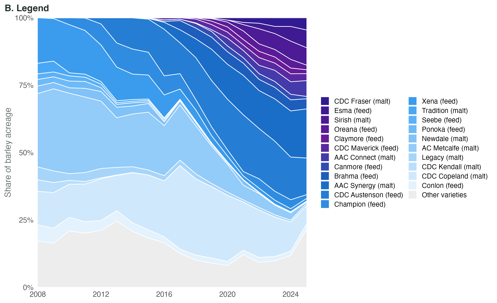
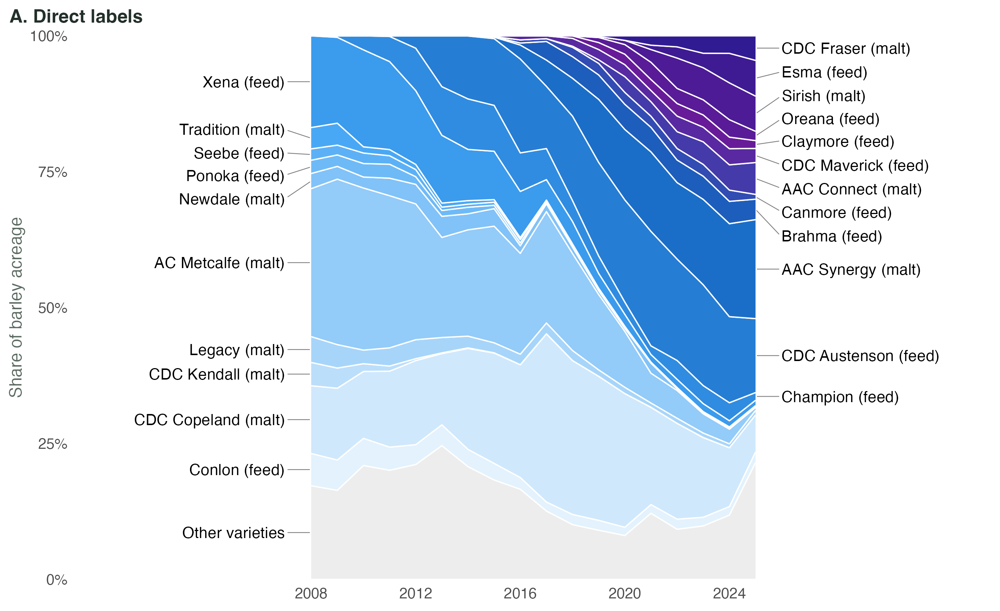

# Graphing Best Practices {#sec-graphing-principles}

A good chart tells a story. It draws the reader’s attention to a pattern, comparison, or relationship in the data and leaves them with something worth remembering. Charts do this by turning numbers into visual comparisons of position, length, area, or colour. When those comparisons make the story in the data easier to see, a chart is more useful than a table of numbers.

One of the best charts I've seen^[I first saw this chart in *The Visual Display of Quantitative Information* by Edward Tufte, who said "it may well be the best statistical graphic ever drawn" [@tufte, p. 40].] tells the story of Napoleon's invasion and subsequent retreat from Russia in 1812 (@fig-minard).

The width of the band represents the size of the army, its position follows the route of advance and retreat, and the line below records temperature and dates during the retreat. The tan band begins with 422,000 men crossing into Russia. The black band returns with 10,000.  Think of all the information that is embodied in this graph -- the size of the army, where they travelled, their dates of travel (on their retreat), and temperature.  A reader could never take in this type of information in a set of data tables.

![Charles Joseph Minard, *Carte figurative des pertes successives en hommes de l'Armée Française dans la campagne de Russie 1812--1813*. Click to view it full size. [Source: Charles Joseph Minard (1869); public domain, via Wikimedia Commons.]{.fig-source}](images/minard.png){#fig-minard}

@fig-georgia was published by the Georgia Department of Public Health in May 2020. It appears to show COVID-19 cases falling steadily in the five counties with the most confirmed cases.

!["Top 5 Counties with the Greatest Number of Confirmed COVID-19 Cases," May 2020. Click to view it full size. [Source: Georgia Department of Public Health; reproduced from @sabin2020georgia.]{.fig-source}](images/georgia_covid.png){#fig-georgia}

The dates along the horizontal axis are out of order. They were sorted by case count, so the decline is built into the chart rather than present in the data. The labels contain the information needed to catch the problem, but only a reader who checks every date will find it.

These examples set the two jobs of a chart. It should make the comparison easy to see, and it should represent the data honestly.

## Learning Objectives {.unnumbered}

::: {.objectives}
By the end of this chapter you should be able to:

1. State the comparison a chart is meant to show.
2. Choose a chart type that fits that comparison.
3. Label a chart so that it can be read without its maker present.
4. Remove clutter and use colour, text and legends deliberately.
5. Identify axis choices and chart forms that can mislead a reader.
:::

## General Principles {#sec-chart-principles}

### Decide whether a chart actually helps {.unnumbered}

First, you need to decide whether you actually need a graph to get the point across to your audience.  Sometimes tables, or just text, do a better job.  For example, if I wanted to compare US and Canadian wheat production, I could do so through @fig-wheat-two.  Or I could simply write: *In 2024 the United States produced 53.7 million tonnes of wheat and Canada produced 34.9 million.* Turning this text into a graph only distracts the reader.

```{r}
#| label: fig-wheat-two
#| eval: true
#| echo: false
#| message: false
#| warning: false
#| fig-width: 5.0
#| fig-height: 1.5
#| fig-cap: "Two values that are easier to state in a sentence. [Source: approximate 2024/25 marketing-year figures from @usda_wasde.]{.fig-source}"
source("R/chart_types.R")
fig_wheat(2)
```

However, if we wanted to give the reader a sense of Canada's place among the world's leading producers of wheat, then @fig-wheat-fifteen would do that better than a table or text.

```{r}
#| label: fig-wheat-fifteen
#| eval: true
#| echo: false
#| message: false
#| warning: false
#| fig-width: 5.4
#| fig-height: 3.4
#| fig-cap: "The top fifteen wheat-producing countries, 2024/25. Canada is highlighted. [Source: approximate 2024/25 marketing-year figures from @usda_wasde.]{.fig-source}"
fig_wheat(15)
```

### Check the scale and order {.unnumbered}

Charts can mislead while still plotting correct numbers. @fig-georgia misled audiences by changing the order of the dates.  There are many other ways to mislead. A lot of this comes down to altering the way data is presented relative to the audience's expectations.  In @fig-georgia we expect dates to be ordered chronologically.

One easy way to mislead is to start your vertical axis at a number other than zero.  We generally expect that the relative size of bars on a bar chart reflects the relative differences in the values being plotted.  But when the vertical axis starts at a number other than zero this isn't true.

Consider the two panels in @fig-truncated.  Both show the same five malting barley varieties, with yields from 103 to 114 bushels per acre.  In panel A, the vertical axis starts at 100.  This makes the bar for CDC Copeland appear to be about one-fifth the size of the bar for CDC Churchill.  In panel B, we see that the bar for Copeland is 90% the size of the bar for Churchill, reflecting that Copeland's yields were roughly 90% of Churchill's in the trials.

```{r}
#| label: fig-truncated
#| eval: true
#| echo: false
#| message: false
#| warning: false
#| fig-width: 4.6
#| fig-height: 2.5
#| fig-cap: "The same five yields with the axis beginning at 100 and at zero. [Source: @sask_seed_guide.]{.fig-source}"
#| fig-subcap:
#|   - "A. Axis starting at 100"
#|   - "B. Axis starting at zero"
#| layout-ncol: 2
source("R/chart_types.R")
fig_truncated(ymin = 100, labels = FALSE)
fig_truncated(ymin = 0)
```


Excel chooses axis bounds automatically and may produce panel A by default when the values are close together. For a column chart, right-click the value axis, choose **Format Axis**, and set the Minimum bound to 0. The zero baseline displays the size difference honestly, but it does not establish that small differences between trial averages are meaningful.

Line charts are different. A line shows position rather than length, so its vertical axis does not always need to begin at zero. The displayed range should still be wide enough that ordinary movement does not look like a crisis.

### Use descriptive labels {.unnumbered}

Every chart should tell the reader what they are looking at. At a minimum, this usually means clear labels for the horizontal and vertical axes, along with tick-mark labels that make the scale easy to interpret. Labels should also make the units clear. If a chart shows yield, for example, the reader should not have to guess whether it is measured in bushels per acre, tonnes per hectare, or something else.

There is some art to labelling a chart. Too little information leaves the reader guessing, while too much text can make the chart feel cluttered. Include the information the reader needs to interpret the figure, but avoid labels that simply repeat information already obvious from the chart.

When a figure will appear in a report, it generally looks best to leave the chart title blank in your statistical software and give the figure a caption in the document itself. For example, if you create a chart in R and insert it into a Word report, you can leave the title blank in R and use Word's captioning function instead. This keeps figure titles consistent with the formatting and numbering used throughout the report.  

### Remove clutter {.unnumbered}

Gridlines, borders, markers and decoration all compete with the data. Keep the elements that help the comparison and remove the rest.  Some formatting that I would suggest (some of this is personal preference):

- A minimal number of horizontal gridlines, spaced at intervals of 1, 2, 5, 10, 20, 25, 50 or 100 (not 3, 7 or 12).
- No vertical gridlines, except for scatter plots.
- When dealing with large numbers, put the vertical axis in thousands or millions.

```{r}
#| label: fig-clutter
#| eval: true
#| echo: false
#| message: false
#| warning: false
#| fig-width: 4.7
#| fig-height: 2.7
#| fig-cap: "The same four series before and after unnecessary chart elements are removed. [Source: @scic_smp.]{.fig-source}"
#| fig-subcap:
#|   - "A. Cluttered"
#|   - "B. Reduced"
#| layout-ncol: 2
source("R/chart_types.R")
fig_clutter(load_yields())
fig_declutter(load_yields())
```

Three-dimensional effects distort length and area. Patterned fills were useful when charts had to be printed in black and white, but on a screen they make the bars harder to read.

```{r}
#| label: fig-pattern
#| eval: true
#| echo: false
#| message: false
#| warning: false
#| fig-width: 4.7
#| fig-height: 2.7
#| fig-cap: "Patterned and flat fills applied to the same bars. [Source: @scic_smp.]{.fig-source}"
#| fig-subcap:
#|   - "A. Patterned fills"
#|   - "B. Flat fills"
#| layout-ncol: 2
fig_pattern(load_yields())
fig_flat(load_yields())
```

### Label lines directly {.unnumbered}

A legend makes the reader match each line to a separate key. When there is room, put the series name at the end of the line instead.  Admittedly, both of the panels in @fig-variety-labels are a bit busy.  But at least in panel B, you can easily identify which line corresponds to a particular variety.

::: {#fig-variety-labels layout-ncol=2}




Western Canadian barley variety shares of acreage, 2008--2025. [Source: @cgc_varieties.]{.fig-source}
:::

Legends are still useful when direct labels would overlap, or when the same symbols appear in several panels.

### Annotate what needs explanation {.unnumbered}

A short note within the chart can explain an unusual point or change, or draw the reader's attention to an important part of the story in the data (as in panel B of @fig-fertilizer). Use notes sparingly, however: too many can clutter the chart and obscure the very patterns they are meant to highlight (as in panel A of @fig-fertilizer).

```{r}
#| label: fig-fertilizer
#| eval: true
#| echo: false
#| message: false
#| warning: false
#| fig-width: 5.0
#| fig-height: 2.9
#| fig-cap: "Urea prices with many annotations and with one; indicative annual US Gulf prices, USD per tonne. [Source: author's indicative figures; for the underlying urea price series see @worldbank_pink.]{.fig-source}"
#| fig-subcap:
#|   - "A. Every movement annotated"
#|   - "B. The unusual movement annotated"
#| layout-ncol: 2
fig_fertilizer("heavy")
fig_fertilizer("light")
```


### Adding more information to charts {.unnumbered}

While most charts are two dimensional, there are ways of bringing in more information, through colours, shapes and sizes. @fig-minard is a great example of artfully condensing a considerable amount of information into a single plot. Another example is @fig-bubble, where the point size represents spring wheat seeded acres in addition to wheat and barley yield, and the point colour marks each risk zone's soil zone.

```{r}
#| label: fig-bubble
#| eval: true
#| echo: false
#| message: false
#| warning: false
#| fig-width: 5.4
#| fig-height: 2.9
#| fig-cap: "Wheat yield, barley yield, spring wheat seeded acres and soil zone for Saskatchewan risk zones, 2025. [Source: @scic_smp.]{.fig-source}"
fig_bubble(load_yields())
```

Medical journals have taken this idea further with the **visual abstract**, a one-page graphic that summarizes a whole study. @fig-cte-abstract is the BMJ's visual abstract for a study of chronic traumatic encephalopathy in former NFL players [@daneshvar_cte_2026]. Notice how much of this chapter it uses. The answer comes first, in a sentence. Exact values sit in a small table. The dot circles scale their area to the number of donors at each CTE stage, so the concentration of dementia cases at stages III and IV is visible before you read a single number. The photo carries no data; it is there to say what the graphic is about at a glance.

![The BMJ's visual abstract for a study of CTE in former NFL players. [Source: @daneshvar_cte_2026, visual abstract, © 2026 BMJ Publishing Group Ltd.]{.fig-source}](images/bmj_cte_visual_abstract.jpg){#fig-cte-abstract}

However, one should be wary of trying to cram too much information into a single plot.  A particular no-no is to use two different vertical axes on the same plot, as in @fig-dual.  This is a poor choice for a number of reasons, notably that the audience has to work to understand which line corresponds to which axis.  It is almost always better to plot these as two separate charts.

```{r}
#| label: fig-dual
#| eval: true
#| echo: false
#| message: false
#| warning: false
#| fig-width: 4.4
#| fig-height: 2.6
#| fig-cap: "The same two series under two choices for the right-hand axis. [Source: @scic_smp.]{.fig-source}"
#| fig-subcap:
#|   - "A. First right-hand scale"
#|   - "B. Second right-hand scale"
#| layout-ncol: 2
fig_dual_axis(load_yields(), TRUE)
fig_dual_axis(load_yields(), FALSE)
```


### Use colour for a reason {.unnumbered}

Colour can distinguish groups, show an ordered scale or draw attention to one observation. For example, in @fig-wheat-fifteen we highlighted Canada in the plot, as I was assuming our audience would be Canadian.  If we were presenting on the possible impacts on world wheat markets of Russia's invasion of Ukraine, then we might want to highlight Russia and Ukraine.   In @fig-bubble, we denoted different soil zones with different colours.

Choose colours that remain distinguishable for readers with colour-vision deficiencies and when printed in grey. It is also best practice to distinguish series by colour and some other means, where possible.  For example, if you have three lines on a graph, you can use colours, direct labels, and dashes to differentiate them.  Again, much depends on your particular data.  In @fig-line the lines on the graph are all very distinct, so direct labels are enough to allow the audience to distinguish each line across the whole graph.  If the lines intersected each other more, we might want to add different dashing to the lines.

## Types of Charts {#sec-chart-types}

```{r}
#| label: setup-charts
#| eval: true
#| echo: false
#| message: false
#| warning: false
source("R/chart_types.R")
yields <- load_yields()
```

### Bar charts: compare categories {.unnumbered}

A bar chart compares a value across categories such as yield by crop, acres by region or revenue by customer. Sort bars by value unless the categories have a natural order (as in the example of @fig-georgia, where bars should have been ordered chronologically). Start the value axis at zero. Note that bar charts often look better when horizontal, particularly where there are a large number of categories.

```{r}
#| label: fig-bar-orientation
#| eval: true
#| echo: false
#| message: false
#| warning: false
#| fig-width: 4.4
#| fig-height: 2.7
#| fig-cap: "The same five varieties drawn with vertical and horizontal bars. [Source: @sask_seed_guide.]{.fig-source}"
#| fig-subcap:
#|   - "A. Vertical"
#|   - "B. Horizontal"
#| layout-ncol: 2
fig_bar_vertical()
fig_bar_horizontal()
```

### Line charts: show change over time {.unnumbered}

A line chart shows movement over a continuous scale, usually time. The connection between points implies that the order and interval have meaning.  Most commonly they are used with a measure of time on the horizontal axis.  Do not connect unordered categories such as Barley, Canola and Oats with a line.  

```{r}
#| label: fig-line
#| eval: true
#| echo: false
#| message: false
#| warning: false
#| fig-width: 6.4
#| fig-height: 2.9
#| fig-cap: "Average crop yield by year, with labels at the right-hand ends of the lines; provincial averages weighted by acres. [Source: @scic_smp.]{.fig-source}"
fig_line(yields)
```


### Scatter plots: compare two numeric variables {.unnumbered}

A scatter plot places one numeric variable on each axis and one observation at each point.

```{r}
#| label: fig-scatter
#| eval: true
#| echo: false
#| message: false
#| warning: false
#| fig-width: 6.4
#| fig-height: 2.8
#| fig-cap: "Spring wheat and barley yield in Saskatchewan's 21 risk zones. [Source: @scic_smp.]{.fig-source}"
fig_scatter(yields)
```

The points rise from left to right in this 2025 cross-section. Both crops in a zone shared the same growing season, so the pattern says little by itself about whether zones that are good for wheat are generally good for barley. Module 7 develops the numerical tools for describing relationships like this.

### Stacked and grouped bars: compare composition {.unnumbered}

A stacked bar shows a total and its components.

```{r}
#| label: fig-stacked
#| eval: true
#| echo: false
#| message: false
#| warning: false
#| fig-width: 6.6
#| fig-height: 2.9
#| fig-cap: "Seeded acres by crop and year, drawn as stacked bars. [Source: @scic_smp.]{.fig-source}"
fig_stacked(yields)
```

One issue with stacked bar charts is that only the bottom segment and the total of each bar can be easily compared.  In @fig-stacked it is difficult to compare the seeded acreage of canola over time.

Grouped bars give each component a zero baseline, but they become crowded as the number of groups grows, making it hard to compare different crops within one year and crops across time.

```{r}
#| label: fig-grouped
#| eval: true
#| echo: false
#| message: false
#| warning: false
#| fig-width: 6.6
#| fig-height: 2.9
#| fig-cap: "The same acreage data drawn as grouped bars. [Source: @scic_smp.]{.fig-source}"
fig_grouped(yields)
```

An alternative is plotting the crops in separate plots, as in @fig-facet.

```{r}
#| label: fig-facet
#| eval: true
#| echo: false
#| message: false
#| warning: false
#| fig-width: 6.6
#| fig-height: 2.2
#| fig-cap: "The acreage data divided into one panel per crop. [Source: @scic_smp.]{.fig-source}"
fig_facet(yields)
```


### Pie charts: show a simple share {.unnumbered}

A pie chart shows parts of a total. Most authorities on charts really dislike pie charts.  One reason is that angles and areas are harder to compare than lengths, so a bar chart is usually a better way of visualizing differences.  Labels on pie charts are also somewhat hard to get right, particularly when pie slices are small. If a pie chart is used, keep the number of slices small and label them directly with percentages.


```{r}
#| label: fig-pie
#| eval: true
#| echo: false
#| message: false
#| warning: false
#| fig-width: 3.4
#| fig-height: 2.7
#| fig-cap: "The same four acreage shares shown as a pie and as bars. [Source: @scic_smp.]{.fig-source}"
#| fig-subcap:
#|   - "A. Pie"
#|   - "B. Bars"
#| layout-ncol: 2
pv <- fig_pie_vs_bar(yields)
pv$pie
pv$bar
```


### Ranges, trend lines and reference lines {.unnumbered}

Charts often are used to show averages.  However, one might also want to give the audience some sense of the variation in the data.  This can be done through shading around the line.  The shaded area might represent the minimum and maximum, or particular percentiles.  The definition of the shaded area should be clearly stated in the figure caption.

In @fig-ribbon we use shading to indicate the 10th and 90th percentiles of the risk-zone yields.


```{r}
#| label: fig-ribbon
#| eval: true
#| echo: false
#| message: false
#| warning: false
#| fig-width: 4.6
#| fig-height: 2.6
#| fig-cap: "Average spring wheat yield, with the band covering the 10th to 90th percentiles of risk-zone yields in each year. [Source: @scic_smp.]{.fig-source}"
fig_ribbon(yields)
```

A fitted line summarizes the trend in a scatter plot, as in @fig-trend.  I tend to advocate against trend lines -- if a trend is not so obvious that it can be seen in the raw data, why include the line?

```{r}
#| label: fig-trend
#| eval: true
#| echo: false
#| message: false
#| warning: false
#| fig-width: 4.6
#| fig-height: 2.6
#| fig-cap: "The wheat-barley scatter plot with a fitted straight line added. [Source: @scic_smp.]{.fig-source}"
fig_trend(yields)
```

A reference line can show an average, a target, a break-even value or last year's result, as in @fig-refline.  Include one when the comparison against it is the point of the chart: yields against the five-year average, prices against break-even.  If the reader is not meant to compare each bar against that value, the line is just another element competing for attention, and the information may belong in the caption or the surrounding text instead.

```{r}
#| label: fig-refline
#| eval: true
#| echo: false
#| message: false
#| warning: false
#| fig-width: 4.6
#| fig-height: 2.7
#| fig-cap: "Canola yield by year against its five-year average. [Source: @scic_smp.]{.fig-source}"
fig_refline(yields)
```

## Other resources {.unnumbered}

- **Edward Tufte, *The Visual Display of Quantitative Information*** -- the classic on chart design, including the Minard chart that opens this chapter.
- **Storytelling with Data** -- [*Thoughts on trendlines*](https://www.storytellingwithdata.com/blog/2020/10/20/thoughts-on-trendlines), a short piece on when a trend line helps and when it misleads.

