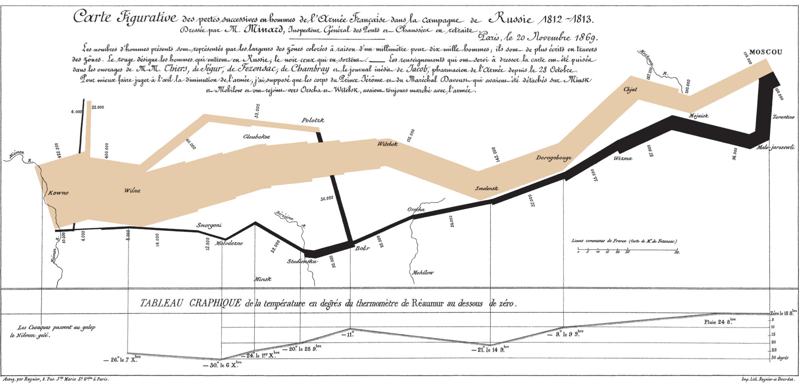

# Graphing Best Practices {#sec-graphing-principles}

A chart asks the reader to compare positions, lengths, areas or colours instead of reading a table of numbers. It is useful when that comparison reveals a pattern more quickly than the table would.

@fig-minard records Napoleon's 1812 invasion of Russia. The width of the band represents the size of the army, its position follows the route, and the line below records temperature during the retreat. The tan band begins with 422,000 men crossing into Russia. The black band returns with 10,000. Tufte called it one of the best statistical graphics ever drawn [@tufte].

{#fig-minard}

@fig-georgia was published by the Georgia Department of Public Health in May 2020. It appears to show COVID-19 cases falling steadily in the five counties with the most confirmed cases.

![Georgia Department of Public Health, "Top 5 Counties with the Greatest Number of Confirmed COVID-19 Cases," May 2020. Reproduced from the Sabin Center for Climate Change Law [@sabin2020georgia]. Click to view it full size.](images/georgia_covid.png){#fig-georgia}

The dates along the horizontal axis are out of order. They were sorted by case count, so the decline is built into the chart rather than present in the data. The labels contain the information needed to catch the problem, but only a reader who checks every date will find it.

These examples set the two jobs of a chart. It should make the comparison easy to see, and it should represent the data honestly.

## Learning Objectives {.unnumbered}

::: {.objectives}
By the end of this chapter you should be able to:

1. State the comparison a chart is meant to show.
2. Choose a chart type that fits that comparison.
3. Label a chart so that it can be read without its maker present.
4. Remove clutter and use colour, text and legends deliberately.
5. Identify axis choices and chart forms that can mislead a reader.
:::

## General Principles {#sec-chart-principles}

### Decide whether a chart helps {.unnumbered}

Two numbers can usually be written in a sentence: *In 2024 the United States produced 53.7 million tonnes of wheat and Canada produced 34.9 million.* Turning them into two bars makes the reader estimate values that the sentence could have given directly.

```{r}
#| label: fig-wheat-two
#| eval: true
#| echo: false
#| message: false
#| warning: false
#| fig-width: 5.0
#| fig-height: 1.5
#| fig-cap: "Two values that are easier to state in a sentence."
source("R/chart_types.R")
fig_wheat(2)
```

The top fifteen producers make a different comparison. The chart shows Canada's position, the gap between the first three countries and the rest, and the closeness of Canada and Australia.

```{r}
#| label: fig-wheat-fifteen
#| eval: true
#| echo: false
#| message: false
#| warning: false
#| fig-width: 5.4
#| fig-height: 3.4
#| fig-cap: "The top fifteen wheat-producing countries, 2024/25. Canada is highlighted. Approximate figures from USDA."
fig_wheat(15)
```

A chart helps when the question concerns a ranking, a trend, a distribution or a relationship. If the point is one or two exact values, use prose or a small table.

### Check the scale and order {.unnumbered}

Charts can mislead without containing a false number. The Georgia chart did it by changing the order of the dates. A truncated axis can do it by changing what the length of a bar represents.

Both panels below show the same five malting barley varieties, with yields from 103 to 114 bushels per acre.

```{r}
#| label: fig-truncated
#| eval: true
#| echo: false
#| message: false
#| warning: false
#| fig-width: 4.6
#| fig-height: 2.5
#| fig-cap: "The same five yields with the axis beginning at 100 and at zero."
#| fig-subcap:
#|   - "A. Axis starting at 100"
#|   - "B. Axis starting at zero"
#| layout-ncol: 2
source("R/chart_types.R")
fig_truncated(ymin = 100, labels = FALSE)
fig_truncated(ymin = 0)
```

In panel A the bars encode yield minus 100. A yield of 103 becomes a bar of length 3 and a yield of 114 becomes a bar of length 14, making a 10% yield difference look more than four times as large. Bar charts should normally begin at zero because their values are read from bar length.

Excel chooses axis bounds automatically and may produce panel A by default when the values are close together. For a column chart, right-click the value axis, choose **Format Axis**, and set the Minimum bound to 0. The zero baseline displays the size difference honestly, but it does not establish that small differences between trial averages are meaningful.

Line charts are different. A line shows position rather than length, so its vertical axis does not always need to begin at zero. The displayed range should still be wide enough that ordinary movement does not look like a crisis.

### Use descriptive labels {.unnumbered}

A title should say what the chart shows. Axis labels should name the variables and their units. A caption should identify the source and any definition the reader needs. `Yield` is incomplete when the value could mean bushels per acre, kilograms per hectare or pounds per acre.

When a figure appears in a report, use the document's caption rather than repeating the same title inside the chart. A chart copied out of the report may need its own title and source.

### Remove clutter {.unnumbered}

Gridlines, borders, markers and decoration all compete with the data. Keep the elements that help the comparison and remove the rest.

```{r}
#| label: fig-clutter
#| eval: true
#| echo: false
#| message: false
#| warning: false
#| fig-width: 4.7
#| fig-height: 2.7
#| fig-cap: "The same four series before and after unnecessary chart elements are removed."
#| fig-subcap:
#|   - "A. Cluttered"
#|   - "B. Reduced"
#| layout-ncol: 2
source("R/chart_types.R")
fig_clutter(load_yields())
fig_declutter(load_yields())
```

Three-dimensional effects distort length and area. Patterned fills were useful when charts had to be printed in black and white, but on a screen they make the bars harder to read.

```{r}
#| label: fig-pattern
#| eval: true
#| echo: false
#| message: false
#| warning: false
#| fig-width: 4.7
#| fig-height: 2.7
#| fig-cap: "Patterned and flat fills applied to the same bars."
#| fig-subcap:
#|   - "A. Patterned fills"
#|   - "B. Flat fills"
#| layout-ncol: 2
fig_pattern(load_yields())
fig_flat(load_yields())
```

### Label lines directly {.unnumbered}

A legend makes the reader match each line to a separate key. When there is room, put the series name at the end of the line instead.

::: {layout-ncol=2}


:::

Legends are still useful when there are many marks, when direct labels would overlap, or when the same symbols appear in several panels.

### Annotate what needs explanation {.unnumbered}

A short note can explain an unusual point or change. Too many notes hide the series they are meant to explain.

```{r}
#| label: fig-fertilizer
#| eval: true
#| echo: false
#| message: false
#| warning: false
#| fig-width: 5.0
#| fig-height: 2.9
#| fig-cap: "Indicative nitrogen fertilizer prices, USD per tonne, with many annotations and with one."
#| fig-subcap:
#|   - "A. Every movement annotated"
#|   - "B. The unusual movement annotated"
#| layout-ncol: 2
fig_fertilizer("heavy")
fig_fertilizer("light")
```

The second panel leaves ordinary changes alone and identifies the movement most readers would stop at.

### Add variables carefully {.unnumbered}

Position on the horizontal and vertical axes carries two variables. Colour, shape and point size can carry more. In @fig-bubble, point size represents spring wheat seeded acres in addition to wheat and barley yield.

```{r}
#| label: fig-bubble
#| eval: true
#| echo: false
#| message: false
#| warning: false
#| fig-width: 5.4
#| fig-height: 2.9
#| fig-cap: "Wheat yield, barley yield and spring wheat seeded acres for Saskatchewan risk zones."
fig_bubble(load_yields())
```

Point size is good for broad comparisons such as large, medium and small. It is poor for reading exact values because people do not judge area very precisely.

Avoid putting two different vertical scales on the same panel. Both charts below contain the same canola yield and acreage data. Only the right-hand scale changes.

```{r}
#| label: fig-dual
#| eval: true
#| echo: false
#| message: false
#| warning: false
#| fig-width: 4.4
#| fig-height: 2.6
#| fig-cap: "The same two series under two choices for the right-hand axis."
#| fig-subcap:
#|   - "A. First right-hand scale"
#|   - "B. Second right-hand scale"
#| layout-ncol: 2
fig_dual_axis(load_yields(), TRUE)
fig_dual_axis(load_yields(), FALSE)
```

The apparent crossing point and distance between the lines are controlled by the two scales. Use separate panels or convert both series to an index when their units differ.

In Excel, this is the **Combo Chart** with the **Secondary Axis** box selected, and Recommended Charts may suggest it when the series have different magnitudes. Prefer two aligned charts or calculate each series as an index relative to its first year so both can share one scale.

### Use colour for a reason {.unnumbered}

Colour can distinguish groups, show an ordered scale or draw attention to one observation. Most categories can remain grey while the category under discussion is highlighted. If every bar has a different bright colour, none has emphasis.

Choose colours that remain distinguishable for readers with colour-vision deficiencies and when printed in grey. Do not use red and green as the only signal; add labels, position or shape.

## Types of Charts {#sec-chart-types}

Choose a chart from the comparison the reader needs to make. The examples below use [`sask_variety_yields.csv`](practice/data/sask_variety_yields.csv), a synthetic AREC 261 teaching dataset with risk-zone, crop, variety, year, seeded-acre and yield observations for 2021–2025. The charts aggregate the variety rows into acreage-weighted averages. A risk zone is an SCIC crop-insurance region, but these teaching values should not be presented as published SCIC estimates.

```{r}
#| label: setup-charts
#| eval: true
#| echo: false
#| message: false
#| warning: false
source("R/chart_types.R")
yields <- load_yields()
```

### Bar charts: compare categories {.unnumbered}

A bar chart compares a value across categories such as yield by crop, acres by region or revenue by customer.

```{r}
#| label: fig-bar
#| eval: true
#| echo: false
#| message: false
#| warning: false
#| fig-width: 6.4
#| fig-height: 2.6
#| fig-cap: "Average yield by crop, 2021–2025, bu/ac."
fig_bar(yields)
```

Sort bars by value unless the categories have a natural order. Start the value axis at zero. Horizontal bars give long category names enough room.

Excel calls vertical bars a **Column** chart and horizontal bars a **Bar** chart. Switch between them with **Chart Design > Change Chart Type**. Excel places the first category at the bottom of a horizontal bar chart; after sorting largest-first, use **Format Axis > Axis Options > Categories in reverse order** if the largest bar should appear at the top.

```{r}
#| label: fig-bar-orientation
#| eval: true
#| echo: false
#| message: false
#| warning: false
#| fig-width: 4.4
#| fig-height: 2.7
#| fig-cap: "The same five varieties drawn with vertical and horizontal bars."
#| fig-subcap:
#|   - "A. Vertical"
#|   - "B. Horizontal"
#| layout-ncol: 2
fig_bar_vertical()
fig_bar_horizontal()
```

Vertical bars work when labels are short. Use a horizontal bar chart when labels would otherwise be rotated or crowded.

### Line charts: show change over time {.unnumbered}

A line chart shows movement over a continuous scale, usually time. The connection between points implies that the order and interval have meaning.

Excel Line charts normally space categories evenly, even when years are missing. For uneven intervals, use an XY Scatter chart with lines or set a recognized date axis under **Format Axis > Axis Type**.

```{r}
#| label: fig-line
#| eval: true
#| echo: false
#| message: false
#| warning: false
#| fig-width: 6.4
#| fig-height: 2.9
#| fig-cap: "Average crop yield by year, with labels at the right-hand ends of the lines."
fig_line(yields)
```

Do not connect unordered categories such as Barley, Canola and Oats with a line.

### Scatter plots: compare two numeric variables {.unnumbered}

A scatter plot places one numeric variable on each axis and one observation at each point.

```{r}
#| label: fig-scatter
#| eval: true
#| echo: false
#| message: false
#| warning: false
#| fig-width: 6.4
#| fig-height: 2.8
#| fig-cap: "Spring wheat and barley yield in Saskatchewan's 21 risk zones."
fig_scatter(yields)
```

The points rise from left to right in this 2025 cross-section. Both crops in a zone shared the same growing season, so the pattern says little by itself about whether zones that are good for wheat are generally good for barley. Module 7 develops the numerical tools for describing relationships like this.

### Stacked and grouped bars: compare composition {.unnumbered}

A stacked bar shows a total and its components.

```{r}
#| label: fig-stacked
#| eval: true
#| echo: false
#| message: false
#| warning: false
#| fig-width: 6.6
#| fig-height: 2.9
#| fig-cap: "Seeded acres by crop and year, drawn as stacked bars."
fig_stacked(yields)
```

Only the bottom segment has a common baseline. The middle and top segments are harder to compare across years. Grouped bars give each component a zero baseline, but they become crowded as the number of groups grows.

```{r}
#| label: fig-grouped
#| eval: true
#| echo: false
#| message: false
#| warning: false
#| fig-width: 6.6
#| fig-height: 2.9
#| fig-cap: "The same acreage data drawn as grouped bars."
fig_grouped(yields)
```

When the grouped chart becomes busy, divide it into **small multiples**, with one panel per series.

```{r}
#| label: fig-facet
#| eval: true
#| echo: false
#| message: false
#| warning: false
#| fig-width: 6.6
#| fig-height: 2.2
#| fig-cap: "The acreage data divided into one panel per crop."
fig_facet(yields)
```

Shared axes support comparisons of levels across panels. Free axes make the shape within each panel easier to see but prevent direct comparisons of height.

Excel does not create small multiples automatically. Make one chart, copy it for the other crops, change each copy's series, and set identical Minimum and Maximum axis bounds. This is a case where R's `facet_wrap()` requires less manual work.

### Pie charts: show a simple share {.unnumbered}

A pie chart shows parts of a total. Angles and areas are harder to compare than lengths, so a bar chart is usually better when the differences matter.

```{r}
#| label: fig-pie
#| eval: true
#| echo: false
#| message: false
#| warning: false
#| fig-width: 3.4
#| fig-height: 2.7
#| fig-cap: "The same four acreage shares shown as a pie and as bars."
#| fig-subcap:
#|   - "A. Pie"
#|   - "B. Bars"
#| layout-ncol: 2
pv <- fig_pie_vs_bar(yields)
pv$pie
pv$bar
```

The pie shows that canola accounts for about half of the acres seeded to these four crops. The bars make the smaller differences easier to compare. If a pie is used, keep the number of slices small, label them directly and leave it two-dimensional.

### Histograms and box plots: show distributions {.unnumbered}

A histogram shows the shape of one numeric variable by counting observations in intervals. A box plot shows the median, the middle half and potential outliers in a compact form. Use a histogram when the shape matters and a box plot when several groups need to be compared (@sec-charts).

### Ranges, trend lines and reference lines {.unnumbered}

A line of averages can be shown with a shaded range behind it. The range might represent a minimum and maximum, a middle percentage of observations or an interval estimate. Its definition belongs in the caption.

```{r}
#| label: fig-extras-1
#| eval: true
#| echo: false
#| message: false
#| warning: false
#| fig-width: 4.6
#| fig-height: 2.6
#| fig-cap: "Average spring wheat yield with the middle 80% of risk zones shaded, and a scatter plot with a fitted line."
#| fig-subcap:
#|   - "A. Shaded range"
#|   - "B. Fitted line"
#| layout-ncol: 2
fig_ribbon(yields)
fig_trend(yields)
```

A fitted line summarizes the pattern in a scatter plot. The grey band in panel B is a 95% confidence interval for the fitted mean; later modules develop what that means. Use a fitted line when the relationship is the question and do not extend it beyond the observed data without a reason.

A reference line can show an average, a target, a break-even value or last year's result. A waterfall chart shows how additions and subtractions turn a starting value into an ending value.

Excel provides Trendline, Histogram, Box and Whisker, and Waterfall directly. In a Waterfall chart, right-click the starting and ending bars and choose **Set as Total**. A reference line usually requires a helper column containing the constant value; a shaded range requires additional area-series columns.

```{r}
#| label: fig-extras-2
#| eval: true
#| echo: false
#| message: false
#| warning: false
#| fig-width: 4.6
#| fig-height: 2.7
#| fig-cap: "Canola yield against its five-year average, and a waterfall from revenue to net margin."
#| fig-subcap:
#|   - "A. Reference line"
#|   - "B. Waterfall"
#| layout-ncol: 2
fig_refline(yields)
fig_waterfall()
```

Dot plots can replace bars in long category lists. Heatmaps use colour to show patterns in a grid. Maps are suited to values reported by region and return in AREC 262.

### Choosing {.unnumbered}

| Comparison | Chart |
|---|---|
| Values across categories | Bar chart |
| Change over time | Line chart |
| Relationship between two numeric variables | Scatter plot |
| Components of a total | Stacked bar or bars for the components |
| Movement of several series | Small multiples |
| Distribution of one variable | Histogram or box plot |
| Contributions from a starting value to an ending value | Waterfall |

If the chart type is hard to choose, state the comparison more precisely before opening the chart menu.

## Excel and R for Charts {#sec-excel-vs-r-charts}

Excel is convenient for a one-off chart that will be edited in a workbook or passed to someone who does not use R. A chart updates when cells in its source range change; using an Excel Table also extends the source when new rows are added. Right-click **Save as Template** to reuse formatting across charts.

R is useful when the chart must be recreated from a script, updated with new data, repeated for many groups or given the same formatting as a set of other figures. The next two chapters make comparable charts in Excel and with `ggplot2`.
