# Graphing in Excel {#sec-graphing-excel}

In this chapter we will work through creating charts in Excel, focusing on bar charts, pie charts, and line charts.  

## Bar charts
We have already made a histogram in Excel in @sec-charts. To refresh our minds on how charts are created in Excel, we can start by making a simple bar chart.  The workbook below contains the data and plots that we will create in this section.  

::: {.callout-tip collapse="true" title="Workbook: bar charts in Excel"}
::: {.excel-embed}
<iframe width="100%" height="170" frameborder="0" scrolling="no" src="https://usaskca1-my.sharepoint.com/:x:/g/personal/pjs998_usask_ca/IQCw1hoGWYKtSqSO50grxhaOATTTjgXLmrbtvTIyTtlz8-4?e=jg23sp&action=embedview&wdAllowInteractivity=False&wdHideGridlines=True&wdHideHeaders=True&wdDownloadButton=True&wdInConfigurator=True"></iframe>
:::
[Open the view-only workbook online](https://usaskca1-my.sharepoint.com/:x:/g/personal/pjs998_usask_ca/IQCw1hoGWYKtSqSO50grxhaOATTTjgXLmrbtvTIyTtlz8-4?e=jg23sp) or [download a copy](textbook_examples/mod_04_bar_chart.xlsx).
:::

To create a bar chart, we can first select the data that we want in the chart -- both the barley variety names and the total acres.  You can select both columns by holding down the control key (or command key on a Mac) and clicking on the column headers or selecting the data with your mouse.  Then we can go to the **Insert** tab, select **Column Chart**, and choose the type of bar chart we want.

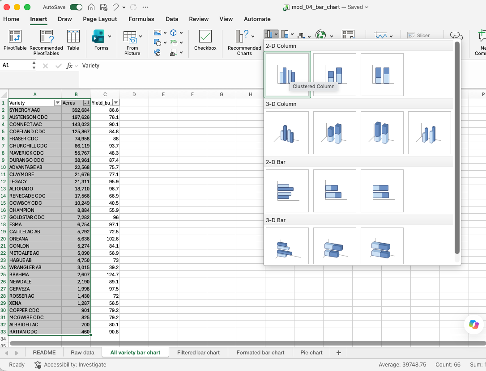{#fig-bar-insert .screenshot}

The chart is below, and it has lots of problems!  There is too much data in the chart, I've sorted the data by total acres but this makes it difficult to find varieties, the chart is so wide there is no way it will fit on a slide or in a document, the axes aren't labelled, etc.

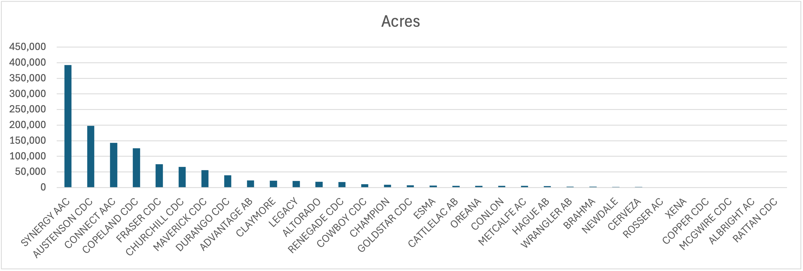{#fig-bar-first}

### Restricting the data
The first thing we might want to do is restrict the data so that there aren't as many varieties in the chart.  How much we want to filter will depend on the purpose of the chart.  In my case, I am going to restrict the data to varieties that have over 10,000 acres across the province.  I can do this with the filter option.  As soon as I filter the data the graph updates to show only the varieties that meet the filter criteria.  

There are a few different ways to sort the varieties so that the chart is easy to read. One option is to sort varieties alphabetically -- this makes it easy to find a specific variety, but it doesn't show the relative acreage of the varieties.  Another option is to sort by acres, which makes it easy to see which varieties are the most and least widely grown, but it makes it difficult to find a specific variety.  I'm going to choose to sort by acres.  My resulting chart is below.

{#fig-bar-filter .screenshot}

### Changing the chart type
The resulting graph is still fairly wide.  As mentioned in the previous chapter, a horizontal bar chart can work better when you have many categories and relatively long category names.  One way of accomplishing this is to right click the chart and select **Change Chart Type**, then choose **Bar Chart** (there are other ways of doing this in Excel too).  Note that the default is to put the first row at the bottom of the bar chart, so I sorted the acres column in ascending, rather than descending order to get the most widely grown variety at the top of the chart.  

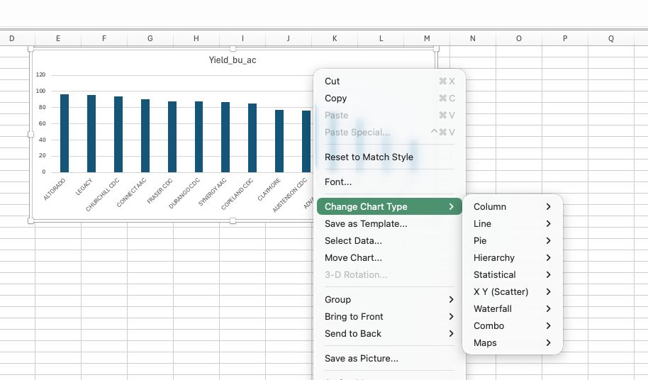{#fig-bar-changetype .screenshot}

### Add titles and labels
The default title of the chart is the name of the data series (*Acres*), which is not very informative.  We can change the title by clicking on it and typing in a new title.  We also need to add horizontal axes labels.  We can do this by clicking **Add chart element** in the **Chart Design** ribbon, then selecting **Axis Titles** and typing in the appropriate titles.  We can also add data labels to the bars by selecting **Data Labels** from the same menu.  This will add the yield values to the end of each bar.  In this particular case, we likely don't need a vertical axis label as it is clear that we are referencing barley varieties, but we could add one if we wanted to.  We then may want to change the font size of these titles, labels, and axes to make them more readable.  I tend to find the default font sizes on charts in Excel are too small.

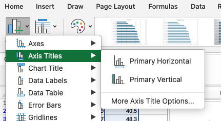{#fig-bar-axistitles .screenshot}

### Changing bar colours and widths
We can also change the appearance of the bars by clicking on one of the bars to select the series.  On the right hand of the screen we will then get a menu where we can change both the colour of the bars and the gap between them.  

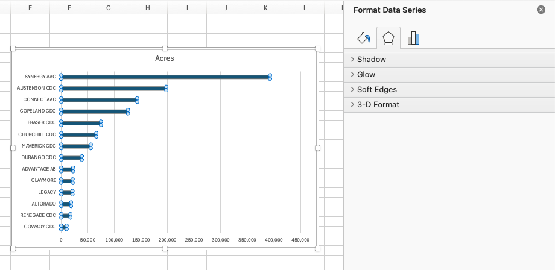{#fig-bar-format .screenshot}

## Other options
There are several other options for changing the appearance of the chart, such as Changing the numbers displayed on the axes.  The default for our chart had a maximum of 120 bu/ac, when no yield was above 100 bu/ac.  When you choose Format axis, you can change the minimum and maximum values, as well as the major and minor tick marks.  This can make the chart easier to read.

Here is my final version of the chart with Copeland highlighted.

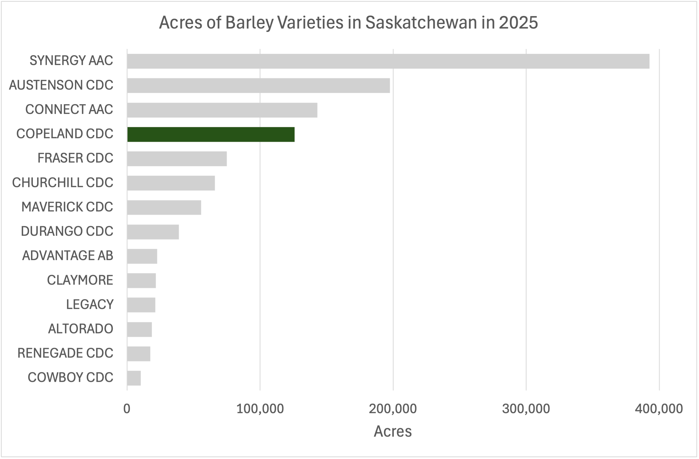{#fig-bar-final}

## Pie charts

A pie chart shows the shares of a whole, and it works best there are a small number of slices (@sec-graphing-principles covers when to be wary of them). Suppose we want to show how 2025 barley acreage splits across varieties. The **Unformated pie chart** sheet in the workbook above makes the first attempt: select the variety and acres columns and choose **Insert > Pie Chart**. With more than sixty varieties, the result is a ring of slivers -- most slices are too small to label and the colours start repeating.

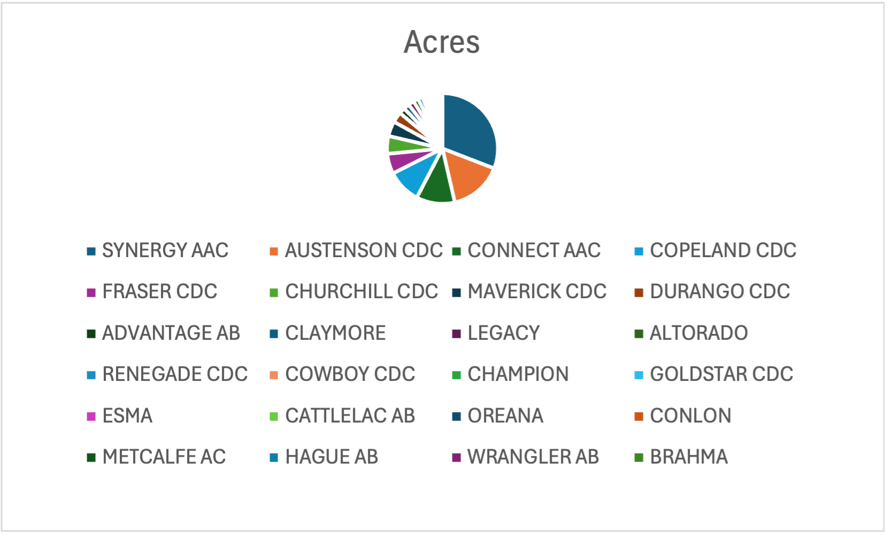{#fig-pie-start .screenshot}

To fix this I group all varieties except the four largest into an `Other` category. Five slices is something a reader can actually take in, and the `Other` slice honestly shows how much of the total the small varieties represent.

After that we need to do the same formatting work as the bar chart: a descriptive title, and data labels through **Add chart element > Data Labels**. One particularly helpful formatting idea is to use **Inside End** to directly label each slice, instead of using a legend.

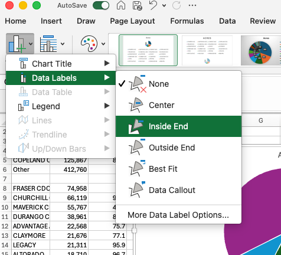{#fig-pie-labels .screenshot}

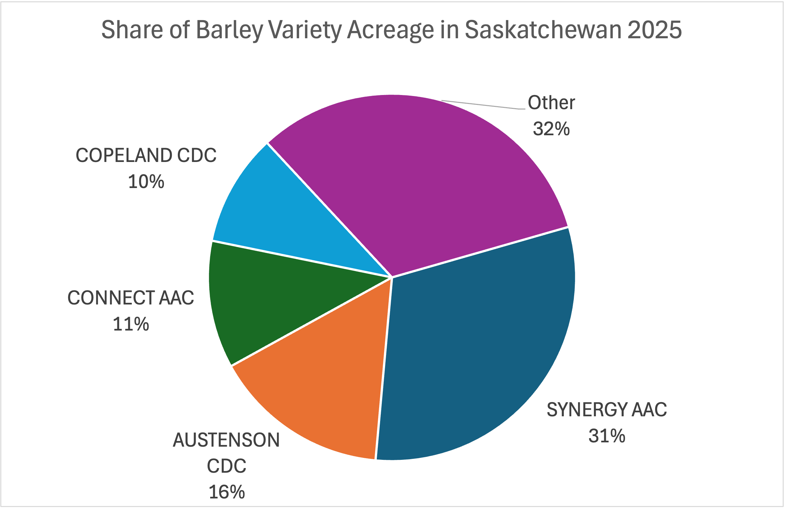{#fig-pie-final .screenshot}

## Line charts
Line charts are useful for showing trends over time.  Let's again work through an example of line charts in Excel.  The data we will use has acreage and yield of all varieties of barley in Saskatchewan from 2020 to 2025.  I again started by selecting the two columns of data that I want to include in the chart.  I then went to the **Insert** tab, selected **Line Chart**, and chose the type of line chart I wanted.

::: {.callout-tip collapse="false" title="Workbook: line charts in Excel"}
::: {.excel-embed}
<iframe width="100%" height="170" frameborder="0" scrolling="no" src="https://usaskca1-my.sharepoint.com/:x:/g/personal/pjs998_usask_ca/IQBku9Gt2hRTSrHWmfW91nO6AbR1Op9rsH63FgHFOlvXO9A?e=GccRRg&action=embedview&wdAllowInteractivity=False&wdHideGridlines=True&wdHideHeaders=True&wdDownloadButton=True&wdInConfigurator=True"></iframe>
:::
[Open the view-only workbook online](https://usaskca1-my.sharepoint.com/:x:/g/personal/pjs998_usask_ca/IQBku9Gt2hRTSrHWmfW91nO6AbR1Op9rsH63FgHFOlvXO9A?e=GccRRg) or [download a copy](textbook_examples/mod04_line_charts.xlsx).
:::

The resulting chart is below.

{#fig-line-wrong .screenshot}

Evidently, this is not correct!  It is showing two lines, one with the acres of synergy one with the year.  I can correct this by right clicking the chart and selecting **Select Data**.  I can then delete the series *Year*, and include Horizontal category labels for the Acres dataset series.

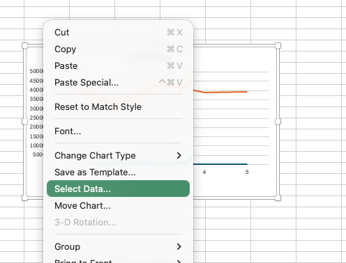{#fig-line-selectdata-menu .screenshot}

{#fig-line-selectdata-dialog .screenshot}

After doing this and fixing titles, axes labels, colours, and gridlines, I have the following chart.

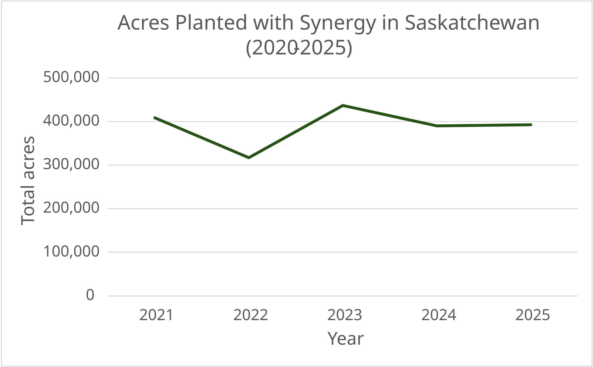{#fig-line-synergy}

### Plotting multiple series
Suppose that we wanted to plot the acreage of two different varieties (for example Synergy and Copeland).  We can do this easily by creating a column with each variety's acreage, by simply copying and pasting numbers for the two varieties into two columns.  I then click **Select Data** again and add a new series for the second variety.  Note that I now need the legend to distinguish the two lines.

<!-- TODO: export the two-series Synergy and Copeland chart from the workbook's
"Synergy and Copeland" sheet as an SVG (synergy_copeland.svg) and place it here.
{#fig-line-two-series}
-->

## PivotCharts
The approach above works for a quick chart with two varieties.  But what if we want to add more varieties?  Maybe we want all the varieties in the province, perhaps with smaller varieties grouped together.  We can accomplish this through a PivotChart.  A PivotChart is really just a PivotTable with a chart attached to it.  We can create a PivotChart by selecting the data and then clicking **Insert > PivotChart** (alternatively, if you already have a PivotTable created you can select the PivotTable and then insert a chart).

After changing the type of chart to a line chart, you can then select the data to be the series and another set of data to be the axes.

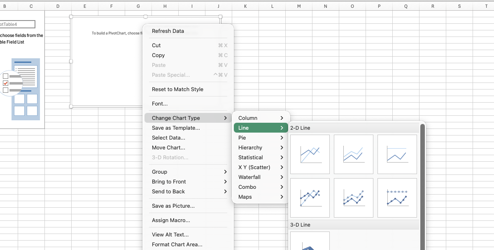{#fig-line-pivot-changetype .screenshot}  The resulting chart is what we wanted but is a bit of a mess.

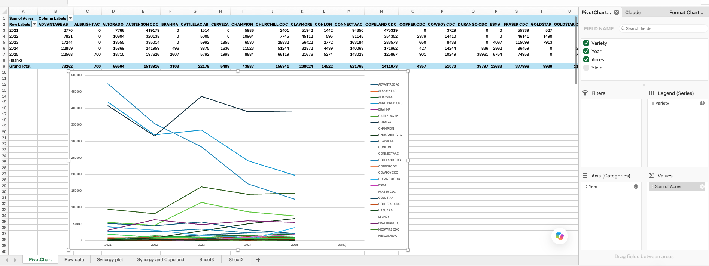{#fig-line-pivotchart .screenshot}

In the screenshot it is clear that we cannot distinguish the lines for the smaller varieties.  So it is best to eliminate these.  We can do this by either filtering out smaller varieties (those whose total acreage across all years is less than some value).  As below:

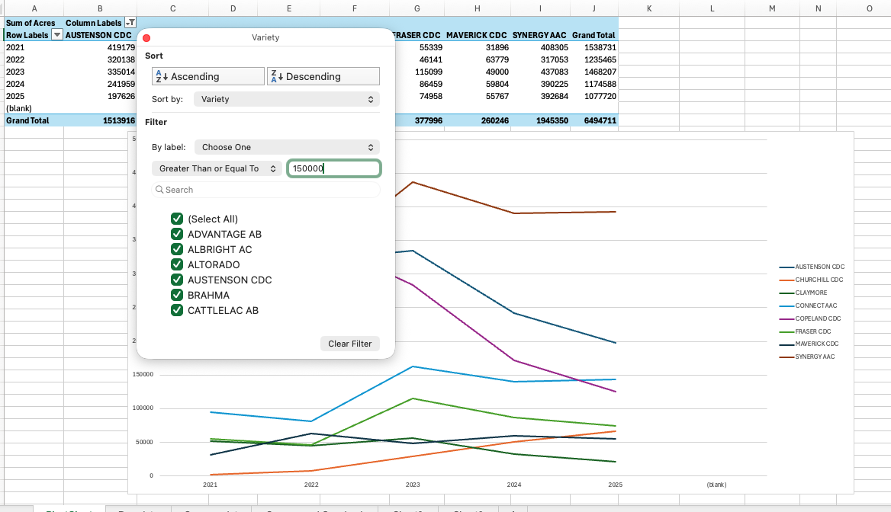{#fig-line-pivot-filter .screenshot}

Or we could group all the smaller varieties together.  As in the following screenshot.

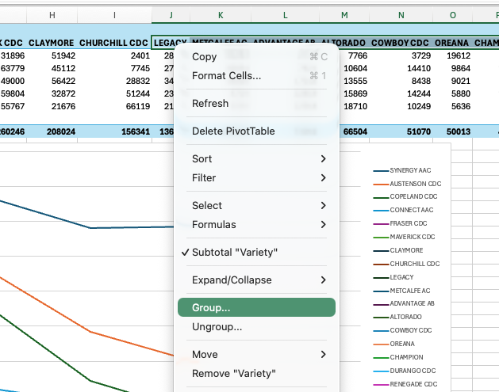{#fig-line-pivot-group .screenshot}

The resulting graph (after some cosmetic changes to fonts, titles and gridlines) is below:

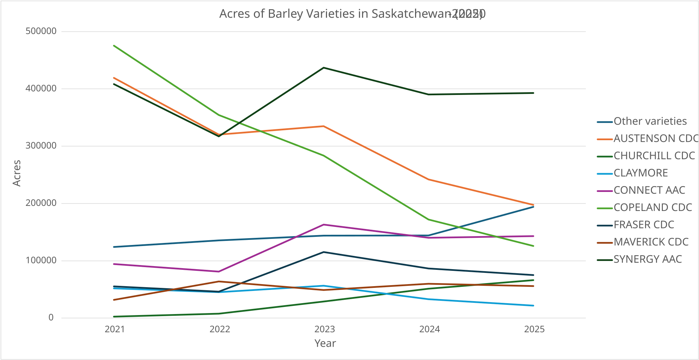{#fig-line-final}

## Managing the data for graphing in Excel {#sec-excel-data-layout}

How the data is laid out on the sheet decides how hard the chart is to make, because Excel builds a chart straight from a block of cells. A few rules cover most of it:

- **Charts read one rectangular block.** One header row, categories in the first column, one column per series -- no merged cells, no blank rows, and no totals or notes mixed in. Anything extra in the selected block becomes another series in the chart (the fix is **Select Data** on the chart's right-click menu, where extra series can be removed).
- **Excel wants wide data for a multi-series chart -- the opposite of R.** To plot three crops over time as three lines, put the year in the first column and one column per crop. The long, tidy form from @sec-tidy-data cannot feed an ordinary chart at all; long data is charted through a PivotChart instead. So expect to pivot between the two shapes: long for analysis and R, wide for an Excel chart.
- **Numbers must be stored as numbers and dates as dates.** A yield stored as text plots as zero or is skipped without warning, and text dates give a category axis, with the years evenly spaced whatever their values, instead of a true time axis. Put units in the header, as in `Yield (bu/ac)`; typing them into the cells turns the column into text.
- **Leave missing values blank.** A zero draws a bar of height zero and drags a line down to the floor. A blank leaves a gap, and **Select Data > Hidden and Empty Cells** controls whether a line bridges it.
- **Sort the table in the order you want the bars.** Excel plots rows in sheet order, so sorting the summary table descending is the chart-ordering step.
- **Chart a small summary table, not the raw data.** The charts in this chapter draw on small summary tables, not the thirteen thousand source rows. Formatting that block as a Table (**Ctrl+T**; **Cmd+T** on a Mac) makes the chart pick up new rows automatically when the table grows.
