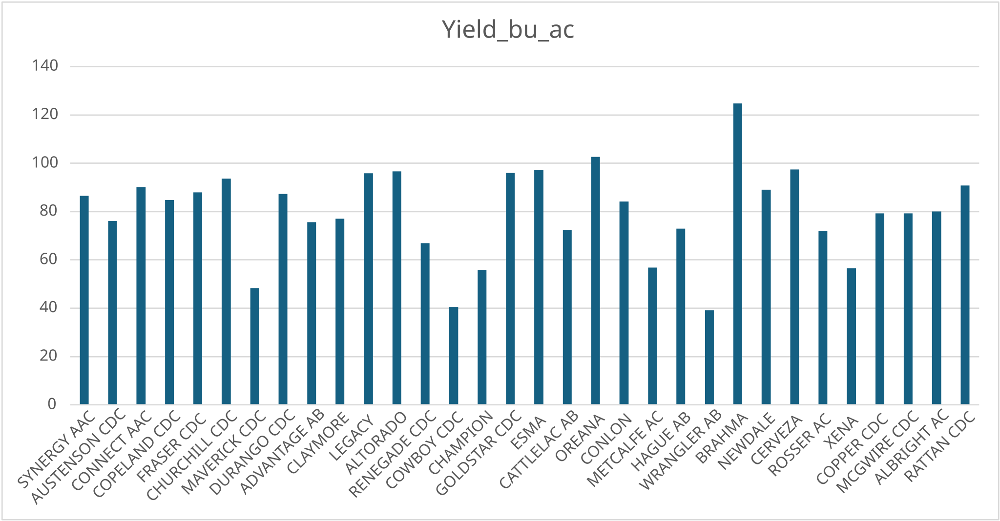
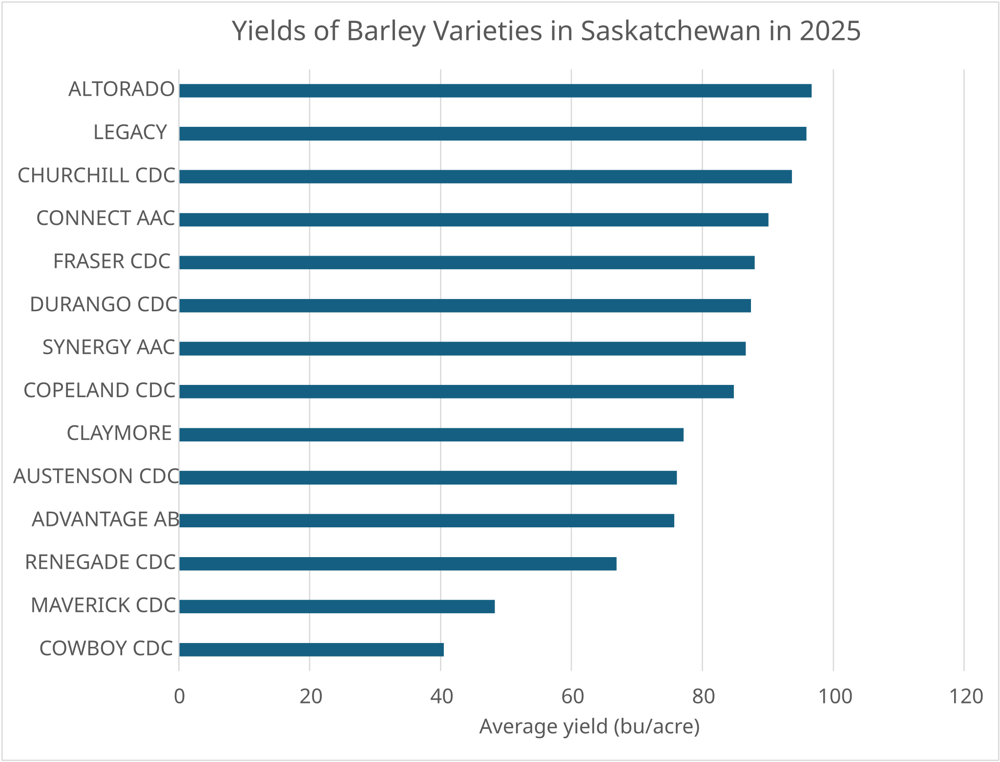
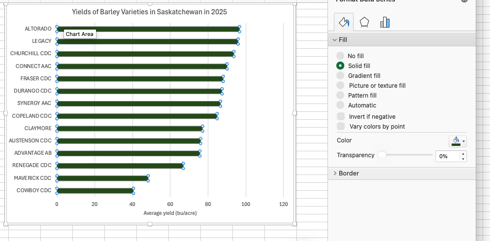
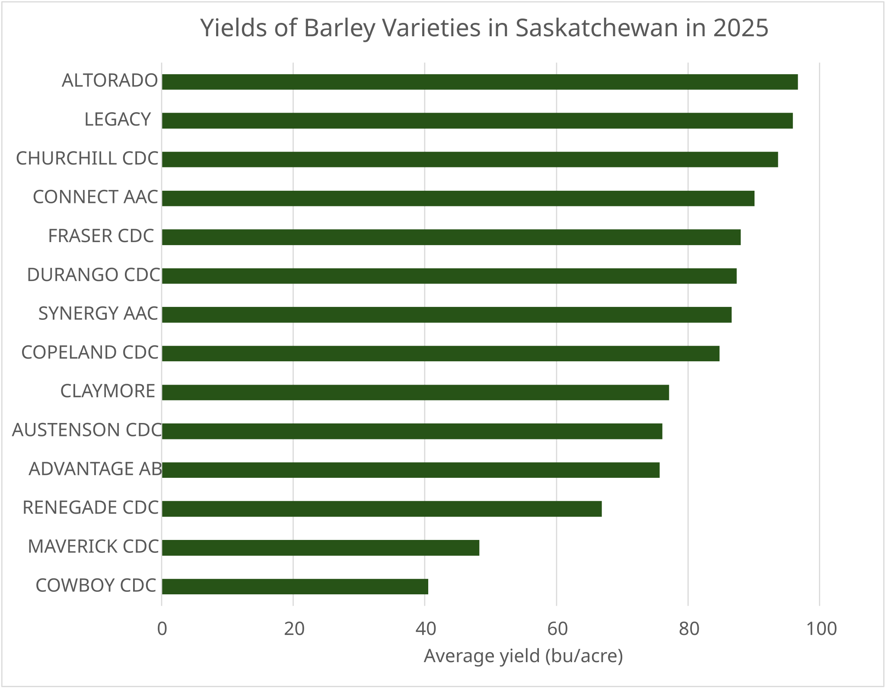

# Graphing in Excel {#sec-graphing-excel}

The examples in this chapter use [`sask_variety_yields.csv`](practice/data/sask_variety_yields.csv), which contains Saskatchewan Crop Insurance Corporation variety yields by risk zone from 2021 to 2025 [@scic_smp]. The file has 13,625 rows and includes 3,370 rows for `Canola/Rapeseed`.

The main example compares the 2025 acre-weighted provincial yields of the ten most widely grown canola varieties. The R chapter uses the same records, filters and calculations.

## Learning Objectives {.unnumbered}

::: {.objectives}
By the end of this chapter you should be able to:

1. Build a chart from a worksheet summary table.
2. Check and correct the categories and series used by a chart.
3. Change a chart's title, axis titles, bounds and tick spacing.
4. Decide whether a legend or data labels help the reader.
5. Create a scatter plot and histogram from actual variety-yield data.
6. Explain why provincial yields are weighted by reported acres.
7. Format and export a chart without adding unnecessary decoration.
:::

## Bar charts
We have already made a histogram in Excel in @sec-charts. To refresh our minds on how charts are created in Excel, we can start by making a simple bar chart.  

The workbook below contains average yields and total acres of barley varieties in Saskatchewan in 2025.  To create a bar chart, we can first select the data that we want in the chart -- both the barley variety names and the average yield values.  You can select both columns by holding down the control key (or command key on a Mac) and clicking on the column headers or selecting the data with your mouse.  Then we can go to the **Insert** tab, select **Column Chart**, and choose the type of bar chart we want.

::: {.callout-tip collapse="false" title="Workbook: bar charts in Excel"}
::: {.excel-embed}
<iframe width="100%" height="500" frameborder="0" scrolling="no" src="https://usaskca1-my.sharepoint.com/personal/pjs998_usask_ca/_layouts/15/Doc.aspx?sourcedoc=%7B061ad6b0-8259-4aad-a48e-e7482bc6168e%7D&action=embedview&wdAllowInteractivity=False&wdHideGridlines=True&wdHideHeaders=True&wdDownloadButton=True&wdInConfigurator=True"></iframe>
:::
[Open the view-only workbook online](https://usaskca1-my.sharepoint.com/:x:/g/personal/pjs998_usask_ca/IQCw1hoGWYKtSqSO50grxhaOATTTjgXLmrbtvTIyTtlz8-4?e=jg23sp) or [download a copy](textbook_examples/mod_04_bar_chart.xlsx).
:::

{#fig-bar-insert .screenshot}

The chart is below, and it has lots of problems!  There is too much data in the chart, I've sorted the data by total acres but this makes it difficult to find varieties, the chart is so wide there is no way it will fit on a slide or in a document, the axes aren't labelled, etc.

{#fig-bar-first}

### Restricting the data
The first thing we might want to do is restrict the data so that there aren't as many varieties in the chart.  How much we want to filter will depend on the purpose of the chart.  In my case, I am going to restrict the data to varieties that have over 10,000 acres across the province.  I can do this with the filter option.  As soon as I filter the data the graph updates to show only the varieties that meet the filter criteria.  

There are a few different ways to sort the varieties so that the chart is easy to read. One option is to sort varieties alphabetically -- this makes it easy to find a specific variety, but it doesn't show the relative yields of the varieties.  Another option is to sort by yield, which makes it easy to see which varieties have the highest and lowest yields, but it makes it difficult to find a specific variety.  I'm going to choose to sort by yields.  My resulting chart is below.

<!-- TODO: export the filtered, yield-sorted column chart from the workbook as an SVG
(second_bar_chart.svg) and place it here; no clean image of this intermediate chart exists yet.
{#fig-bar-filtered}
-->

### Changing the chart type
The resulting graph is still fairly wide.  As mentioned in the previous chapter, a horizontal bar chart can work better when you have many categories and relatively long category names.  One way of accomplishing this is to right click the chart and select **Change Chart Type**, then choose **Bar Chart** (there are other ways of doing this in Excel too).  Note that the default is to put the first row at the bottom of the bar chart, so I sorted the yield column in ascending, rather than descending order to get the highest yielding variety at the top of the chart.  

{#fig-bar-changetype .screenshot}

### Add titles and labels
The default title of the chart is the name of the data series (*Yield_bu_ac*), which is not very informative.  We can change the title by clicking on it and typing in a new title.  We also need to add horizontal axes labels.  We can do this by clicking **Add chart element** in the **Chart Design** ribbon, then selecting **Axis Titles** and typing in the appropriate titles.  We can also add data labels to the bars by selecting **Data Labels** from the same menu.  This will add the yield values to the end of each bar.  In this particular case, we likely don't need a vertical axis label as it is clear that we are referencing barley varieties, but we could add one if we wanted to.  We then may want to change the font size of these titles, labels, and axes to make them more readable.  I tend to find the default font sizes on charts in Excel are too small.

{#fig-bar-axistitles .screenshot}

{#fig-bar-titled}

### Changing bar colours and widths
We can also change the appearance of the bars by clicking on one of the bars to select the series.  On the right hand of the screen we will then get a menu where we can change both the colour of the bars and the gap between them.  I've changed my bars to be green and to be a bit wider (i.e., less gap between them).

{#fig-bar-colour .screenshot}

## Other options
There are several other options for changing the appearance of the chart, including:
- Changing the numbers displayed on the axes.  The default for our chart had a maximum of 120 bu/ac, when no yield was above 100 bu/ac.  When you choose Format axis, you can change the minimum and maximum values, as well as the major and minor tick marks.  This can make the chart easier to read.

{#fig-bar-final}

## Line charts
Line charts are useful for showing trends over time.  Let's again work through an example of line charts in Excel.  The data we will use has acreage and yield of all varieties of barley in Saskatchewan from 2020 to 2025.  I again started by selecting the two columns of data that I want to include in the chart.  I then went to the **Insert** tab, selected **Line Chart**, and chose the type of line chart I wanted.

::: {.callout-tip collapse="false" title="Workbook: line charts in Excel"}
::: {.excel-embed}
<iframe width="100%" height="500" frameborder="0" scrolling="no" src="https://usaskca1-my.sharepoint.com/personal/pjs998_usask_ca/_layouts/15/Doc.aspx?sourcedoc=%7Badd1bb64-14da-4a53-b1d6-99f5bdd673ba%7D&action=embedview&wdAllowInteractivity=False&wdHideGridlines=True&wdHideHeaders=True&wdDownloadButton=True&wdInConfigurator=True"></iframe>
:::
[Open the view-only workbook online](https://usaskca1-my.sharepoint.com/:x:/g/personal/pjs998_usask_ca/IQBku9Gt2hRTSrHWmfW91nO6AbR1Op9rsH63FgHFOlvXO9A?e=GccRRg) or [download a copy](textbook_examples/mod04_line_charts.xlsx).
:::

The resulting chart is below.

{#fig-line-wrong .screenshot}

Evidently, this is not correct!  It is showing two lines, one with the acres of synergy one with the year.  I can correct this by right clicking the chart and selecting **Select Data**.  I can then delete the series *Year*, and include Horizontal category labels for the Acres dataset series.

{#fig-line-selectdata-menu .screenshot}

{#fig-line-selectdata-dialog .screenshot}

After doing this and fixing titles, axes labels, colours, and gridlines, I have the following chart.

{#fig-line-synergy}

### Plotting multiple series
Suppose that we wanted to plot the acreage of two different varieties (for example Synergy and Copeland).  We can do this easily by creating a column with each variety's acreage, by simply copying and pasting numbers for the two varieties into two columns.  I then click **Select Data** again and add a new series for the second variety.  Note that I now need the legend to distinguish the two lines.

<!-- TODO: export the two-series Synergy and Copeland chart from the workbook's
"Synergy and Copeland" sheet as an SVG (synergy_copeland.svg) and place it here.
{#fig-line-two-series}
-->

### Using a PivotChart
The approach above works for a quick chart with two varieties.  But what if we want to add more varieties?  Maybe we want all the varieties in the province, perhaps with smaller varieties grouped together.  We can accomplish this through a PivotChart.  A PivotChart is really just a PivotTable with a chart attached to it.  We can create a PivotChart by selecting the data and then clicking **Insert > PivotChart** (alternatively, if you already have a PivotTable created you can select the PivotTable and then insert a chart).

After changing the type of chart to a line chart, you can then select the data to be the series and another set of data to be the axes.  The resulting chart is what we wanted but is a bit of a mess.

{#fig-line-pivotchart .screenshot}

In the screenshot it is clear that we cannot distinguish the lines for the smaller varieties.  So it is best to eliminate these.  We can do this by either filtering out smaller varieties (those whose total acreage across all years is less than some value).  As below:

{#fig-line-pivot-filter .screenshot}

Or we could group all the smaller varieties together.  As in the following screenshot.

{#fig-line-pivot-group .screenshot}

The resulting graph (after some cosmetic changes to fonts, titles and gridlines) is below:

{#fig-line-final}

## Managing the data for graphing in Excel {#sec-excel-canola-source}

Each source row represents one risk-zone, crop, variety and year combination. `Risk_Zone` is an identifier, not a measured quantity. `Acres` records the reported acreage and `Yield` is measured in bushels per acre.

Some earlier-year observations are suppressed. Their acres and yields are blank in the source file and remain blank in the workbook. A blank is not the same as a zero, so it should not be converted to one before summarizing or graphing.

The **Canola records** sheet is the exact `Canola/Rapeseed` subset plus one transparent helper column. `Acre-yield total` multiplies acres by yield for each reported row. The helper is blank when either input is blank.

Beyond these particulars, how the data is laid out on the sheet decides how hard the chart is to make, because Excel builds a chart straight from a block of cells. A few rules cover most of it:

- **Charts read one rectangular block.** One header row, categories in the first column, one column per series -- no merged cells, no blank rows, and no totals or notes mixed in. Anything extra in the selected block becomes another series in the chart (@sec-excel-select-data shows the fix when it happens).
- **Excel wants wide data for a multi-series chart -- the opposite of R.** To plot three crops over time as three lines, put the year in the first column and one column per crop. The long, tidy form from @sec-tidy-data cannot feed an ordinary chart at all; long data is charted through a PivotChart instead. So expect to pivot between the two shapes: long for analysis and R, wide for an Excel chart.
- **Numbers must be stored as numbers and dates as dates.** A yield stored as text plots as zero or is skipped without warning, and text dates give a category axis, with the years evenly spaced whatever their values, instead of a true time axis. Put units in the header, as in `Yield (bu/ac)`; typing them into the cells turns the column into text.
- **Leave missing values blank.** A zero draws a bar of height zero and drags a line down to the floor. A blank leaves a gap, and **Select Data > Hidden and Empty Cells** controls whether a line bridges it.
- **Sort the table in the order you want the bars.** Excel plots rows in sheet order, so sorting the summary table descending is the chart-ordering step.
- **Chart a small summary table, not the raw data.** The bar chart in this chapter draws on a ten-row table, not the 3,370 source rows. Formatting that block as a Table (**Ctrl+T**; **Cmd+T** on a Mac) makes the chart pick up new rows automatically when the table grows.

## The worked workbook {#sec-excel-graphing-workbook}

The workbook contains the canola records, a formula-driven variety summary, and finished bar, scatter and histogram examples. Open the **Bar chart** sheet first. The nine numbered steps beside the chart are meant to be followed in Excel.

::: {.callout-tip collapse="false" title="Workbook: graphing examples in Excel"}

<iframe width="100%" height="700" frameborder="0" scrolling="no" src="https://usaskca1-my.sharepoint.com/personal/pjs998_usask_ca/_layouts/15/Doc.aspx?sourcedoc=%7B7e79c20b-509a-4f55-83b4-1108f88d92fd%7D&action=embedview&wdAllowInteractivity=False&wdHideGridlines=True&wdHideHeaders=True&wdDownloadButton=True&wdInConfigurator=True&ActiveCell=%27README%27!A1"></iframe>

[Open the view-only workbook online](https://usaskca1-my.sharepoint.com/:x:/g/personal/pjs998_usask_ca/IQALwnl-mlBVT4O0EQj4jZL9ASmOupIPmOfjGocibTAS9oA?e=ULMgyT) or [download a copy](textbook_examples/mod04_graphing_excel.xlsx).
:::

## Start with the chart-driving table {#sec-excel-chart-table}

The raw canola subset has 3,370 rows, but the bar chart needs one value per variety. The **Bar chart** sheet therefore contains a ten-row summary table.

The ten varieties were selected by total reported 2025 acres. Their provincial yield is calculated as:

$$
\text{weighted yield} = \frac{\sum(\text{Acres} \times \text{Yield})}{\sum \text{Acres}}.
$$

This calculation gives more influence to a risk zone with 100,000 reported acres than to one with 1,000 acres. A simple average of the risk-zone yields would give both zones equal influence.

The workbook uses `SUMIFS` to total the `Acre-yield total` and acres for the selected variety and year. The **Variety summary** sheet repeats the calculation for all 97 canola varieties.

## Create the bar chart {#sec-excel-create-bar}

On the **Bar chart** sheet, select cells `A4:B14`, including the two headers. Do not include reported acres, risk-zone counts or the formula text.

Use **Insert > Column or Bar Chart > 2-D Bar > Clustered Bar**. Excel calls horizontal bars a **bar chart** and vertical bars a **column chart**. Horizontal bars leave more room for variety names, so they suit this example.

If you include columns C through E, Excel may treat acres, zone counts or formula text as additional series. Remove those series with **Chart Design > Select Data**, or delete the chart and select only `A4:B14` again.

## Check the source data {#sec-excel-select-data}

With the chart selected, open **Chart Design > Select Data**. The **Legend Entries (Series)** list should contain one series named `Weighted yield (bu/ac)`. The **Horizontal (Category) Axis Labels** should contain the ten variety names.

If the varieties appear as separate series, click **Switch Row/Column**. This changes the orientation of the selected data; it does not recalculate the weighted yields.

The chart remains linked to cells `A4:B14`. Changing a formula result changes the corresponding bar. Sorting the table changes the order of the bars.

## Change the title {#sec-excel-chart-title}

Click the default chart title and type `2025 yield of leading canola varieties`. If the title is missing, use **Chart Design > Add Chart Element > Chart Title > Above Chart**.

A useful title identifies the year, measure and comparison. The phrase `leading canola varieties` refers to the ten varieties with the largest reported 2025 acreage, not the ten highest-yielding varieties.

To change the title's typeface or size, click the title itself before using the **Home** tab or **Format Chart Title** pane. Clicking the chart background selects a different chart element.

## Add and alter the axes {#sec-excel-alter-axes}

Use **Chart Design > Add Chart Element > Axis Titles > Primary Horizontal** and type `Acre-weighted yield (bu/ac)`. The variety names already explain the category axis, so it does not need another title.

Right-click the numbered axis and choose **Format Axis**. Under **Axis Options**, set **Minimum** to `0`, **Maximum** to `55` and **Major unit** to `10`.

The zero minimum matters because bar length encodes yield. Starting the axis near 40 would make the differences look much larger than they are. Scatter plots can use narrower limits because points encode position rather than length.

Excel often places the first source row at the bottom of a horizontal bar chart. If the largest yield appears at the bottom, right-click the category axis and select **Format Axis > Categories in reverse order**.

## Legends, labels and colour {#sec-excel-chart-elements}

The chart has one series, so its legend repeats information already supplied by the title and value axis. Remove it with **Chart Design > Add Chart Element > Legend > None**.

Exact values remain readable with ten bars. Use **Chart Design > Add Chart Element > Data Labels > Outside End**, then open **Format Data Labels > Number** and show one decimal place.

Click one bar once to select the whole series, then apply one fill colour. Clicking the same bar a second time selects only that variety. Use a second colour only when the text gives that variety a deliberate reason for emphasis.

Keep light value gridlines, but remove heavy borders, gradients, shadows and three-dimensional effects.

## Create the two-year scatter plot {#sec-excel-scatter-example}

The **Scatter plot** sheet compares each variety's 2024 and 2025 acre-weighted provincial yield. The helper table in `J41:L113` contains the 72 varieties reported in both years.

Select the two numeric columns, `K41:L113`, and use **Insert > Scatter > Scatter with only Markers**. Open **Chart Design > Select Data** and confirm that the X values are `K42:K113` and the Y values are `L42:L113`.

Add the title `Canola variety yield: 2024 versus 2025`. Label the horizontal axis `2024 acre-weighted yield (bu/ac)` and the vertical axis `2025 acre-weighted yield (bu/ac)`.

Set the horizontal bounds to 0 and 55 and the vertical bounds to 20 and 55. The ranges are different because the lowest reported provincial value differs between the years. The chart contains 72 points; 25 varieties without a 2024 value are omitted rather than plotted at zero.

The correlation is about 0.29. That number describes a weak positive linear association, but it does not explain why yields changed between years.

## Create the histogram {#sec-excel-histogram-example}

The **Histogram** sheet counts the 674 reported 2025 risk-zone-by-variety yields in 5 bu/ac intervals. The bin table uses `COUNTIFS` to require `Year = 2025` and then apply the lower and upper yield boundaries.

Select `J27:K38` and use **Insert > Column or Bar Chart > Clustered Column**. Set **Gap Width** close to zero if you want the columns to touch like conventional histogram bins.

The eleven bin counts add to 674 and cover yields from 18.0 to 69.0 bu/ac. The tallest interval is 45 to 50 bu/ac, with 222 reported rows.

You can also create Excel's automatic histogram by filtering **Canola records** to 2025, selecting the visible `Yield` values and using **Insert > Insert Statistic Chart > Histogram**. Right-click the horizontal axis, choose **Format Axis**, and set **Bin width** to `5`. The formula table is preferable when the Excel and R examples must use identical boundaries.

Use `Reported 2025 canola yields (5 bu/ac bins)` as the title. Label the vertical axis `Reported risk-zone-by-variety rows` so readers do not mistake the bars for farms, fields or provincial varieties.

## Resize, copy and export {#sec-excel-chart-export}

Drag a corner handle to resize a selected chart without distorting it. Leave enough room for the title, labels and tick marks, and check the chart at the size it will occupy in the report.

Copying a chart into Word or PowerPoint provides several paste options. **Picture** or **Paste Special > Picture (PNG)** fixes its appearance. A linked chart can update from Excel but can break when the workbook and document are moved or shared separately.

Desktop Excel also provides **Save as Picture** from a chart's right-click menu. Before exporting, compare at least one plotted value with its source cell and check the title, source range, axis bounds, units, missing-value treatment and number of observations.
