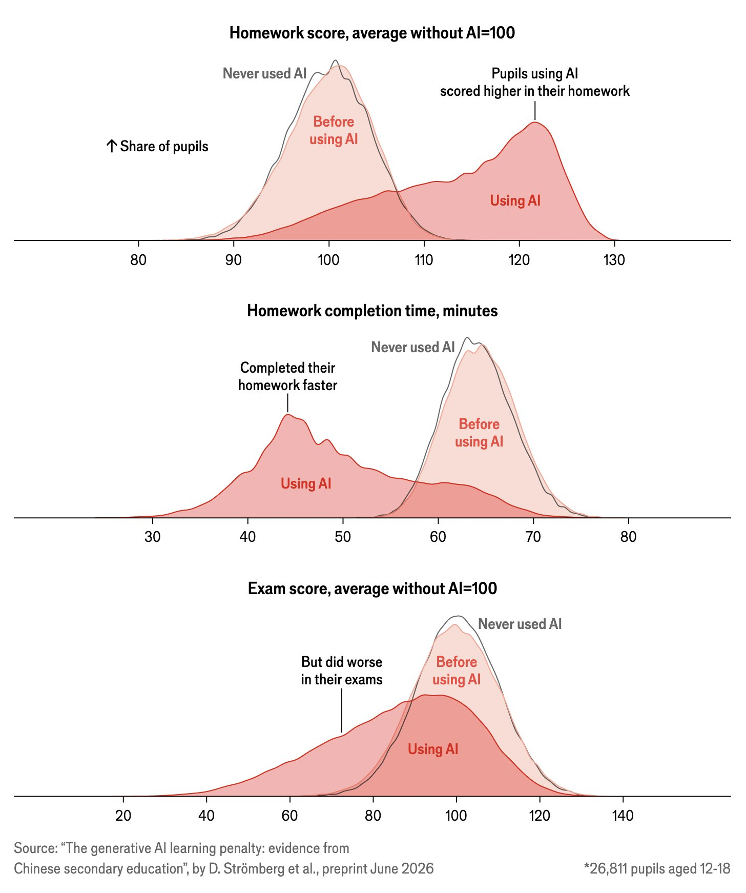

# AI Tools {#sec-ai-tools}

```{r}
#| include: false
#| eval: true
source("_console.R")
```

AI tools can explain an error, suggest R code and edit a whole project. They can also produce code that runs and answers the wrong question.

The practical question is whether you can check the result. A task is safer to hand to an AI when an error will be obvious or easy to test. It is riskier when a wrong answer looks plausible.

## Learning Objectives {.unnumbered}

::: {.objectives}
By the end of this chapter you should be able to:

1. Decide whether an AI-assisted task can be checked reliably.
2. Explain why fluent output can still be wrong.
3. Distinguish a chatbot, an in-editor assistant and a coding agent.
4. Recognize common AI failures in agricultural data work.
5. Identify data that should not be sent to an external AI service.
6. State the course policy on AI use.
:::

## What a Language Model Produces {#sec-what-ai-does}

A large language model is trained to predict and generate text from the context it receives. That training includes natural language and a great deal of code. Additional training makes the model better at following instructions and producing useful answers.

The important word here is *generate*. The model does not retrieve a correct answer from a database. It generates a response that fits your request and the context available to it. This is why it can explain an R error very well, but also invent a function name that sounds as though it should exist.

The model's wording does not measure its certainty. A correct function name and an invented one can arrive in the same confident tone. People often use hesitation as a clue that another person is unsure; generated text does not provide that clue reliably. Judge an answer from its code, sources and results rather than from how confident it sounds.

## Three Ways to Use AI for Code {#sec-ai-generations}

Broadly, there are three ways to use AI for help with data analysis.

1. **A chatbot.** You are likely familiar with chatting with Claude, ChatGPT or Gemini through a web page or app. Chatbots are useful for asking questions, brainstorming and learning about a new method. You can paste in an error message, attach a screenshot or upload a script and ask what went wrong. The chatbot only knows what you give it in that conversation, along with any files or saved project instructions it can access.

2. **An in-editor assistant.** This type of assistant lives inside another program. It can see the open script, workbook or other selected project context. It offers completions while you type and answers questions without as much copying between windows. GitHub Copilot in Positron and Copilot in Excel are examples. The convenience is useful, but it also makes suggestions very easy to accept without reading them.

3. **A coding agent.** An agent can inspect several files, edit them, run code, read the resulting errors and try again. You give it a task rather than asking for one line of code. This makes an agent much more useful for work that crosses several scripts or files. It also gives the agent more opportunities to make changes you did not intend. Your job shifts from typing each line to defining the task, setting limits and reviewing what changed.

Up to this point, you have mostly used AI through a chatbot. There is also a course chatbot that has access to this textbook and should have more context about the examples and conventions used here. In this module we will begin using AI inside the software where we do the analysis.

## Current AI products

There are a handful of companies that are provide most of the AI tools that are currently being used.  While this is a dynamic space, I've tried to list the current products that are available below to help you get a sense of what is available to you.


1. **[Claude](https://claude.ai/)** is Anthropic's general chatbot. It accepts documents, spreadsheets, images and code, and conversations can be organized into projects with shared instructions and files. **[Claude Code](https://www.anthropic.com/claude-code)** is Anthropic's coding agent. It works with a folder or repository and can inspect files, edit them and run commands.  A subscription is needed to access this coding agent.

2. **[ChatGPT](https://chatgpt.com/)** is OpenAI's general chatbot. It can work with uploaded files, run data analysis and use tools such as web search. **[Codex](https://openai.com/codex/)** is OpenAI's coding agent. It can work with a repository, edit files, run commands and show the changes for review.

3. **[Gemini](https://gemini.google.com/)** is Google's general chatbot. It is closely connected to Google products such as Drive, Docs and Sheets, and it can accept code files and repositories as context. Google also provides coding assistants based on Gemini, although we will not use them directly in this course.

4. **[Microsoft Copilot](https://copilot.microsoft.com/)** is Microsoft's name for a family of AI assistants.  There is a Copilot chatbot.  However, perhaps more useful, are the tools that are embedded in Miscrosoft products like Word and Excel.  The Excel copilot tool can create formulas, summaries and charts using the workbook that is already open. 

5. **[GitHub Copilot](https://github.com/features/copilot)** is a coding assistant that works in editors such as Positron, as well as on GitHub itself. It began mainly as an inline code-completion tool, but it now also includes chat and agent modes that can edit several files and run code. We will use GitHub Copilot in the next chapter.  Notee that copilot relies on models from Claude, OpenAI, and others.

6. **[Cursor](https://cursor.com/)** is a code editor built around AI assistance. It looks and behaves much like VS Code, but chat, code completion and coding agents are central parts of the editor. It can use models from several AI companies.

7. **Open-source and open-weight models** can be downloaded and run on your own computer or on a server you control. This can provide more control over the model and where the data go, although running a capable model may require substantial computing power. Typically, most individual users prefer to use one of the big AI companies rather than these open source products.  However, companies that are heavy users have started using free, open source products for mundane tasks, while giving more complex tasks to frontier models from Claude and OpenAI.

Features, access and product names change quickly, so check the current documentation before deciding which one to use.

## Eight principles for data analysis with AI {#sec-ai-understanding}

1. **You are still responsible.**  AI can perform much of the work, but you remain responsible for the data, methods, results, and conclusions. You should understand the analysis thoroughly and be able to explain and defend it.

2. **Use AI to explore, but verify before relying on it.**  AI is especially valuable for inexpensive exploration. You may have an interesting idea that would take days to code, but an AI agent can investigate it quickly. The result can help you decide whether the idea is worth pursuing. Other agents can help identify obvious problems, but agreement between agents is not proof. If you decide to pursue the the analysis, you must verify the data, code, methods, and results yourself.

3. **Protect your data.**   Do not provide confidential, personal, proprietary, or sensitive data to an AI system unless that system has been approved for such data. When possible, use de-identified data, synthetic examples, or a description of the data structure.

4. **Manage the context.**  AI needs the relevant files, definitions, background, and project conventions to do good work. Too little context encourages guessing, but too much irrelevant context can also reduce performance. Maintain a current `README.md`, data dictionary, or project instruction file that records the information the AI needs. Update it as the project changes.  You can also ask your AI agent to continually maintain this and other files that provide them with context in their next session.

5. **Define the task and the desired output.**  Be explicit about what you want the AI to produce, what constraints it must follow, which files it may use or change, and how it should determine whether the task is complete.

6. **Make AI show and explain its work.**  Ask the AI to describe its approach, assumptions, data transformations, exclusions, and analytical choices. Require inspectable code and supporting sources where appropriate. An explanation supports understanding, but it does not replace verification.

7. **Use multiple agents and models strategically.**  Do not rely entirely on one model or one conversation. Use different agents for different roles: one might develop an analysis, another audit it, and another attempt an independent implementation. Give reviewers specific tasks rather than simply asking whether the first answer is correct.

8. **Document the analysis and your use of AI.**  Preserve the raw data, code, prompts or instructions that materially affected the analysis, and important analytical decisions. Disclose meaningful AI assistance and ensure that someone else could reproduce the final results without relying on the original AI conversation.


## Common Failure Modes {#sec-ai-failure-modes}

### Invented functions and packages {.unnumbered}

A model may suggest a plausible function such as `summarise_by()` or `read_excel_sheet()` even when it does not exist. R stops with an error, so this is usually easy to find. Search the package's official reference before installing a package or changing the script around an unfamiliar function.

In Excel, an invented or unavailable function produces `#NAME?`. The same error can mean that a real Microsoft 365 function is unavailable in an older Excel version, so check the function's Microsoft support page and its version list.

### Assumed column names {.unnumbered}

If the model has not seen the data, it may write code for columns named `yield`, `crop` and `year`. The file may use `Yield`, `Crop_Name` and `Harvest_Year`. Supply `glimpse()` output or a short description of the columns before asking for code. For Excel, supply the exact header row, two or three made-up example rows, the sheet and range, and whether the range is an Excel Table.

### Out-of-date syntax {.unnumbered}

Packages change. An old function or argument may have been replaced since the model's training data was collected. For example, `gather()` still appears in older code, while current tidyr uses `pivot_longer()`. “Superseded” means an older function still works but is no longer recommended; “deprecated” normally warns; “defunct” errors. Package documentation is the check.

### Numbers produced without a reproducible calculation {.unnumbered}

Do not ask a chatbot to calculate a reported statistic from pasted rows and then trust the number. Ask for code, run it in R and keep the calculation in the script. In Excel, every reported number should come from a visible formula rather than a typed constant; use `FORMULATEXT` when the calculation needs to be audited.

### Assumptions from another place {.unnumbered}

Answers about agriculture may default to US crops, agencies and geography. Saskatchewan data may use rural municipalities rather than counties, SCIC definitions rather than a US crop-insurance program, and bushels per acre rather than another yield unit.

@fig-units shows the same 2025 canola yield in three units. A conversion error can change the numerical scale without causing an R error.

```{r}
#| label: fig-units
#| eval: true
#| echo: false
#| message: false
#| warning: false
#| fig-width: 5.0
#| fig-height: 2.0
#| fig-cap: "The acreage-weighted mean 2025 canola yield in the teaching variety file, reported in three units."
source("R/ai_failures.R")
fig_units()
```

The failures differ in how easy they are to notice. An invented function stops the script. A wrong unit or incomplete join may not.

```{r}
#| label: fig-spectrum
#| eval: true
#| echo: false
#| message: false
#| warning: false
#| fig-width: 6.0
#| fig-height: 2.2
#| fig-cap: "Common failures arranged by whether R is likely to stop the script."
fig_failure_spectrum()
```

## A Silent Failure {#sec-ai-silent-failure}

The yield file is synthetic teaching data, and the five round crop prices are illustrative placeholders rather than observed 2025 market prices. The question is the average 2025 revenue per acre for spring wheat, canola, barley and oats, weighted by acres; the resulting dollars demonstrate a join and are not a Saskatchewan revenue estimate.

The following code looks reasonable. It filters the yield data, joins prices by crop, calculates revenue and then uses `na.rm = TRUE` in the weighted mean.

```{r}
#| eval: true
#| echo: false
console('
# Load the two files
suppressPackageStartupMessages(library(tidyverse))

d <- read_csv(
  "practice/data/sask_variety_yields.csv",
  show_col_types = FALSE
)
p <- read_csv(
  "practice/data/crop_prices.csv",
  show_col_types = FALSE
)

# Keep recorded yields for four crops in 2025
d25 <- d |>
  filter(
    Year == 2025,
    Crop %in% c(
      "Wheat - Hard Red Spring",
      "Canola/Rapeseed",
      "Barley",
      "Oats"
    ),
    !is.na(Yield),
    !is.na(Acres),
    Acres > 0
  )

# Add the price and calculate revenue per acre
j <- d25 |>
  left_join(p, by = "Crop") |>
  mutate(Revenue = Yield * Price_per_bu)

weighted.mean(j$Revenue, j$Acres, na.rm = TRUE)
')
```

The result, $476.79 per acre, is plausible. The crop names do not all match. The price file uses `Canola` and `Spring wheat`; the yield file uses `Canola/Rapeseed` and `Wheat - Hard Red Spring`. Barley and oats match, while canola and wheat receive `NA` for price.

Count the failed matches before calculating anything:

```{r}
#| eval: true
#| echo: false
console('
nrow(d25)
nrow(j)

d25 |>
  anti_join(p, by = "Crop") |>
  distinct(Crop)

sum(is.na(j$Price_per_bu))

sum(j$Acres[is.na(j$Price_per_bu)]) / sum(j$Acres)

j |>
  count(Crop, price_missing = is.na(Price_per_bu))
')
```

The join preserves all 1,416 rows, but 1,051 rows—and about 87% of the acres—have no price. `na.rm = TRUE` removes them from the weighted mean, so the reported value describes barley and oats rather than all four crops. Use `na.rm = TRUE` only after counting the missing values and explaining their source.

```{r}
#| label: fig-join-loss
#| eval: true
#| echo: false
#| message: false
#| warning: false
#| fig-width: 5.4
#| fig-height: 2.5
#| fig-cap: "Rows in the 2025 yield data according to whether the join found a crop price."
fig_join_loss()
```

Reconcile the two known names, repeat the join and check again:

```{r}
#| eval: true
#| echo: false
console('
# Reconcile crop names with the price table
d25_fixed <- d25 |>
  mutate(Crop = case_match(
    Crop,
    "Canola/Rapeseed" ~ "Canola",
    "Wheat - Hard Red Spring" ~ "Spring wheat",
    .default = Crop
  ))

# Repeat the join and state the expected relationship
j_fixed <- d25_fixed |>
  left_join(
    p,
    by = "Crop",
    relationship = "many-to-one"
  ) |>
  mutate(Revenue = Yield * Price_per_bu)

sum(is.na(j_fixed$Price_per_bu))
stopifnot(!anyNA(j_fixed$Price_per_bu))
weighted.mean(j_fixed$Revenue, j_fixed$Acres)
')
```

The corrected result is $571.17 per acre. In Excel, `XLOOKUP` would expose unmatched names as `#N/A`; do not let an AI hide them with `IFERROR(...,0)`, and avoid `VLOOKUP` without an explicit exact-match argument. Count missing results with `=SUMPRODUCT(--ISNA(price_range))` before calculating revenue.

Supplying the price table's exact crop names in the prompt could have prevented this case. The checks that catch it regardless of the prompt are `anti_join()`, before-and-after row counts, a missing-value count, and the `stopifnot()` guard.

## Tasks That Are Easy to Check {#sec-ai-good-uses}

AI assistance is useful when the result can be tested quickly:

- Explain an R error message and identify the line it refers to.
- Suggest the name of a function, followed by a check of its documentation.
- Draft repetitive syntax such as a `case_when()` block.
- Explain an unfamiliar line of code.
- Produce a first draft of a plot whose labels, groups and values can be inspected.
- Explain an Excel error such as `#SPILL!`, `#VALUE!` or `#REF!`, followed by checking the referenced cells.
- Draft a `SUMIFS` or `XLOOKUP`, followed by filtering the source table and checking matching rows.

In each case, R or the user provides a separate check.

## Tasks Requiring More Judgment {#sec-ai-bad-uses}

Some tasks require information the model does not have:

- Choosing the analysis without a clear question.
- Deciding whether the observations represent the population of interest.
- Judging whether an agricultural result is plausible in its stated units and location.
- Choosing which caveat matters to a producer, client or policy maker.
- Supplying references that have not been checked against the original source.

AI can help list possibilities, but the final decision has to be justified from the question, data and subject matter.

## Data That Should Not Be Sent {#sec-ai-privacy}

Prompts and code sent to a hosted AI service leave the computer. What is stored, for how long, and whether it is used to improve a service depends on the provider, account and organization settings.

The datasets in this course are public or synthetic. A producer's field records, financial statements, contact information, employee data and material covered by a confidentiality agreement are different. Do not paste someone else's confidential data into a consumer AI tool. Describe the column names, types and problem without supplying the values, or use a service approved by the organization that owns the data.

An in-editor assistant may use the current file or other project context. Check what context has been selected and close or exclude files that should not be sent (@sec-copilot-modes).

Copilot in Excel sends Table content to Microsoft's service; it is not a local calculation. An organization-managed Microsoft 365 account may operate within that organization's data protections, while a consumer chatbot account does not inherit them. Follow the data owner's policy and use headers plus made-up rows when approval is uncertain.

## Course Policy {#sec-ai-policy}

AI tools may be used for module practice and the course project. They may not be used on tests.

Tests check whether you can read the data, choose an analysis and recognize an implausible answer without the tool doing those jobs for you. For submitted work, you must be able to explain every line of code and account for every reported number.

A 2026 working paper reports an observational comparison involving 26,811 Chinese secondary students who self-selected into using generative AI [@stromberg2026]. After adoption, homework scores rose and completion times fell, while exam scores fell.

{#fig-ai-penalty}

The paper argues that students substituted the tool for practice. That is a plausible interpretation, but its subgroup comparison contrasts students who chose to change their work differently; it is not a clean experimental test of the mechanism. The result therefore does not imply that every use of AI reduces learning.

Other courses have their own rules. Check the syllabus for each course before using AI on assessed work.

## The Rest of This Module {#sec-ai-module-plan}

The next chapter sets up GitHub Copilot as a provider for Positron Assistant and develops a checking routine. The final chapter uses graphing exercises because a visible figure makes many coding errors easier to inspect. This module practises AI assistance mainly in Positron because scripts make the generated work visible; the same checking habits apply to formulas and charts produced by Copilot in Excel.

::: {.callout-tip collapse="true"}
## Other resources -- AI-assisted coding

- **3Blue1Brown**, [*But what is a GPT?*](https://www.youtube.com/watch?v=wjZofJX0v4M) gives a visual explanation of language-model prediction.
- **Simon Willison**, [*Not all AI-assisted programming is vibe coding*](https://simonwillison.net/2025/Mar/19/vibe-coding/) develops the explanation standard used above.
:::
