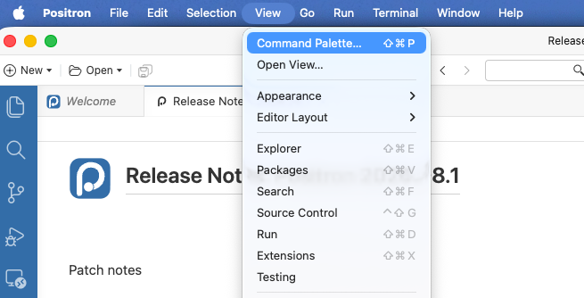
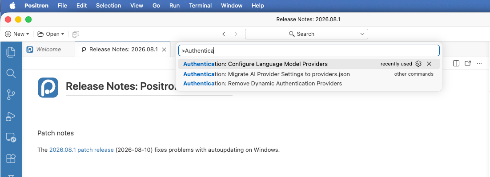
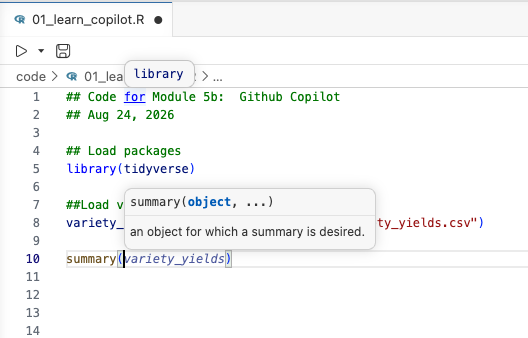
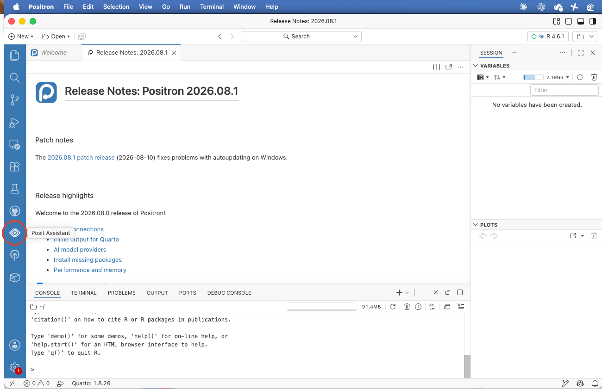
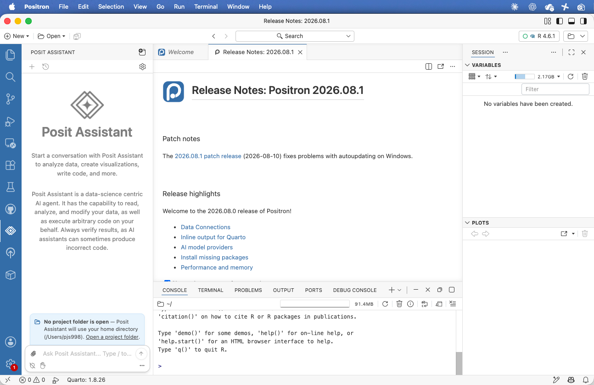
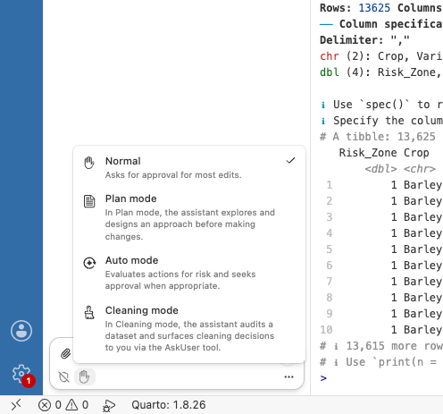
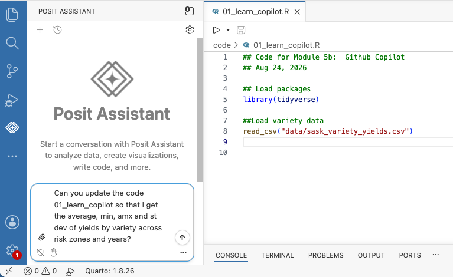
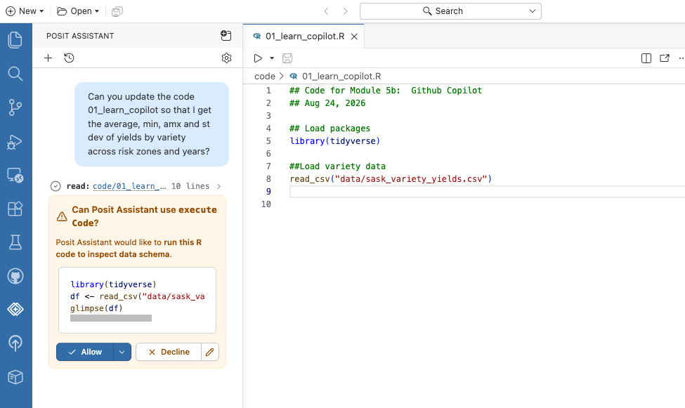
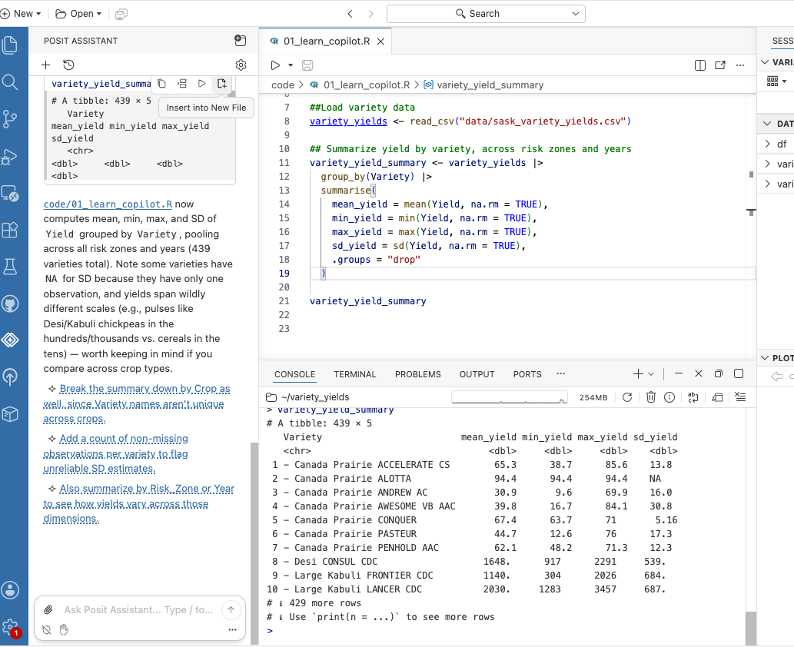

# GitHub Copilot {#sec-copilot}

```{r}
#| include: false
#| eval: true
source("_console.R")
```

The AI coding assistant we will use for this course is GitHub Copilot.  This assistant works well within the Positron environment.  It can function at all three levels of AI assistance -- as a chatbot, an inline editor, and an agent.  Most importantly, it is free for students and faculty.

Note that GitHub Copilot and Microsoft 365 Copilot are separate products. GitHub Copilot supplies coding help in Positron and is the product used here. Copilot in Excel requires separate Microsoft licensing; GitHub Education does not unlock it.

## Learning Objectives {.unnumbered}

::: {.objectives}
By the end of this chapter you should be able to:

1. Connect a GitHub Copilot account to Positron.
2. Use inline completions and Posit Assistant chat for different tasks.
3. Give the assistant enough information about a dataset to avoid guessing.
4. Decide whether to accept, revise or reject suggested code.
5. Check AI-assisted code before it becomes part of an analysis.
:::

## Getting Access {#sec-copilot-signup}

A GitHub Pro plan is free for post-secondary students and faculty.  This provides you with the equivalent of \$15 of monthly credits, which should be more than enough for our class.  To apply for the student benefit:

1. Create a personal account at [github.com](https://github.com) if you do not have one.
2. Open your [GitHub Education benefits](https://github.com/settings/education/benefits) and start a student application.
3. Add and verify your `@usask.ca` address if GitHub asks for an academic email.
4. Supply current proof of enrolment, such as a student card with an enrolment date, a class schedule, a transcript or an enrolment letter.
5. After verification, return to the benefits page and activate the Copilot benefit. Education approval and Copilot activation are separate steps.

Apply early as verification can take several days.  

## Connecting Copilot to Positron {#sec-copilot-positron}

You can connect to Github Copilot directly through Positron using these steps:

1. Update Positron before beginning.
2. Open **View > Command Palette**, or use `Cmd+Shift+P` on macOS or `Ctrl+Shift+P` on Windows.
3. Run **Authentication: Configure Language Model Providers**.
4. Select **GitHub Copilot** and sign in through the browser window that opens.
5. Return to Positron and open Posit Assistant chat. Copilot should appear as an available provider.

::: {#fig-copilot-connect layout-ncol=2}
{.screenshot}

{.screenshot}

Connecting Copilot through the Command Palette.
:::

Copilot's grey inline completions become available after the same sign-in. If chat or completions do not appear, restart Positron. If the account was connected in an older Positron release, sign out of GitHub from the Accounts menu and sign in again.

The command **AI: Create Diagnostic Report** lists the active providers and AI settings without exposing the content of your prompts. It is the quickest check when Positron appears connected but produces no suggestions.

These command names were checked in August 2026. If a later Positron release uses different wording, search the Command Palette for “language model” or “AI” and consult the configuration page linked below.

## Two Ways to Use It {#sec-copilot-modes}

### Inline completions {.unnumbered}

Inline completions appear as grey text while you type. Press `Tab` to accept a suggestion, `Esc` to dismiss it or keep typing to replace it.

In @fig-copilot-wrong-file the AI is trying to helpfully suggest how to complete my code to read in a file.  **Unfortunately, it is completing with the wrong file name!** This is because the inline completion is trying to guess what I want from just what is in the existing code -- since it knows from my comment that I want to load variety data, it makes the, not illogical, guess that the raw data is called `data/variety_data.csv`.

{#fig-copilot-wrong-file .screenshot}

In @fig-copilot-summary, I want to summarize the columns in the data.  More helpfully, once I start typing `summa` it correctly guesses that I want to run `summary(variety_yields)`.

{#fig-copilot-summary .screenshot}

Inline completion is useful for predictable syntax, repeated arguments and the next line of a pattern already present in the script. It is a poor place to ask for an explanation because the result arrives as code rather than a discussion.

### Posit Assistant chat {.unnumbered}

More powerful is the Posit Assistant chat.  You can open it from the sidebar, as shown in @fig-assistant-open.

::: {#fig-assistant-open layout-ncol=2}
{.screenshot}

{.screenshot}

Opening Posit Assistant.
:::

By default, the assistant can access all the files in your project.  Make sure you want to give it this access before proceeding.  The assistant also has modes (@fig-assistant-modes) that control how much it does before asking: in Normal mode it asks for approval before most edits, while Auto mode approves more of its own actions.

{#fig-assistant-modes .screenshot}

Not only can the assistant answer questions about your code, but it can write code for you.  In @fig-assistant-task I ask it to summarize the yields of each variety.  It writes the code, asks permission to run it, and executes it, ensuring that it actually runs.

::: {#fig-assistant-task layout-ncol=2}
{.screenshot}

{.screenshot}

Asking the assistant to write a summary.
:::

{#fig-assistant-result .screenshot}


If this isn't mind blowing enough, it can do much more than that.  For example, you can ask it to write a report for you.  In the drop down below you can see my very short conversation asking the assistant to generate a report on the most common varieties planted to each crop in 2025.  The report it generated is embedded beneath.  The report is far from perfect -- it has a big table of crop acres that I didn't want; I just wanted the bar charts it produced.  But I can quite easily ask it to remove those tables, alter the graphs, and so on.  This is pretty amazing for about a minute of work on my part!  The code it wrote is right in the report file for me to validate.

::: {.callout-note collapse="true"}
## The full conversation

{#fig-copilot-report-chat .screenshot}
:::

```{=html}
<iframe src="examples/variety_yield_report.html" width="100%" height="560" style="border: 1px solid #d5d9d6; border-radius: 6px;" title="The variety yield report generated by Posit Assistant"></iframe>
```

The report is also [available on its own page](examples/variety_yield_report.html).


::: {.callout-tip collapse="true"}
## Other resources -- Copilot and Positron

- **GitHub Docs**, [Access Copilot as a student](https://docs.github.com/en/copilot/how-tos/copilot-on-github/set-up-copilot/enable-copilot/set-up-for-students) -- current eligibility and activation instructions.
- **GitHub Docs**, [Apply to GitHub Education](https://docs.github.com/en/education/about-github-education/github-education-for-students/apply-to-github-education-as-a-student) -- accepted documents and the application process.
- **Positron**, [Configure AI features](https://positron.posit.co/ai-configuration.html) -- providers, completions, chat and diagnostic settings.
:::
