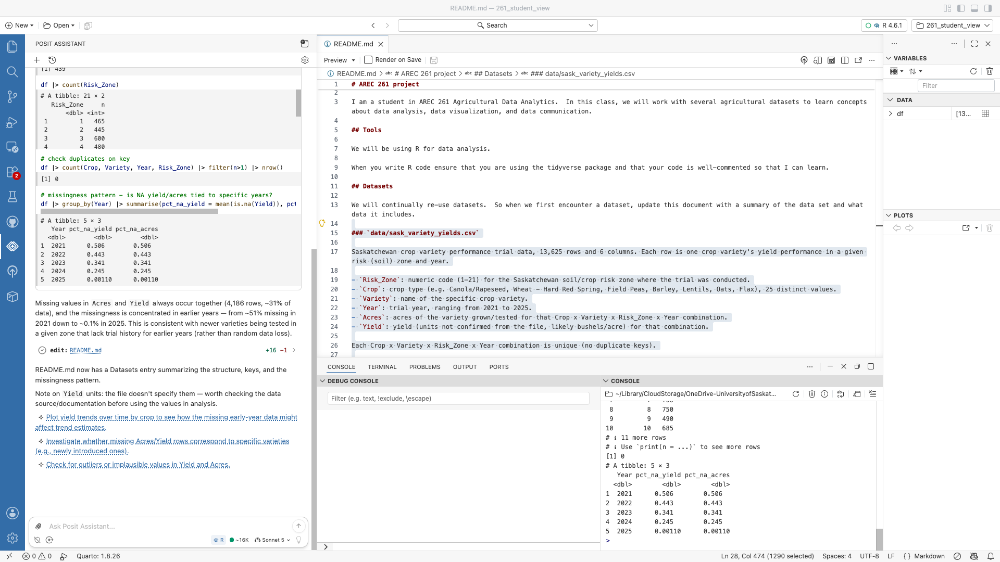
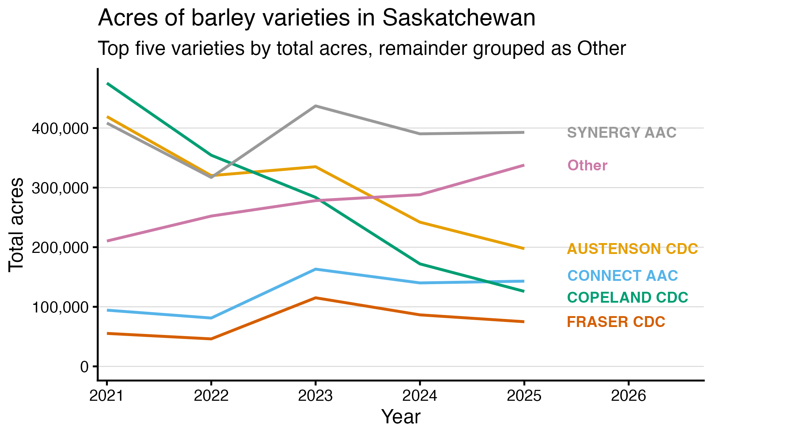
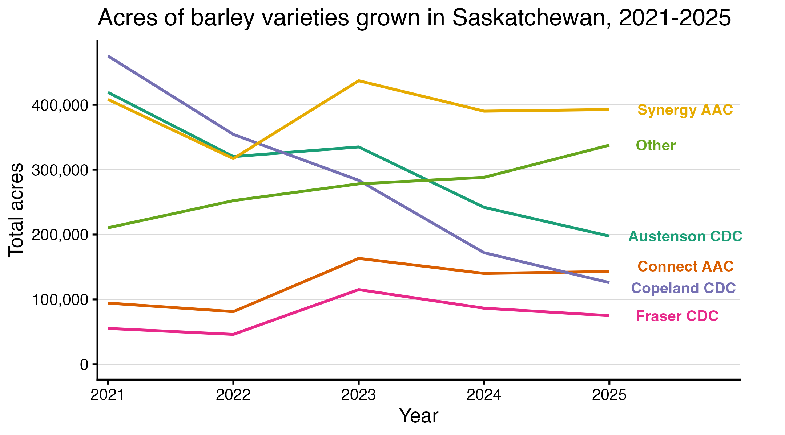
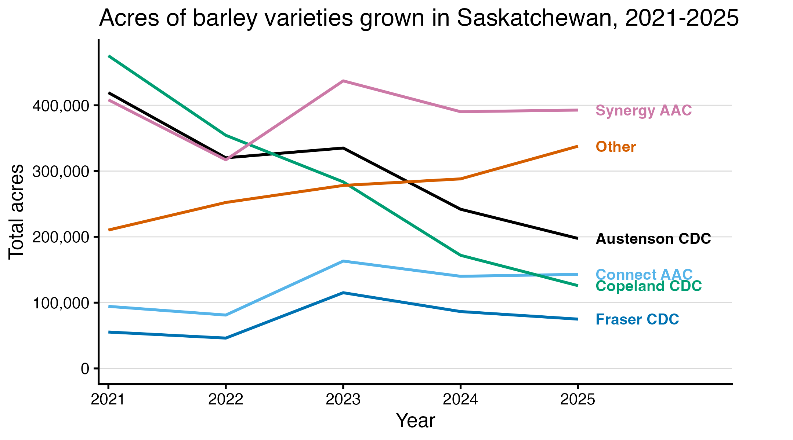
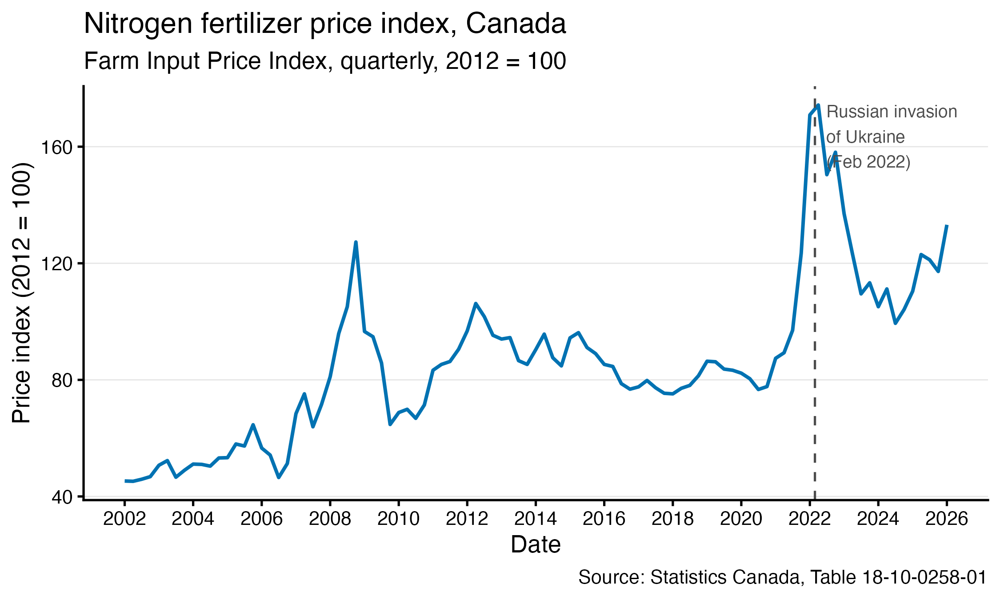

# Graphing with AI {#sec-graphing-ai}

```{r}
#| include: false
#| eval: true
source("_console.R")
```

Graphing is a good place to begin using AI assistance. `ggplot2` is a great package, but details such as annotations, direct labels and axis breaks require arguments that are easy to forget and somewhat difficult to implement -- for example, getting text in just the right place can take trial and error. An assistant can draft that syntax quickly.

It is also fairly easy to verify the work an AI assistant does on a chart.  If you make the raw chart yourself, then you only need to verify that the aesthetics of the graph have been updated correctly, which can be seen visually as opposed to through the code.

This chapter works in R with an assistant in Positron, in three stages: setting up a README the assistant can rely on, iterating on a chart we built ourselves, and then handing the assistant a whole task, from download to report.

## Learning Objectives {.unnumbered}

::: {.objectives}
By the end of this chapter you should be able to:

1. Set up a README file that gives an assistant standing context for a project.
2. Improve a chart by iterating with an assistant, one round of specific feedback at a time.
3. Hand an assistant a complete task -- download, analysis, chart and report -- and review each piece it produces.
4. Write prompts that state the outcome, the context and the deliverables.
5. Verify agentic work: its data, its code and its departures from your instructions.
:::

## Set up the readme file {.unnumbered}
Our first thing to do is to establish a readme file that the assistant can refer to.  This should establish the structure of the project.  We don't need to be too detailed about the data we are using, because the AI itself can continue to build this readme file.  

The common file format is a .md file.  You can write this as essentially a plain text file, denoting sections with hashtags.  For example, my first README.md is below  

```markdown
# AREC 261 

I am a student in AREC 261 Agricultural Data Analytics.  In this class, we
will work with several agricultural datasets to learn concepts about data
analysis, data visualization, and data communication.

## Tools

We will be using R for data analysis.

When you write R code ensure that you are using the tidyverse package and
that your code is well-commented so that I can learn.

## Datasets

We will continually re-use datasets.  So when we first encounter a dataset,
update this document with a summary of the data set and what data it
includes.
```

That's it.  Save it as `README.md` at the top of your project folder, beside `data/`, `code/` and `output/`.

Now we can get the assistant to read our variety data and summarize it for us.  With the readme in place, the request can be short, because the standing instructions are already written down:

::: {.ai-prompt}
Read data/sask_variety_yields.csv.  Summarize its structure -- the columns, what one row represents, the years covered, and anything I should know about missing values -- and add that summary to the Datasets section of README.md.
:::

You could see in your console that the agent is actually running some R code and learning about the data.  The output of which it might paste in your chat.  For me, it created the following addition to the Readme file:   

```markdown
### `data/sask_variety_yields.csv`

Saskatchewan crop variety performance trial data, 13,625 rows and 6 columns. Each row is one crop variety's yield performance in a given risk (soil) zone and year.

- `Risk_Zone`: numeric code (1–21) for the Saskatchewan soil/crop risk zone where the trial was conducted.
- `Crop`: crop type (e.g. Canola/Rapeseed, Wheat - Hard Red Spring, Field Peas, Barley, Lentils, Oats, Flax), 25 distinct values.
- `Variety`: name of the specific crop variety.
- `Year`: trial year, ranging from 2021 to 2025.
- `Acres`: acres of the variety grown/tested for that Crop x Variety x Risk_Zone x Year combination.
- `Yield`: yield (units not confirmed from the file, likely bushels/acre) for that combination.

Each Crop x Variety x Risk_Zone x Year combination is unique (no duplicate keys).

**Missing values:** `Acres` and `Yield` are missing together in the same 4,186 rows (~31% of the data), and never missing individually. Missingness is strongly concentrated in earlier years — about 51% of rows are missing in 2021, dropping steadily to ~0.1% in 2025. This pattern suggests missingness reflects newer varieties without trial history in earlier years, rather than random data loss, but this should be confirmed with the data source before drawing conclusions.
```

(The summary was accurate when the assistant wrote it. The dataset has since been extended with risk zones 22 and 23, so the file now has 14,700 rows, and the counts you get will be a little larger.)

{#fig-assistant-readme .screenshot}

Before trusting the summary, check it the same way you would check any other AI output.  

## Now for charts
Let's go back to the line chart we made in the previous session.  Below I have the minimal code for producing the last line chart that we created in that chapter.

```r
library(tidyverse)
library(janitor)

# Risk-zone records for all crops, varieties and years
variety_yields <- read_csv(
  "data/sask_variety_yields.csv",
  show_col_types = FALSE
) |>
  clean_names()          # column names to lowercase


# Total acres for each variety and year
barley_by_year <- variety_yields |>
  filter(crop == "Barley") |>
  group_by(variety, year) |>
  summarise(acres = sum(acres, na.rm = TRUE), .groups = "drop")

barley_by_year

##First get the total acreage of each variety across all risk zones and years
barley_variety_yields <- variety_yields |>
  filter(crop == "Barley") |>
  group_by(variety) |>
  mutate(total_acres = sum(acres, na.rm = TRUE)) |>
  ungroup()

## For varieties with less than 150,000 acres across all years, rename them to "Other"
barley_variety_yields <- barley_variety_yields |>
    mutate(variety = if_else(total_acres<150000, "Other", variety))

# Total acres for each variety and year
barley_by_year <- barley_variety_yields |>
  group_by(variety, year) |>
  summarise(acres = sum(acres, na.rm = TRUE)) |>
  ungroup()

barley_by_year |>
  ggplot(aes(x = year, y = acres, colour = variety)) +
  geom_line(linewidth = 0.9) +
  scale_y_continuous(labels = scales::comma, limits = c(0, NA)) +
  labs(title = "Acres of barley varieties in Saskatchewan",
       x = "Year", y = "Total acres", colour = NULL) +
  theme_classic(base_size = 13)

## Create plot (as above) and save it as the object variety_line_chart
variety_line_chart <- barley_by_year |>
  ggplot(aes(x = year, y = acres, colour = variety)) +
  geom_line(linewidth = 0.9) +
  scale_y_continuous(labels = scales::comma, limits = c(0, NA)) +
  labs(title = "Acres of barley varieties in Saskatchewan",
       x = "Year", y = "Total acres", colour = NULL) +
  theme_classic(base_size = 13)

## Visualize variety line chart by printing it in the console
variety_line_chart

# Save the finished line chart
ggsave(
  "output/module_4/variety_line_chart.png",
  plot = variety_line_chart,
  width = 6.4,
  height = 4.0,
  dpi = 300
)
```

In my view the graph is OK.  But there are many ways to improve it.  My list would be:
1. Includes only the top five varieties and an other category -- this means grouping the other varieties into the other category.
2. Include faint gridlines at each 100,000
3. Instead of a legend put variety names directly in the graph
4. The colours are a bit too bright -- use a more muted, colour-blind palette

These variations are all quite possible with ggplot.  But they are tedious work.  The type of tedious work that AI excels at.  So let's ask the assistant to do it for us.  The prompt I would use is:

::: {.ai-prompt}
Write a new script that modifies the script in module_4/ch12_02_line_charts.R and produces a final chart that differs from the current output in four ways:

1. Includes only the top five varieties and an other category -- this means grouping the other varieties into the other category.
2. Include faint gridlines at each 100,000.
3. Instead of a legend put variety names directly in the graph.
4. The colours are a bit too bright -- use a more muted, colour-blind palette.

Call this script module_5/ch15_updated_line_graph.R
:::

The assistant wrote the script, saved it as `code/module_5/ch15_updated_line_graph.R`, ran it, and produced the chart below.  All four requests are there.  It also stretched the x-axis to 2026, a year with no data, to make room for the labels -- whether to accept that is your call, not its.

{#fig-ai-five-variety}

I like this graph more than the first.  But there are still some issues.  For one, Copilot has a habit of adding information to the graph to demonstrate that it fulfilled your instructions.  The subtitle is an example of this.  Other things that I don't like include the colour pallette (still), the all-caps of the variety names, and the fact that 2026 is on the horizontal axis.  

My next instruction to the assistant is:

::: {.ai-prompt}
This is good!  Now:

1. Remove the subtitle -- always use titles as if you are making the graph for an external audience.  Don't include references to my instructions or past graphs.
2. Put varieties in proper casing (Synergy AAC)
3. Move the variety names slightly to the left -- cover about half the white space that now exists between the labels and the end of the plots.
4. Remove 2026 from the horizontal axis
5. I still don't love the colours -- is there a better standard option for graphs.  I particularly don't like the grey for Synergy.
:::

Giving AI positive feedback (This is good!) is important for two reasons.  First, I think we should be nice to AI agents -- it enforces habits of politeness that we will draw on in our human relationships and AI may one day come to rule us, hopefully it will be as nice to us in those coming years.  Second, it reinforces that we like the job that AI did, which it will learn from.

Its second attempt is here:

{#fig-ai-five-variety-2}


I'm still not a huge fan of the colour palette.  And the direct labels are not quite straight.  I'll ask for two more changes:

::: {.ai-prompt}
Almost perfect! Make sure the labels are all aligned left -- right now they are almost exactly in the right place, but they are not all aligned. And use the Okabe-Ito colour palette, avoiding the yellow.
:::

Here is my final result:

{#fig-ai-five-variety-3}

Importantly, the work of the AI is clearly documented in the code that it produced.  Because this is a graph, my standards for going through the code line-by-line are a bit more lax.  I can see the data has not changed from my first graph, and the generated code only pertains to the aesthetics of the graph.

::: {.callout-note collapse="true" title="The script the assistant produced: code/module_5/ch15_updated_line_graph.R"}
```r
library(tidyverse)
library(janitor)

# Risk-zone records for all crops, varieties and years
variety_yields <- read_csv(
  "data/sask_variety_yields.csv",
  show_col_types = FALSE
) |>
  clean_names()          # column names to lowercase

## First get the total acreage of each barley variety across all risk zones and years
barley_variety_yields <- variety_yields |>
  filter(crop == "Barley") |>
  group_by(variety) |>
  mutate(total_acres = sum(acres, na.rm = TRUE)) |>
  ungroup()

# Identify the top five varieties by total acres; everyone else becomes "Other"
top_five_varieties <- barley_variety_yields |>
  distinct(variety, total_acres) |>
  slice_max(total_acres, n = 5) |>
  pull(variety)

barley_variety_yields <- barley_variety_yields |>
  mutate(variety = if_else(variety %in% top_five_varieties, variety, "Other"))

# Recase variety names (e.g. "SYNERGY AAC" -> "Synergy AAC"), keeping short
# all-caps breeding-program codes (AAC, CDC, AC) in upper case
recase_variety <- function(x) {
  words <- str_split(x, " ")
  map_chr(words, function(w) {
    w |>
      str_to_title() |>
      (\(w2) if_else(str_length(w) <= 3 & w == str_to_upper(w), str_to_upper(w), w2))() |>
      paste(collapse = " ")
  })
}

barley_variety_yields <- barley_variety_yields |>
  mutate(variety = recase_variety(variety))

# Total acres for each variety (including "Other") and year
barley_by_year <- barley_variety_yields |>
  group_by(variety, year) |>
  summarise(acres = sum(acres, na.rm = TRUE), .groups = "drop")

# Labels are placed at each line's final year, to replace the legend
label_data <- barley_by_year |>
  filter(year == max(year))

## Create the output folder for this module if needed
dir.create("output/module_5", recursive = TRUE, showWarnings = FALSE)

variety_line_chart <- barley_by_year |>
  ggplot(aes(x = year, y = acres, colour = variety)) +
  geom_line(linewidth = 0.9) +
  # geom_text (not geom_text_repel) with a fixed x guarantees every
  # label's left edge lines up, since ggrepel can override hjust
  geom_text(
    data = label_data,
    aes(label = variety, x = 2025.15),
    hjust = 0,
    size = 3.5,
    fontface = "bold",
    show.legend = FALSE
  ) +
  # Okabe-Ito colour-blind-friendly palette, replacing yellow (#F0E442) and
  # orange (#E69F00) since orange reads as yellow at this size
  scale_colour_manual(values = c(
    "#000000", "#56B4E9", "#009E73", "#0072B2", "#D55E00", "#CC79A7"
  )) +
  scale_y_continuous(
    labels = scales::comma,
    limits = c(0, NA),
    breaks = scales::breaks_width(100000)
  ) +
  # Give labels room to the right of the last data point without cutting them off
  scale_x_continuous(
    breaks = unique(barley_by_year$year),
    expand = expansion(mult = c(0.02, 0.28))
  ) +
  coord_cartesian(clip = "off") +
  labs(
    title = "Acres of barley varieties grown in Saskatchewan, 2021-2025",
    x = "Year", y = "Total acres"
  ) +
  theme_classic(base_size = 13) +
  theme(
    legend.position = "none",
    panel.grid.major.y = element_line(colour = "grey85", linewidth = 0.3),
    plot.margin = margin(t = 5.5, r = 40, b = 5.5, l = 5.5)
  )

## Visualize variety line chart by printing it in the console
variety_line_chart

# Save the finished line chart
ggsave(
  "output/module_5/five_variety_line_chart.png",
  plot = variety_line_chart,
  width = 7.2,
  height = 4.0,
  dpi = 300
)
```
:::


## Building a graph from scratch

In the previous example, I asked an AI agent to perfect a graph I had already built.  But we can ask AI to do much more -- download data, analyze the data, output results, and build reports.  

In this example, I will ask the AI to download data on nitrogen fertilizer prices from Statistics Canada from 2018 to present.  It should create a graph and on the graph include the text that points to the date of the Russian invasion of Ukraine.  It should then write a quick report saying where it obtained the data, what the data is, and what the graph shows.  

::: {.ai-prompt}
Download the nitrogen fertilizer price index from Statistics Canada (Table 18-10-0258-01) using the cansim package.  Analyze the data in R. Create a graph showing how prices have changed over time and annotate the date of the Russian invasion of Ukraine. Write a short report describing the data source, what the data measure, and the main pattern shown in the graph.  The audience for the report is just myself, so that I can verify what you have done.  But I will later embed the chart in a report. Save everything needed to reproduce the analysis in this project.
:::

The agent downloaded the table, saved a local copy of the extracted series into `data/`, and produced the chart, a script and a report.

{#fig-nitrogen-chart}

Two things are worth checking against my instructions.  I asked for 2018 to present; the agent plotted the whole series back to 2002.  The longer window arguably makes a better chart, but the departure from the instruction is the kind of thing you only find by looking.  And in the report below, the agent itself flags that fertilizer prices were rising well before the invasion, so the annotation marks a date, not a cause -- exactly the caution the limitations guidance in @sec-report-tips asks for in your own writing.

::: {.callout-note collapse="true" title="The script: code/module_5/ch16_nitrogen_fertilizer_price.R"}
```r
# AREC 261 - Nitrogen fertilizer price index
#
# Downloads StatCan Table 18-10-0258-01 (Farm input price index) via the
# cansim package, extracts the "Nitrogen fertilizers" series for Canada,
# and plots how the index has changed over time, annotating the date of
# Russia's invasion of Ukraine (2022-02-24).
#
# A local copy of the extracted series is saved to data/ so the analysis
# can be re-run without re-downloading from StatCan.

library(tidyverse)
library(cansim)

## ---- Download data ---------------------------------------------------

# get_cansim() caches the table locally after the first download, so
# re-running this script will not repeatedly hit the StatCan API
raw_data <- get_cansim("18-10-0258-01")

# Farm Input Price Index, "Nitrogen fertilizers" component, Canada-level
nitrogen_prices <- raw_data |>
  filter(GEO == "Canada", `Price index` == "Nitrogen fertilizers") |>
  select(date = Date, price_index = VALUE, uom = UOM) |>
  arrange(date)

# Save a local copy so the rest of this script (and future sessions) can
# reproduce the analysis without re-downloading from StatCan
write_csv(nitrogen_prices, "data/nitrogen_fertilizer_price_index.csv")

## ---- Plot --------------------------------------------------------------

invasion_date <- as.Date("2022-02-24")

dir.create("output/module_5", recursive = TRUE, showWarnings = FALSE)

nitrogen_price_chart <- nitrogen_prices |>
  ggplot(aes(x = date, y = price_index)) +
  geom_line(linewidth = 0.9, colour = "#0072B2") +
  geom_vline(
    xintercept = invasion_date,
    linetype = "dashed",
    colour = "grey30"
  ) +
  annotate(
    "text",
    x = invasion_date + 120,
    y = max(nitrogen_prices$price_index, na.rm = TRUE),
    label = "Russian invasion\nof Ukraine\n(Feb 2022)",
    hjust = 0,
    vjust = 1,
    size = 3.3,
    colour = "grey30"
  ) +
  scale_x_date(date_breaks = "2 years", date_labels = "%Y") +
  labs(
    title = "Nitrogen fertilizer price index, Canada",
    subtitle = "Farm Input Price Index, quarterly, 2012 = 100",
    x = "Date",
    y = "Price index (2012 = 100)",
    caption = "Source: Statistics Canada, Table 18-10-0258-01"
  ) +
  theme_classic(base_size = 13) +
  theme(panel.grid.major.y = element_line(colour = "grey90", linewidth = 0.3))

nitrogen_price_chart

ggsave(
  "output/module_5/nitrogen_fertilizer_price_index.png",
  plot = nitrogen_price_chart,
  width = 7.5,
  height = 4.5,
  dpi = 300
)
```
:::

::: {.callout-note collapse="true" title="The report: output/module_5/nitrogen_fertilizer_price_report.md"}
```markdown
# Nitrogen fertilizer price index — verification notes

## Data source

Statistics Canada, Table 18-10-0258-01, "Farm input price index" (formerly
CANSIM 002-0022), downloaded programmatically with the `cansim` R package
(`get_cansim("18-10-0258-01")`). Reproduced with
[code/module_5/ch16_nitrogen_fertilizer_price.R](../../code/module_5/ch16_nitrogen_fertilizer_price.R).
A local snapshot of the extracted series is saved at
[data/nitrogen_fertilizer_price_index.csv](../../data/nitrogen_fertilizer_price_index.csv)
so the analysis does not depend on re-downloading from StatCan.

## What the data measure

The Farm Input Price Index (FIPI) tracks prices paid by Canadian farm
operators for inputs used in agricultural production. This series is
narrowed to:

- **Geography**: Canada (national level; the table also has provincial
  breakdowns)
- **Component**: "Nitrogen fertilizers" (a sub-category of "Fertilizer",
  itself under "Crop production" inputs)
- **Frequency**: quarterly
- **Units**: index, 2012 = 100 (i.e., prices are expressed relative to
  their average level in 2012, not in dollar terms)

The extracted series runs from 2002 Q1 to 2026 Q1 (97 observations).

## Main pattern in the graph

Nitrogen fertilizer prices show two large spikes over the sample period:
one around 2008–09 (index peaking near 126, coinciding with the global
commodity/food price spike of that period) and a much larger one in
2021–22 (index peaking near 172 in early 2022). The 2021–22 rise begins
before the Russian invasion of Ukraine (Feb 24, 2022) — prices were
already climbing sharply through 2021, likely reflecting natural gas
price increases (a key nitrogen fertilizer input) and post-pandemic
supply chain disruption. The index continues rising for a few months
after the invasion before falling back, and by 2023–2024 settles in the
100–115 range, still elevated relative to the pre-2021 range (roughly
75–95). Prices have risen again through 2025 into 2026 (index ~133 as of
2026 Q1).

**Caveat**: the invasion is annotated as a reference point requested for
the chart, but the graph alone cannot establish that the invasion caused
the price spike — the run-up predates the invasion, and other factors
(natural gas prices, general inflation, supply chain conditions) were
also in play concurrently. Treat the annotation as marking a
contextually relevant date, not as evidence of a causal break.
```
:::


## Prompting AI

AI output is sensitive to the way you prompt the program.  Although AI is becoming better at autonomous work, it still benefits from clear instructions.  Here are some tips:

1. Start with the outcome, not the procedure. Be specific about the deliverables and what it means for the task to be completed.

2. Ask the agent to verify its own work.  Even better, ask the agent to spawn other agents to verify its work.  These new agents will not have the context of the working agent, so they are better able to assess the work on its own merits.

3. Give it the context it needs.  Explain what the work is for, what files/data already exist, who the audience is, and any relevant background. 

4. Balance giving constraints with allowing for flexibility. For data analysis, we would definitely want the agent to write R code, as opposed to Python code (assuming we aren't familiar with the Python language).  However, we may not want to specify the exact R functions to use, as the AI may be able to introduce us to new approaches.  

5. Review the agent's work, not just its final answer. An agent can produce a beautiful graph from the wrong series. Check its source, data selection, code, assumptions, and intermediate decisions. Greater autonomy makes oversight more important, not less. 

::: {.callout-tip collapse="true"}
## Other resources -- ggplot2

- **ggplot2: Elegant Graphics for Data Analysis**, [ggplot2-book.org](https://ggplot2-book.org/) -- an explanation of the grammar and its components.
- **R Graph Gallery**, [r-graph-gallery.com](https://r-graph-gallery.com/) -- examples organized by the kind of chart being built.
- **ggplot2 reference**, [ggplot2.tidyverse.org/reference](https://ggplot2.tidyverse.org/reference/) -- function arguments and current syntax.
:::
